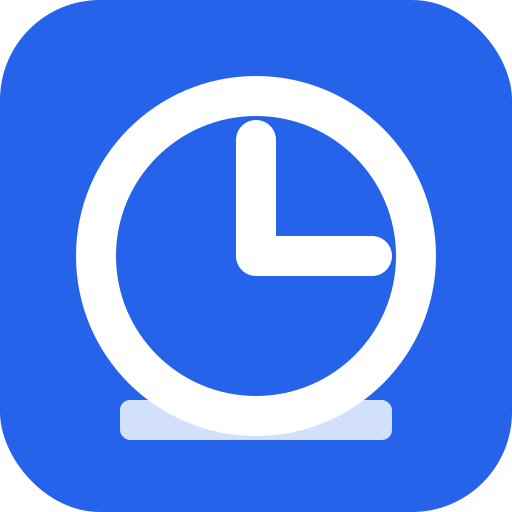

       

#  QuickLog-Solo

「1秒で記録、1秒で集計」をコンセプトにした、ミニマリスト向け・サイドパネル型作業メモツールです。

業務記録を負担に感じるが、ツールの透明性や安全性に厳しい技術者や、プライバシーを重視するすべての人のために設計されました。

設計思想や行動指針については [AGENTS.md](AGENTS.md) を参照してください。

## 特徴
- **1秒で記録、1秒で集計:** カテゴリを選ぶだけで即座に計測開始。前後のタスクは自動的に連結・終了処理され、日報や集計データもワンクリックで作成できます。
- **ブラウザ・サイドバー常駐:** Chrome, Edge のサイドパネルに対応。作業を妨げず、いつでもブラウザの傍らでクイックに記録可能です。
- **Visual Healing（視覚的癒やし）:** 20種類以上のLCDドットマトリクス風アニメーションを搭載。「1秒の重み」を緩やかな変化で表現し、作業中のストレスを軽減する心地よい体験を提供します。
- **タグ別集計:** カテゴリにタグを紐付けることで、複数のカテゴリにまたがるプロジェクト横断の工数集計を一瞬で行えます。ヘッダーの「📊」ボタンから利用可能です。
- **アラーム・通知機能:** 指定した時刻にメッセージを表示し、作業を自動的に終了・一時停止・開始できます。了解ボタンが押されるまで実行を待機する「確認モード」も備えています。また、デフォルトで 23:59 に終了する設定が有効になっており、止め忘れを防止して翌日の記録をクリーンに開始できるようサポートします。
- **ローカルファイルバックアップ:** 指定したローカルフォルダへのバックアップに対応。ブラウザのキャッシュクリア等による予期せぬデータ消失から記録を守ります（File System Access API を利用）。バックアップデータがあれば、他のブラウザへの移行もスムーズに行えます。
- **徹底したプライバシーと透明性:**
    - **完全ローカル:** 記録されたデータはすべてブラウザ内の IndexedDB に保存されます（バックアップを実行した際には、ローカルファイルシステムにも保存されます）。
    - **外部通信ゼロ:** CSP（Content Security Policy）により技術的に外部通信を遮断しています。
    - **ピュアで長寿命な設計:** 外部ライブラリを一切使用しない Vanilla JS 構成。OSS のライフサイクルやトレンドに左右されないため、10年後も変わらず使い続けられる長期的安心感を提供します。また、依存関係によるブラックボックスを排除し、技術者が安心して利用・検証できる透明性を確保しています。
    - **OSS脆弱性・依存関係監査:** OSSの依存関係および脆弱性を継続的に監視するため、Googleの提供する **OSV-Scanner** による厳格な監査を全開発フローで実施しています。さらに、AI エージェント等による一時的なスクリプトの混入を防ぐため、ルートディレクトリの厳格なクリーンネス・ポリシーを CI で強制しています。

## インストール方法

### 🚀 リリース版 (Chrome Web Store) - 推奨
Chrome / Edge をお使いの場合は、Chrome Web Store から簡単にインストールできます。**新バージョンへの自動アップデートが適用されるため、通常はこちらの利用を強く推奨します。**

※ 現在、限定公開（リンクを知っているユーザーのみ）として公開されています。

### 🛠️ 開発版 (Zip)
**最新の未リリース機能をいち早く試したい方**は、以下の手順でインストールしてください。開発版へのフィードバックは随時受け付けています。なお、**開発版は新しいバージョンへの自動アップデートが行われないため、手動での更新が必要です。**

1. `releases/QuickLog-Solo-Chrome.zip` をダウンロードして解凍します。
2. ブラウザで拡張機能管理ページを開きます（Chrome: `chrome://extensions` / Edge: `edge://extensions`）。
3. 「デベロッパー モード」をオンにします。
4. 「パッケージ化されていない拡張機能を読み込む」ボタンをクリックし、解凍したフォルダを選択します。
5. ツールバーの拡張機能アイコンをクリックし、QuickLog-Solo をピン留めして使用します。

## 使用方法
- **タスク開始:** カテゴリボタンをクリックすると、即座に計測が始まります。
- **一時停止/再開:** 「一時停止」ボタンで休憩や割り込みに対応. 再度クリックで元のタスクを再開します。
- **タスク終了:** 「終了」ボタンで現在の作業を完了します。
- **データ出力:**
    - **日報・集計:** ヘッダーのボタン（📋, 📊）から、日報形式やタグ別の集計結果をクリップボードにコピーできます。
    - **CSVエクスポート:** 設定（⚙️）の「一般」タブから、過去の全履歴をCSVとしてエクスポート/インポートできます。
- **メンテナンス:** 設定（⚙️）の「メンテナンス」タブから、ログの一括削除や、カテゴリ・設定の初期化（リセット）が行えます。不具合発生時や環境をクリーンにしたい場合に使用します。

## データの保存場所とリスク (Data Storage & Risks)
- **データの保存先:** 記録されたデータはすべてブラウザ内の **IndexedDB** に保存されます（バックアップを実行した際には、ローカルファイルシステムにも保存されます）。
- **消失リスク:** ブラウザの「閲覧履歴の消去」やキャッシュクリア、またはブラウザ自体の仕様により、データが予期せず削除される可能性があります。
- **推奨事項:** 大切な記録を守るため、設定の「バックアップ」タブから定期的にバックアップを実行することを強く推奨します。
- **Data Storage:** All recorded data is stored in the browser's **IndexedDB** (and also to the local file system when the backup is executed).
- **Data Loss Risk:** Data may be unexpectedly deleted due to browser "Clear browsing history," cache clearing, or browser-specific storage policies.
- **Recommendation:** To protect your valuable records, we strongly recommend performing regular backups from the "Backup" tab of the settings.

## プライバシーとセキュリティ (Privacy & Security)
- **Local Only:** 本アプリは、CSP（Content Security Policy）により技術的に外部への通信を一切行わないことが保証されています。
- **トラッキングなし:** アクセス解析や広告、外部サービスへのデータ送信は一切行いません。
- **透明性:** プログラムは Vanilla JS で記述されており、依存関係によるブラックボックスがありません。また、開発者ツール（F12）から IndexedDB の中身を直接確認することが可能です。さらに、Google OSV-Scanner を用いた[透明性レポート（監査ログ）](https://github.com/masanori-satake/QuickLog-Solo/actions/workflows/audit.yml)を公開し、依存関係の安全性と透明性を確保しています。
- **Local Only:** This app is guaranteed by CSP (Content Security Policy) to technically block all external communications.
- **No Tracking:** No analytics, advertisements, or data transmission to external services are performed.
- **Transparency:** The program is written in Vanilla JS with no hidden dependencies. You can directly inspect the contents of IndexedDB using browser developer tools (F12). We also publish a [Transparency Report (Audit Logs)](https://github.com/masanori-satake/QuickLog-Solo/actions/workflows/audit.yml) powered by Google OSV-Scanner to ensure the security and transparency of dependencies.

## カスタマイズ
- **テーマ:** ライトモード / ダークモードの切り替えが可能です。
- **アクセントカラー:** カテゴリごとに 14 色のカラーバリエーションから選択できます。
- **フォント切り替え:** 言語ごとに最適化された複数のフォントから選択可能です。
- **背景アニメーション:** 20 種類以上の LCD ドットマトリクス風アニメーションを搭載。

## 関連プロジェクト
- **[QL-Animation Studio (β版)](https://quick-log-solo.vercel.app/studio):** ブラウザ上でオリジナルの背景アニメーションを作成・テストできる開発環境。
- **[QL-Category Editor](https://quick-log-solo.vercel.app/category-editor):** 広い画面でカテゴリの詳細編集や並び替えを効率的に行えるウェブベースのエディタ。

## 開発者向け情報
開発環境の構築、ディレクトリ構成、テスト方法などの技術的な詳細は [docs/README_DEV.md](docs/README_DEV.md) を参照してください。

---

This project uses Material Design 3, an open-source design system by Google.

## 免責事項 (Disclaimer)
本ソフトウェアは、個人によって開発されたオープンソース・プロジェクトであり、**無保証 (AS IS)** です。
利用に際して生じたいかなる損害（データの消失、業務の中断、PCの不具合など）についても、開発者は一切の責任を負いません。
MIT ライセンスの規定に基づき、「現状のまま」提供されるものとします。自己責任でご利用ください。

This software is a personal open-source project and is provided **"AS IS"** without warranty of any kind.
The developer shall not be liable for any damages (including data loss, work interruption, etc.) arising from the use of this software.
Use at your own risk, as per the MIT License.
