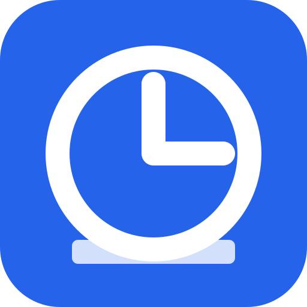

#  QuickLog-Solo - 1-Sec Local Task Logger & Time Tracker

> **Log in 1 second, summarize in 1 second.** A minimalist, privacy-first side-panel task logger and time tracker designed for maximum productivity without compromising data security.

## Overview
Context switching and complex time-tracking tools disrupt daily focus and introduce unnecessary friction. **QuickLog-Solo** solves this by delivering an ultra-fast, lightweight Chrome extension that stays right in your browser side panel. Track tasks in a single click, boost your daily productivity, and keep your activity records 100% private with local-first storage.

## Key Features
- **⚡ 1-Sec Task Logger & Time Tracker (`time-tracker`, `task-logger`):** Click any category to start logging instantly. Previous tasks are automatically closed and transitioned seamlessly so you can focus on work.
- **🔌 Chrome Extension Side Panel (`chrome-extension`):** Runs directly in the Chrome / Edge side panel, keeping your task logger accessible without cluttering your tabs or desktop.
- **🔒 100% Privacy-First & Local-First (`privacy-first`, `local-first`):** All records stay strictly on your device inside browser IndexedDB by default. Zero third-party external servers, zero telemetry, and zero tracking.
- **🚀 Maximize Productivity & Daily Summary (`productivity`):** One-click daily report copy and tag-based aggregation across projects to streamline daily standups and work log submissions.
- **🎨 Visual Healing Animations:** Over 20 retro LCD dot-matrix canvas animations that visually represent passing time and reduce daily stress.
- **⏰ Smart Alarms & Auto-Pause:** Set scheduled alarms with custom actions (start, pause, complete) to prevent unrecorded overtime.
- **📁 Local File Backup & Device Sync (Beta):** Securely export backups to a designated local folder via File System Access API or enable optional Device Sync (`chrome.storage.sync`).

## 🔒 Privacy & Security
Data security and user privacy are foundational principles of QuickLog-Solo:

- **100% Local Execution (Default):** All task logs and user data remain stored locally in your browser's IndexedDB. When optional Device Sync is explicitly enabled, `chrome.storage.sync` synchronizes settings, categories, alarms, current task state, deletion info, and recent history (up to 50 records) across your Chrome-synced devices.
- **Zero Third-Party Server Communication:** Strict Content Security Policy (CSP) blocks all external API calls and outgoing third-party network requests.
- **Pure Vanilla JS (Zero Dependencies):** Built without external runtime frameworks or third-party packages, eliminating supply chain vulnerabilities.
- **Zero Data Collection:** No user telemetry, analytics, cookies, or tracking scripts are included or used.
- **Continuous Security Auditing:** Automatically scanned and verified using Google OSV-Scanner and strict dependency policies.

## Chromebook & Offline Environment Friendly
QuickLog-Solo is optimized for seamless performance across Windows, macOS, ChromeOS / Chromebooks, and air-gapped network environments.

- **100% Offline Capability:** Works completely without an internet connection (no external font or script dependencies).
- **Responsive Layout Options:** Adjust display height (Normal, Compact, Mini) and category grid rows (2x8, 2x4) to fit compact Chromebook screens or large desktop displays.
- **Minimal Resource Footprint:** Lightweight Vanilla JS engine ensures smooth execution even on entry-level devices.

## Installation

### 🚀 Stable Release (Chrome Web Store) - Recommended
For automatic updates and easy installation, get QuickLog-Solo directly from the Chrome Web Store:

### 🛠️ Developer Release (Zip)
To try the latest unreleased features:

1. Download and extract `releases/QuickLog-Solo-v1.35.1.zip`.
2. Open your browser's extensions page (`chrome://extensions` or `edge://extensions`).
3. Enable **Developer mode**.
4. Click **Load unpacked** and select the extracted directory.

## Usage Guide
- **Start Task:** Click a category button to begin tracking immediately.
- **Pause / Resume:** Click **Pause** during interruptions and click again to resume the previous task.
- **Complete Task:** Click **Finish** to conclude the active log.
- **Reports & Summaries:** Copy daily reports or tag-based summaries to your clipboard via the header icons (📋, 📊).
- **CSV Import / Export:** Export or restore full log history under Settings (⚙️) > **General**.

## Related Projects
- **[Category Editor](https://masanori-satake.github.io/QuickLog-Solo/projects/category-editor/):** Web-based manager to edit and organize category items.
- **[Alarm Editor](https://masanori-satake.github.io/QuickLog-Solo/projects/alarm-editor/):** Visual editor for advanced alarms and business day schedules.
- **[Animation Maker](https://masanori-satake.github.io/QuickLog-Solo/projects/animation-maker/):** No-code editor to upload custom GIFs and generate dot-matrix canvas animations.
- **[QL-Animation Studio (Beta)](https://masanori-satake.github.io/QuickLog-Solo/projects/studio/):** Interactive environment to create and test custom background animations.

---

## 🇯🇵 日本語

### QuickLog-Solo - 1秒で作業記録できるローカル完結型タイムトラッカー

「1秒で記録、1秒で集計」をコンセプトにした、ミニマリスト向け・サイドパネル型作業メモツールです。

業務記録を負担に感じるが、ツールの透明性や安全性に厳しい技術者や、プライバシーを重視するすべての人のために設計されました。

設計思想や行動指針については [AGENTS.md](AGENTS.md) を参照してください。

#### 特徴・主な機能
- **1秒で記録、1秒で集計:** カテゴリを選ぶだけで即座に計測開始。前後のタスクは自動的に連結・終了処理され、日報や集計データもワンクリックで作成できます。
- **ブラウザ・サイドバー常駐:** Chrome, Edge のサイドパネルに対応。作業を妨げず、いつでもブラウザの傍らでクイックに記録可能です。
- **Visual Healing（視覚的癒やし）:** 20種類以上のLCDドットマトリクス風アニメーションを搭載。「1秒の重み」を緩やかな変化で表現し、作業中のストレスを軽減する心地よい体験を提供します。
- **タグ別集計:** カテゴリにタグを紐付けることで、複数のカテゴリにまたがるプロジェクト横断の工数集計を一瞬で行えます。ヘッダーの「📊」ボタンから利用可能です。
- **アラーム・通知機能:** 指定した時刻にメッセージを表示し、作業を自動的に終了・一時停止・開始できます。了解ボタンが押されるまで実行を待機する「確認モード」も備えています。また、デフォルトで 23:59 に終了する設定が有効になっており、止め忘れを防止して翌日の記録をクリーンに開始できるようサポートします。
- **端末間同期 (Sync) [β版]:** オプションで端末間同期機能を有効にすると、ブラウザの同期機能（`chrome.storage.sync`）を利用して、設定、カテゴリ、アラーム、現在のタスク状態、削除情報、および直近50件の履歴データを同一アカウントの複数端末間でセキュアに同期します。同期オフ時はすべての作業ログがローカル（IndexedDB）のみに保持されます。
- **ローカルファイルバックアップ:** 指定したローカルフォルダへのバックアップに対応。ブラウザのキャッシュクリア等による予期せぬデータ消失から記録を守ります（File System Access API を利用）。バックアップデータがあれば、他のブラウザへの移行もスムーズに行えます。
- **徹底したプライバシーと透明性:**
    - **完全ローカル（標準状態）:** 記録されたデータはすべてブラウザ内の IndexedDB に保存されます（バックアップを実行した際には、ローカルファイルシステムにも保存されます）。端末間同期機能を有効にした場合のみ、Chrome Sync 経由で一部設定および直近の履歴（最大50件）が同期対象となります。
    - **サードパーティ通信ゼロ:** CSP（Content Security Policy）により技術的にサードパーティの外部通信を遮断しています。
    - **ピュアで長寿命な設計:** 外部ライブラリを一切使用しない Vanilla JS 構成。OSS のライフサイクルやトレンドに左右されないため、10年後も変わらず使い続けられる長期的安心感を提供します。また、依存関係によるブラックボックスを排除し、技術者が安心して利用・検証できる透明性を確保しています。
    - **OSS脆弱性・依存関係監査:** OSSの依存関係および脆弱性を継続的に監視するため、Googleの提供する **OSV-Scanner** による厳格な監査を全開発フローで実施しています。さらに、AI エージェント等による一時的なスクリプトの混入を防ぐため、ルートディレクトリの厳格なクリーンネス・ポリシーを CI で強制しています。

#### Chromebook & オフライン環境への最適化
ローカル完結・高速動作・安心のデータ保護を徹底追及した結果、Windows / macOS はもちろん、画面サイズの多様な Chromebook やネットワーク制限のある環境でも極めて快適に動作する高い親和性を備えています。

- **オフライン完結設計:** Google Fonts 等の外部リソース依存を完全に排除。ネットワークが遮断されたオフライン環境や、帯域制限・セキュリティ制限のある学校・オフィスでも完璧に動作します。
- **自由度の高いレイアウト選択:** ユーザーが表示要素の高さ（通常 / コンパクト / ミニ）やカテゴリ一覧のグリッド段数（2列×8段 / 2列×4段）を自由に調整可能。1366×768 のコンパクトな Chromebook 画面からマルチモニター環境まで、作業領域に合わせた最適な表示を選択できます。
- **圧倒的な軽量性:** Vanilla JS と IndexedDB によるシンプルな構成で、エントリースペックの CPU やメモリ制限のある端末でもストレスなく高速・軽快に動作します。
- **厳格なセキュリティ & 最小権限設計:** 業務記録に必要な最小限の権限のみで動作し、不要な追加権限を要求しないため、組織の管理ポリシー（Chrome Enterprise 等）にも安心して適合・運用できます。

#### 使用方法
- **タスク開始:** カテゴリボタンをクリックすると、即座に計測が始まります。
- **一時停止/再開:** 「一時停止」ボタンで休憩や割り込みに対応。再度クリックで元のタスクを再開します。
- **タスク終了:** 「終了」ボタンで現在の作業を完了します。
- **データ出力:**
    - **日報・集計:** ヘッダーのボタン（📋, 📊）から、日報形式やタグ別の集計結果をクリップボードにコピーできます。
    - **CSVエクスポート:** 設定（⚙️）の「一般」タブから、過去の全履歴をCSVとしてエクスポート/インポートできます。
- **メンテナンス:** 設定（⚙️）の「メンテナンス」タブから、ログの一括削除や、カテゴリ・設定の初期化（リセット）が行えます。不具合発生時や環境をクリーンにしたい場合に使用します。

#### データの保存場所とリスク
- **データの保存先:** 記録されたデータはすべてブラウザ内の **IndexedDB** に保存されます（バックアップを実行した際には、ローカルファイルシステムにも保存されます）。端末間同期機能を有効にした場合は、一部の設定や直近の履歴（最大50件）が `chrome.storage.sync` 経由で保持されます。
- **消失リスク:** ブラウザの「閲覧履歴の消去」やキャッシュクリア、またはブラウザ自体の仕様により、データが予期せず削除される可能性があります。
- **推奨事項:** 大切な記録を守るため、設定の「バックアップ」タブから定期的にバックアップを実行することを強く推奨します。

#### カスタマイズ
- **テーマ:** ライトモード / ダークモードの切り替えが可能です。
- **アクセントカラー:** カテゴリごとに 14 色のカラーバリエーションから選択できます。
- **フォント切り替え:** 言語ごとに最適化された複数のフォントから選択可能です。
- **背景アニメーション:** 20 種類以上の LCD ドットマトリクス風アニメーションを搭載。

#### 関連プロジェクト
- **[業務カテゴリ・エディタ (Category Editor)](https://masanori-satake.github.io/QuickLog-Solo/projects/category-editor/):** 広い画面でカテゴリの詳細編集や並び替えを効率的に行えるウェブベースのエディタ。
- **[アラーム・エディタ (Alarm Editor)](https://masanori-satake.github.io/QuickLog-Solo/projects/alarm-editor/):** 高度なアラーム設定や稼働日設定を視覚的に管理できるエディタ。
- **[アニメーション・メーカー (Animation Maker)](https://masanori-satake.github.io/QuickLog-Solo/projects/animation-maker/):** プログラミング不要で、GIF画像をアップロードするだけで誰でも直感的に自分だけのカスタムアニメーションを作成・追加できるエディタ。
- **[QL-Animation Studio (β版)](https://masanori-satake.github.io/QuickLog-Solo/projects/studio/):** ブラウザ上でオリジナルの背景アニメーションを作成・テストできる開発環境。

#### 開発者向け情報
開発環境の構築、ディレクトリ構成、テスト方法などの技術的な詳細は [docs/README_DEV.md](docs/README_DEV.md) を参照してください。

---

## 免責事項 (Disclaimer)
本ソフトウェアは、個人によって開発されたオープンソース・プロジェクトであり、**無保証 (AS IS)** です。
利用に際して生じたいかなる損害（データの消失、業務の中断、PCの不具合など、本ツールやドキュメントを利用したことによるすべての損害）について、開発者は一切の責任を負いません。
MIT ライセンスの規定に基づき、「現状のまま」提供されるものとします。自己責任でご利用ください。

This software is an open-source project provided **"AS IS"** without warranty of any kind.
The developer shall not be liable for any damages (including data loss, work interruption, etc.) arising from the use of this software.
Use at your own risk, as per the MIT License.
