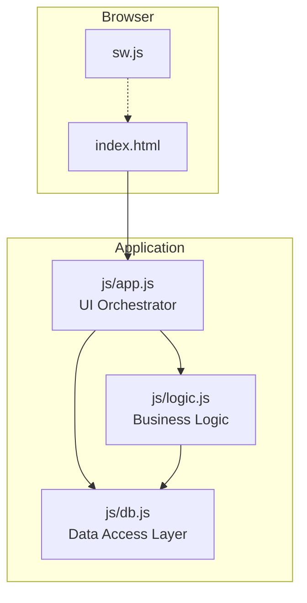
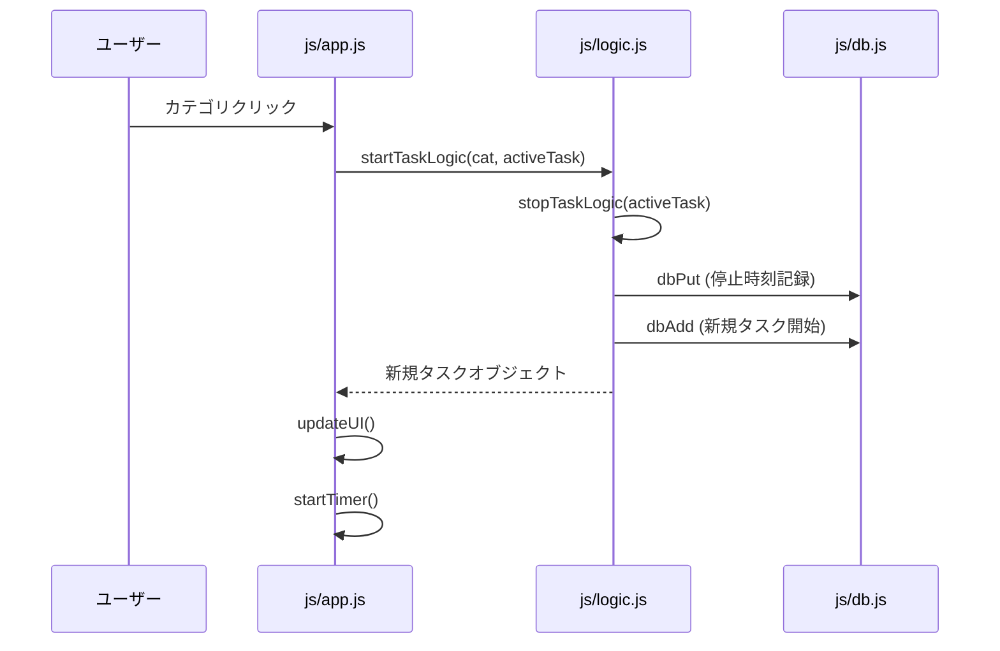

# QuickLog-Solo: 開発者ガイド

このドキュメントでは、QuickLog-Solo の内部構造、設計思想、および開発ワークフローについて詳細に説明します。

## 1. アーキテクチャ概要

本アプリは、外部ライブラリに依存しない Vanilla JS によるモジュール・アーキテクチャを採用しています。

### モジュール構成図



### 各モジュールの役割

-   **js/app.js (UI層):**
    -   DOM要素の取得と操作。
    -   イベントリスナーの設定。
    -   UI状態の同期（`updateUI`）。
    -   ユーザーへの通知（トースト、確認ダイアログ）。
-   **js/logic.js (ロジック層):**
    -   タスクの開始・停止・一時停止の純粋な状態遷移ロジック。
    -   時間のフォーマット計算。
    -   アニメーション状態（clip-path）の計算。
    -   DOMに直接触れず、テストが容易な形式で記述。
-   **js/app.js (テスト・デバッグ機能):**
    -   URLパラメータによる状態インジェクション機能（`handleTestParameters`）。
-   **js/db.js (データ層):**
    -   IndexedDB (Raw API) のカプセル化。
    -   CRUD操作の提供。
    -   データベースの初期化、マイグレーション、クリーンアップ。

---

## 2. 主要な振る舞い

### タスクの開始・切り替えフロー



### カテゴリのページネーション

カテゴリ数が増えた場合（9個以上）、1ページあたり8個のボタンを表示するページネーションが自動的に適用されます。
- **実装方法:** `js/app.js` 内の `currentCategoryPage` 変数で現在のページを管理。
- **操作:** `category-section` 上でのマウスホイール操作を検知し、ページを切り替え。
- **UI:** 下部に非活性なページインジケーター（ドット）を表示。

### ピン留め（PiP）とウィンドウ制御

ピン留め機能（Document Picture-in-Picture）利用時のユーザー体験を向上させるため、以下のウィンドウ制御を行っています。

- **ウィンドウの退避:** ピン留め開始時、元のウィンドウをモニタの端に移動し、サイズを最小化します。これにより、作業の邪魔になるのを防ぎます。
- **状態の復元:** PiP ウィンドウが閉じられた際、元の座標とサイズを復元し、`window.focus()` を呼び出します。
- **配置の安全性:** `js/app.js` の `recoverWindowPosition` により、起動時にウィンドウが画面外にある場合や、前回の PiP 状態が残っている場合は、自動的に視認可能な位置に戻します。これはクラッシュ等で復元処理がスキップされた場合の備えで、`localStorage` を用いた状態管理により確実に復元を行います。

### アニメーション・ロジック (Clip-path)

タスク実行中の背景アニメーションは、`js/logic.js` の `getAnimationState` によって制御されます。
-   **偶数分:** 右から左へ「白 → アクセントカラー」で塗りつぶし。
-   **奇数分:** 右から左へ「アクセントカラー → 白」で塗りつぶし（クリッピング解除）。
-   **一時停止時:** アニメーションを停止し、状態グリフ（⏸）を点滅させます。
これにより、視覚的に「進んでいる」感覚と「リフレッシュ」を繰り返します。

---

## 3. 採用している設計原則

本プロジェクトでは以下の原則を遵守し、シンプルで保守性の高いコードを維持します。

-   **SLAP (Single Level of Abstraction Principle):**
    -   `js/app.js` の関数内では、詳細な DOM 操作と高度なビジネスロジックを混在させず、適切なモジュールに委譲します。
-   **DRY (Don't Repeat Yourself):**
    -   繰り返される UI 更新やデータ取得パターンを共通関数化しています。
-   **KISS (Keep It Simple, Stupid):**
    -   過剰なフレームワークや複雑なデザインパターンを避け、標準 Web API を最大限に活用します。
-   **YAGNI (You Ain't Gonna Need It):**
    -   現時点で必要のない拡張機能や抽象化は行いません。
-   **OCP (Open-Closed Principle):**
    -   カテゴリや設定項目をデータ駆動で処理し、コード本体を変更せずに設定の追加・変更が可能な構造にしています。

---

## 4. テストと品質管理

### テスト構成

-   **Jest:** テストランナー。
-   **fake-indexeddb:** Node.js 環境で IndexedDB をエミュレート。
-   **jsdom:** ブラウザ環境のエミュレート。

### 実行コマンド

```bash
# 全テストの実行
npm test

# リンターの実行
npx eslint .
npx stylelint "**/*.css"
```

### pre-commit フック

コミット時に以下のチェックが自動的に実行されます。
1.  **check-version:** `version.json` と `sw.js` のキャッシュ名の一貫性チェック。
2.  **eslint:** JS の静的解析。
3.  **stylelint:** CSS の静的解析。
4.  **jest:** ユニットテストの実行。

---

## 5. 拡張・修正時の注意点

1.  **ドキュメントの更新:** 実装の修正や拡張を行った場合、必ず `README.md` および `README_DEV.md` を更新してください。
2.  **Vanilla JS の維持:** 新たな外部ライブラリ（npm パッケージ）の導入は、開発用ツール（devDependencies）を除き、原則禁止です。
3.  **互換性:** `js/db.js` のスキーマを変更する場合は、`setupInitialData` 内で適切なデータ移行（Migration）処理を記述してください。
