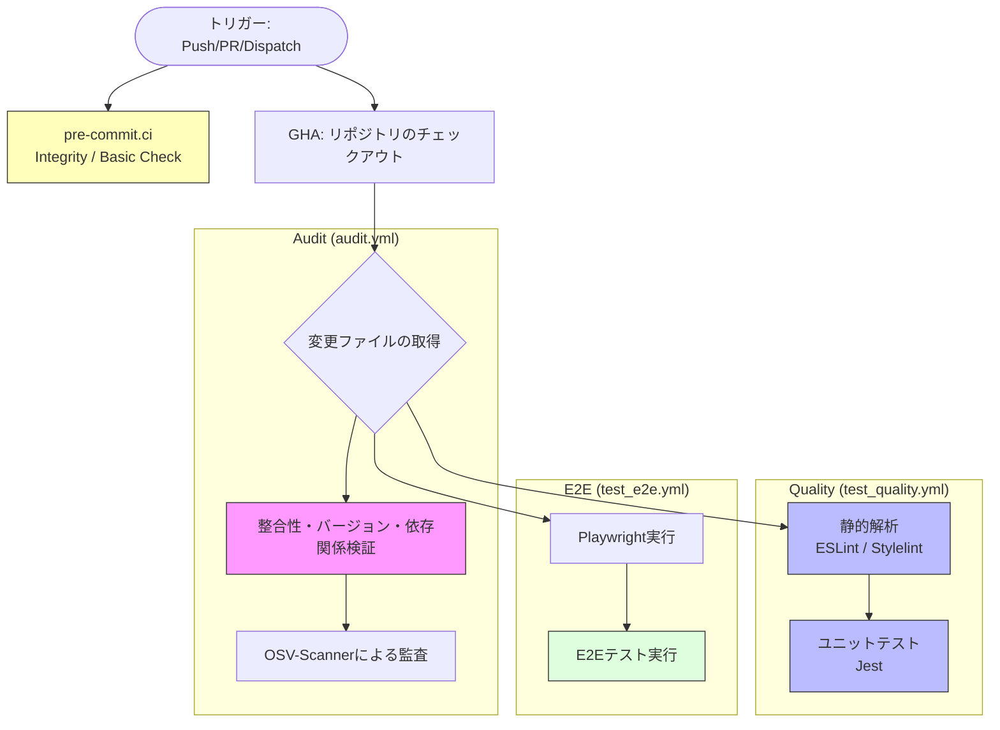
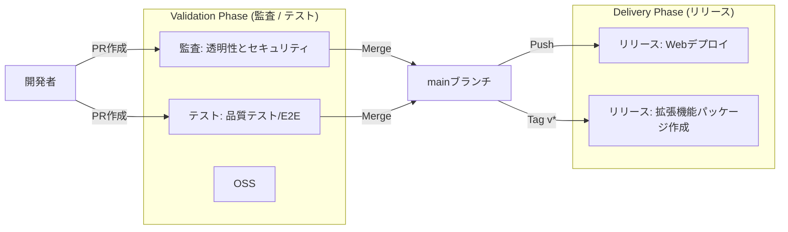

# GitHub Actions ワークフロー構成

本プロジェクトにおける CI/CD および自動化プロセスの概要と詳細をまとめます。

> 2026-04: 再現性とポリシー整合性を高めるため、`npm ci` の採用、`concurrency` による重複実行抑制、`scripts/verify_project_policies.py` と `scripts/language_check.py` を使ったガードを追加しました。

## 共通設定

GitHub Actions Runners における Node.js 20 の廃止に伴い、プロジェクト全体のワークフロー環境を以下のように統一しています。

- **Node.js 実行環境**: すべてのワークフローで Node.js **v24** を使用します。
- **先行オプトイン**: `FORCE_JAVASCRIPT_ACTIONS_TO_NODE24: true` 環境変数を設定し、アクションが Node.js 24 ランタイムで動作するように強制しています。
- **アクションの安定版採用**: `actions/checkout@v4`, `actions/setup-node@v4`, `actions/setup-python@v5`, `actions/cache@v4` 等の安定したメジャーバージョンを採用しています。不具合を避けるため、未リリースの将来バージョン（@v6等）の指定は行いません。

## ワークフロー一覧

各ワークフローは、役割に応じて **Audit（監査）**, **Test（テスト）**, **Release（公開）**, **Update（更新）** の4つのグループに分類されています。

| グループ | ワークフロー名 | ファイル | 概要 | トリガー |
| :--- | :--- | :--- | :--- | :--- |
| Audit | **監査: 透明性とセキュリティ** | `audit.yml` | コード整合性、バージョン検証、OSS脆弱性検査、依存関係監査 | `main`へのPush/PR (*1), 手動 |
| Test | **テスト: コード品質 (Lint/Unit)** | `test_quality.yml` | ESLint, Stylelint, Jest による静的解析とユニットテスト | `main`へのPush/PR (*1), 手動 |
| Test | **テスト: E2E** | `test_e2e.yml` | Playwright による End-to-End テスト | `main`へのPush/PR (*1), 手動 |
| Test | **テスト: アニメーション品質** | `test_animation.yml` | アニメーションモジュールの品質（描画率、変化率）評価 | `main`へのPush/PR (*1, *2), 手動 |
| Release | **リリース: Webアプリケーションのデプロイ** | `release_web_deploy.yml` | Vercelへの自動デプロイ（Landing Page, Studio等） | `main`へのPush/PR (*1), 手動 |
| **Release** | **リリース: 拡張機能パッケージの公開** | `release_extension_packages.yml` | バージョンタグ打刻時の自動ビルドおよびGitHub Release作成 | `v*.*.*`タグのPush |
| Update | **更新: ガイド用スクリーンショット** | `update_guide_screenshots.yml` | クイックスタートガイド用画像のリポジトリ自動反映 | `main`へのPush/PR (*1), 手動 |

- (*1) `main`へのPush時は `paths` フィルタに関わらず常に実行されます（ブランチ保護ルールとの兼ね合い）。
- (*2) PR時は `shared/js/animation/**` に変更がある場合のみ実行されます。

## ワークフロー設計指針

### 高速フィードバックと役割分担 (pre-commit.ci)

本プロジェクトでは、開発効率の向上とポリシー遵守を目的として **pre-commit** を導入しています。

- **ローカル環境 (pre-commit)**:
    - 開発者は手元の環境に pre-commit をインストールし、pre-commit install でフックを有効化することで、コミット時に静的解析 (ESLint, Stylelint) やユニットテスト (Jest) を含む検証が自動実行されます。これにより CI でのエラーを最小限に抑えることができます。
- **pre-commit.ci (PR時)**:
    - プルリクエスト作成時に、リポジトリ整合性やバージョン検証などの軽量な監査を高速に実行します。
    - **制限**: Node.js 環境やブラウザ環境を必要とする検証 (ESLint, Stylelint, Jest, Playwright) は、CI での実行速度や再現性を考慮し、pre-commit.ci では実行をスキップしています。
- **GitHub Actions (GHA)**:
    - **役割**: 環境依存の検証 (ESLint, Stylelint)、ユニットテスト (Jest)、E2Eテスト (Playwright) を含む、最終的な品質保証を担います。
    - 各プラットフォームのクリーンな環境で実行され、マージ可否の最終判断基準となります。

### ブランチトリガーと無限ループ防止
PR マージ時の動作を確実にするため、および自動更新による無限ループを防ぐため、以下の指針を徹底しています。

- **PR作成権限の確保:** 資産の自動更新などで Pull Request を自動作成するワークフロー（`peter-evans/create-pull-request` 等を使用する場合）を正しく動作させるため、リポジトリ設定の **Settings > Actions > General > Workflow permissions** にて **"Allow GitHub Actions to create and approve pull requests"** を有効にする必要があります。これは YAML ファイル内で `pull-requests: write` を指定している場合でも必要な設定です。
- **マージトリガー:** PR マージ時にワークフローを確実に実行するため、`pull_request` トリガーに加えて、`main` ブランチへの `push` トリガーを明示的に含めます。
- **無限ループの防止:** アセットを自動生成してリポジトリにコミットするワークフロー（`update_guide_screenshots.yml` 等）では、`push` トリガーに `paths` フィルタを設定し、生成されたアセット自体（例: `shared/assets/guide/*.png`）を監視対象から**除外**します。これにより、自動コミットが自身のトリガーを再度引くことを防ぎます。
- **プッシュ競合の回避:** 自動アセット更新（`update_guide_screenshots.yml` 等）において、`stefanzweifel/git-auto-commit-action@v5` を `pull_request` イベントで使用する場合、明示的に `branch: ${{ github.head_ref }}` を指定する必要があります。これにより、他の並行ワークフローが原因でローカルチェックアウトがリモートから乖離した場合でも、正しいフィーチャーブランチに変更がプッシュされることを保証します。
- **ブランチ名:** 開発およびマージ先ブランチには一貫して `main` を使用します。`master` はレガシー名称として使用を禁止します。

---

## 自動化スクリプト

### 拡張機能パッケージの自動生成（Release & Dev）

本プロジェクトでは、製品版（Release）と開発・検証用（Dev）の2種類のパッケージを自動生成します。

- **実行タイミング**: バージョンタグ（`v*.*.*`）のプッシュ時に `release_extension_packages.yml` が起動し、Release 用と Dev 用の両方の ZIP ファイルを自動的に GitHub Release にアップロードします。
- **実行コマンド**: `npm run build` (内部で `scripts/create_package.py` を実行)
- **パッケージの種類**:
    - **Release版**: 公式配布用。青色アイコン、正規名称。開発専用アニメーションは物理的に除外されます。
    - **Dev版**: 開発・サポート用。オレンジ色アイコン（#ea580c）、名称に `(Dev v0.32.0)` 形式のサフィックスを付与。すべての開発用アニメーションを含みます。
- **ブランディング自動化**: `scripts/generate_png_icons.py` が SVG の背景色を動的に変更し、各サイズ（16, 32, 48, 128）の PNG アイコンを生成します。この処理はビルドプロセス (`create_package.py`) の中で自動的に行われるため、事前作業は不要です。
- **クリーンパブリッシュ**: ブラウザのキャッシュや優先度の問題を避けるため、ZIP パッケージからはソースの `icon.svg` が物理的に除外され、生成された PNG のみが含まれます。

### クイックスタートガイドのスクリーンショット自動作成

ランディングページからアクセス可能なクイックスタートガイド (`guide.html`) に掲載するスクリーンショットを自動的に作成・更新する仕組みを備えています。

- **実行コマンド**: `npm run update-guide-images`
- **内部処理**:
  1. `scripts/generate_guide_screenshots.js` が実行されます。
  2. Playwright を使用して `projects/app/app.html` を開き、内部状態（ダミーデータ等）を注入します。
  3. 各言語（JA, EN等）ごとに、主要なUIコンポーネントのスクリーンショットを要素単位 (`locator.screenshot()`) で取得します。
  4. 生成された画像は `shared/assets/guide/` に保存されます。
- **自動化**: `update_guide_screenshots.yml` ワークフローにより、コード変更時にこれらの画像が自動的に再生成され、リポジトリにコミットされます。
- **検証**: CI (`audit.yml`, `test_quality.yml`, `test_e2e.yml`) の E2E テストフェーズ（`test_e2e.yml`）において、`tests/guide_verification.spec.js` が実行され、画像ファイルの存在と内容の妥当性がチェックされます。

---

## 主要なワークフローの構成

### 1. 監査とテスト (Audit & Test)

旧 `ci.yml` を機能別に分割し、並列実行と実行結果の明確化を図っています。

#### フローチャート (Audit & Test)

#### 特徴的な条件判断
- **トリガーの最適化**: ほとんどのワークフローには `paths` フィルタが設定されており、関連性のないファイル（ドキュメントのみの変更など）の更新時には実行をスキップすることで、リソース（Vercel デプロイ枠など）を節約します。
- **整合性・テスト実行**: `projects/app/`, `shared/`, `tests/`, `scripts/` 等の重要ファイルに変更がある場合のみ実行（`tj-actions/changed-files` を活用）。手動実行時は全ファイルを対象。
- **E2Eテスト**: `test_e2e.yml` はプルリクエスト、プッシュ（mainマージ時）、または手動実行時に実行されます。

---

### 2. 公開・配布 (Release)

#### Webアプリケーションのデプロイ (`release_web_deploy.yml`)
GitHub Actions 経由でビルドを行い、Vercel へデプロイします。
プルリクエスト時にもプレビュー環境が構築されるため、マージ前に Release/Dev 各 ZIP パッケージの動作やブランディング（オレンジアイコン等）を実機で確認することが可能です。

#### 拡張機能パッケージの公開 (`release_extension_packages.yml`)
Node.js **v24** 環境で動作します。本番用の Release ZIP と検証用の Dev ZIP の両方を生成し、GitHub Release にアセットとしてアップロードします。

---

## CI/CD 全体の統合ビュー

### プロセス・フロー概略図

## トラブルシューティング

### GitHub Security タブに "Action workflow file not found" と表示される場合

以前存在していたワークフローファイル（例: `audit_oss_compliance.yml`）が削除されたり、`audit.yml` に統合されたりした際、GitHub の Code scanning 設定に古い登録が残ることがあります。この場合、以下の手順で設定を削除してください。

1. リポジトリの **Security** タブを開く。
2. 左メニューの **Code scanning** をクリック。
3. 右上の **Tool status** ボタンをクリックしてステータスページを開き、不要になった構成（例: `audit_oss_compliance.yml`）の「...」メニューから **Delete**（削除）を選択してください。

## ドキュメントの維持管理

本ドキュメントは、GitHub Actions のワークフローファイル（`.github/workflows/*.yml`）に変更が加えられた際、または新しいワークフローが追加された際に、自律的に更新される必要があります。
詳細は `AGENTS.md` の指示に従ってください。

---

## 免責事項 (Disclaimer)
本ソフトウェアは、個人によって開発されたオープンソース・プロジェクトであり、**無保証 (AS IS)** です。
利用に際して生じたいかなる損害についても、開発者は一切の責任を負いません。
MIT ライセンスの規定に基づき、「現状のまま」提供されるものとします。自己責任でご利用ください。

This software is a personal open-source project and is provided **"AS IS"** without warranty of any kind.
The developer shall not be liable for any damages (including data loss, work interruption, etc.) arising from the use of this software.
Use at your own risk, as per the MIT License.
