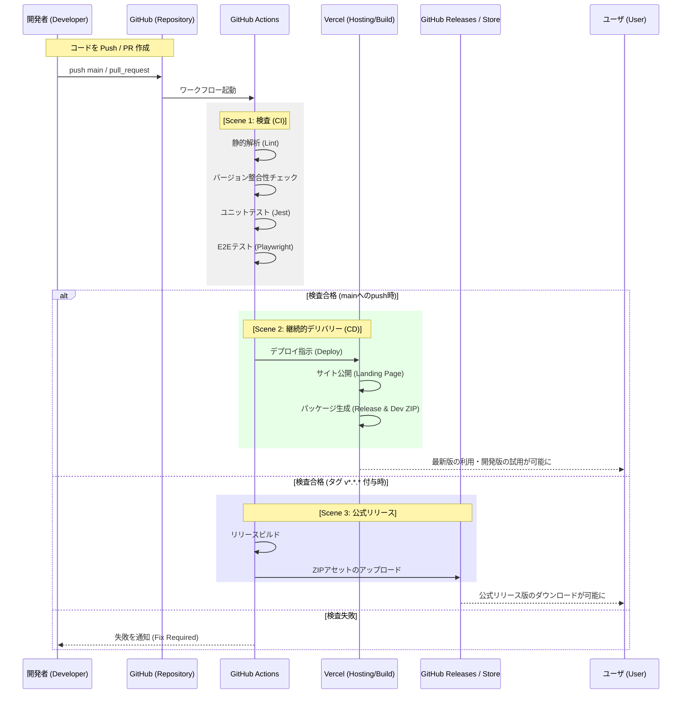

# GitHub Actions ワークフロー構成と CI/CD プロセス

本プロジェクトにおける CI/CD（継続的インテグレーション／継続的デリバリー）および自動化プロセスの概要と詳細をまとめます。GitHub Actions を活用することで、「品質の維持」と「リリースの自動化」を両立しています。

---

## 1. 基本用語の定義
GitHub Actions や CI/CD を初めて触れる開発者向けに、本プロジェクトで使用される用語を整理します。

| 用語 | 定義 | Atlassian Bamboo での対応（参考） |
| :--- | :--- | :--- |
| **CI (Continuous Integration)** | 継続的インテグレーション。コード変更の度に自動でテストや検査を行い、品質を保つ仕組み。 | Plan / Build |
| **CD (Continuous Delivery)** | 継続的デリバリー。検査済みのコードを、いつでも本番環境（Vercel 等）へ公開できる状態にする仕組み。 | Deployment Project |
| **Workflow** | GitHub Actions における一連の処理プロセス全体（`.yml` ファイル単位）。 | Plan |
| **Job** | ワークフロー内の実行単位。複数の Step で構成される。 | Stage |
| **Step** | ジョブ内の個別のタスク（コマンドの実行やアクションの呼び出し）。 | Task |
| **Runner** | 処理が実際に実行される仮想マシン（Ubuntu 等）。 | Remote Agent |
| **Secret** | パスワードやトークンなどの機密情報。GitHub 上で暗号化して管理される。 | Variables (Password type) |
| **Artifact** | 処理の過程で生成されるファイル（ZIPパッケージ等）。 | Artifact |
| **Lint (リンター)** | コードの書き方（構文やスタイル）に問題がないか自動チェックするツール。 | (コード解析タスク) |

---

## 2. 全体像：コード修正から公開まで
開発者がコードを GitHub へ送信してから、ユーザが利用可能になるまでの大まかな流れです。

---

## 3. ワークフロー一覧

各ワークフローは、役割に応じて **Audit（監査）**, **Test（テスト）**, **Release（公開）**, **Update（更新）** の4つのグループに分類されています。

| グループ | ワークフロー名 | ファイル | 概要 | トリガー |
| :--- | :--- | :--- | :--- | :--- |
| **Audit** | **監査: コードとバージョンの整合性** | `audit_integrity.yml` | ルートディレクトリのクリーンネス、バージョン整合性の検証 | `main`へのPush/PR, 手動 |
| **Audit** | **監査: OSSコンプライアンス** | `audit_oss_compliance.yml` | SCANOSSによる外部コード混入（スニペット盗用）の監査 | `main`へのPush/PR, 手動 |
| **Test** | **テスト: コード品質 (Lint/Unit)** | `test_quality.yml` | ESLint, Stylelint, Jest による静的解析とユニットテスト | `main`へのPush/PR, 手動 |
| **Test** | **テスト: E2E** | `test_e2e.yml` | Playwright による End-to-End テスト | `main`へのPR, 手動 |
| **Test** | **テスト: アニメーション品質** | `test_animation.yml` | アニメーションモジュールの品質（描画率、変化率）評価 | `main`へのPR (*1), 手動 |
| **Release** | **リリース: Webアプリケーションのデプロイ** | `release_web_deploy.yml` | Vercelへの自動デプロイ（Landing Page, Studio等） | `main`へのPush/PR, 手動 |
| **Release** | **リリース: 拡張機能パッケージの公開** | `release_extension_packages.yml` | バージョンタグ打刻時の自動ビルドおよびGitHub Release作成 | `v*.*.*`タグのPush |
| **Update** | **更新: ガイド用スクリーンショット** | `update_guide_screenshots.yml` | クイックスタートガイド用画像のリポジトリ自動反映 | `main`へのPush/PR, 手動 |

- (*1) `shared/js/animation/**` に変更がある場合のみ実行

---

## 4. 自動化の詳細プロセス

### 4.1. 検査プロセス (CI)
プルリクエスト（PR）の作成時やブランチへのプッシュ時に実行されます。目的は「壊れたコードを本番環境に入れないこと」です。

- **判断基準**: すべてのスクリプトとテストがエラーなしで終了すること。
- **アニメーション品質**: 新しく追加・修正されたアニメーションが、5秒以内の応答性や一定の密度を維持していること（アニメーション評価システム）。

### 4.2. 継続的デリバリー (CD)
`main` ブランチにコードがマージされると、自動的に Vercel を通じた公開作業が始まります。

- **処理の目的**: 最新のソースコードから、紹介ページ（ランディングページ）を更新し、インストール可能な ZIP ファイルを提供すること。
- **二種類のパッケージ生成**:
    - **Release版**: 公式配布用。青色アイコン、正規名称。開発専用アニメーションは物理的に除外されます。
    - **Dev版**: 開発・サポート用。オレンジ色アイコン、名称に `(Dev vX.X.X)` サフィックスを付与、すべての開発用アニメーションを同梱。

### 4.3. 公式リリース (配布プロセス)
バージョンタグ（例: `v0.32.0`）がリポジトリにプッシュされると、GitHub Releases にアセットが自動登録されます。

- **処理の目的**: 特定のバージョンを正式な成果物として固定し、永続的にダウンロード可能な状態にすること。
- **成果物**: 4つの ZIP ファイル（Chrome/Firefox 用の Release 版および Dev 版）。

---

## 5. 自動化スクリプトの役割

- **scripts/create_package.py**: 拡張機能の ZIP パッケージを作成します。Release/Dev 版の切り分けやアセットの物理的除外を行います。
- **scripts/generate_png_icons.py**: SVG アイコンから、指定された色（Release/Dev）の各サイズ PNG アイコンを自動生成します。
- **scripts/update_guide_images.js**: クイックスタートガイド (`guide.html`) 用のスクリーンショットを Playwright で自動生成します。
- **scripts/check_version.py**: `package.json`, `version.json`, マニフェスト間のバージョン整合性をチェックします。

---

## 6. Vercel への初回設定方法
*※すでに設定済みの場合は不要です。*

1. **Vercel での準備**
   - Vercel にログインし、プロジェクトを作成（GitHub リポジトリをインポート）。
   - Framework Preset は「Other」を選択。
   - プロジェクト設定から `Project ID`, `Org ID` を取得し、`Access Token` を発行。
2. **GitHub リポジトリでの設定**
   - GitHub リポジトリの **Settings** > **Secrets and variables** > **Actions** に `VERCEL_TOKEN`, `VERCEL_ORG_ID`, `VERCEL_PROJECT_ID` を追加。

---

## 7. ドキュメントの維持管理

本ドキュメントは、GitHub Actions のワークフローファイル（`.github/workflows/*.yml`）に変更が加えられた際、または新しいワークフローが追加された際に、自律的に更新される必要があります。
詳細は `AGENTS.md` の指示に従ってください。

---

> [!CAUTION]
> **免責事項 / Disclaimer**
> 本ドキュメントは、本プロジェクトの開発者が自身の環境（Vercel）で構築した際の参考情報を共有するものです。開発者は Vercel の利用を特別に推奨しているわけではなく、また他のサービスを含め、本手順が将来にわたって正常に動作することを保証しません。自動化設定に伴う機密情報の管理やデプロイは、すべて利用者の自己責任において行ってください。
