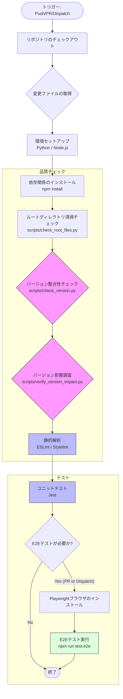
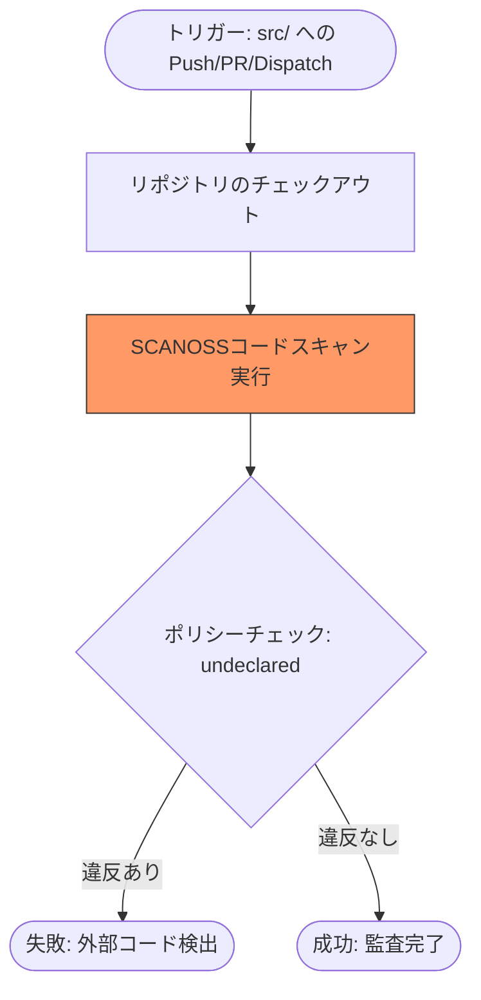
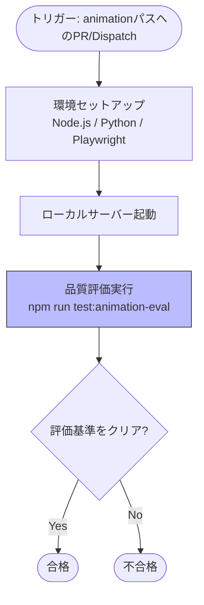
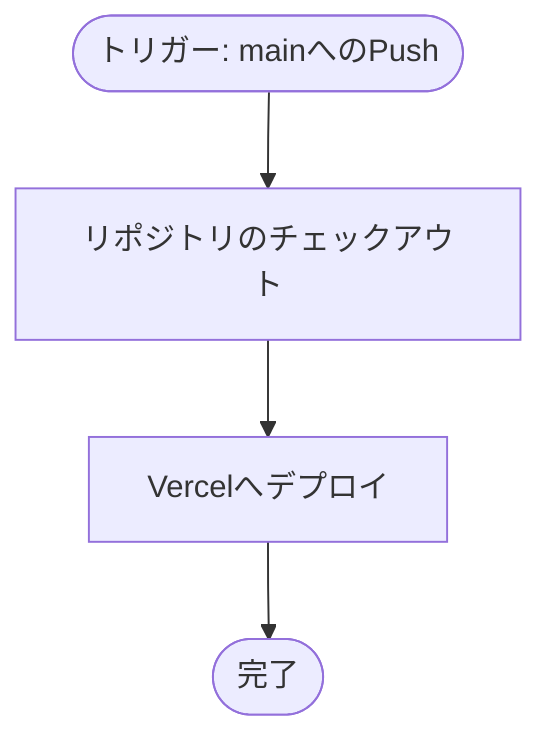
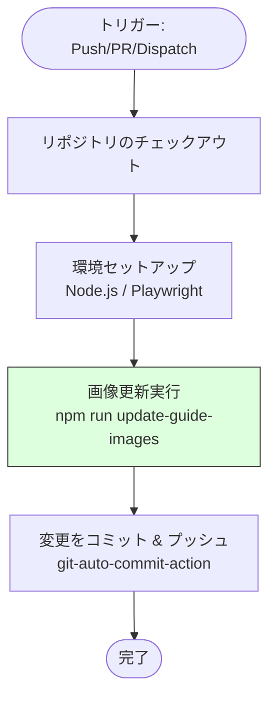
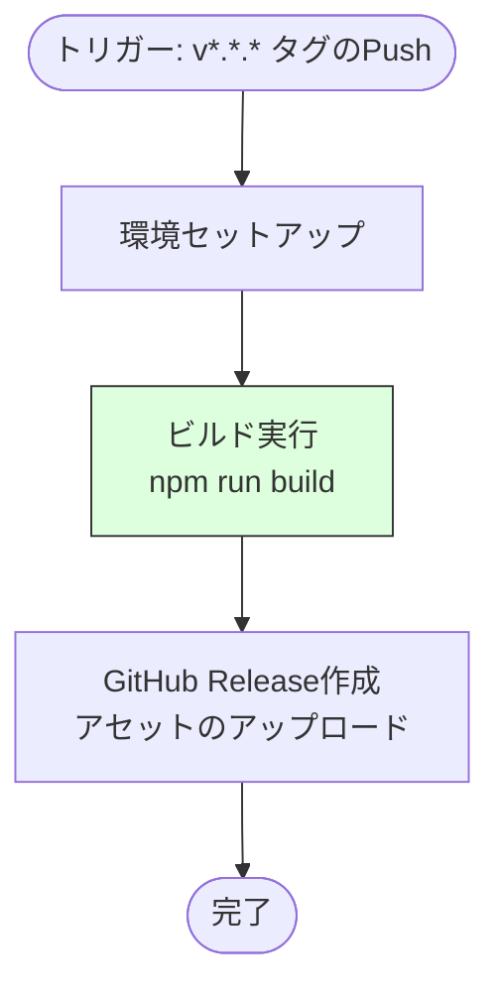
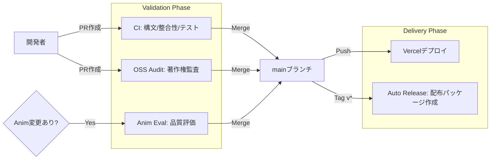

# GitHub Actions ワークフロー構成

本プロジェクトにおける CI/CD および自動化プロセスの概要と詳細をまとめます。

## ワークフロー一覧

| ワークフロー名 | ファイル | 概要 | トリガー |
| :--- | :--- | :--- | :--- |
| **CI** | `ci.yml` | コードの品質管理、バージョン整合性チェック、テスト実行 | `main`へのPush/PR, 手動 |
| **OSS Fragment Audit** | `oss_audit.yml` | SCANOSSによる外部コード混入（スニペット盗用）の監査 | `main`へのPush/PR, 手動 |
| **Animation Quality Evaluation** | `animation_eval.yml` | アニメーションモジュールの品質（描画率、変化率）評価 | `main`へのPR (src/js/animation/**), 手動 |
| **Update Guide Assets** | `update_guide_assets.yml` | クイックスタートガイド用スクリーンショットの自動生成と更新 | `main`へのPush/PR, 手動 |
| **Deploy to Vercel** | `deploy.yml` | 本番・開発環境への自動デプロイ | `main`へのPush |
| **Auto Release** | `release.yml` | バージョンタグ打刻時の自動ビルドおよびGitHub Release作成（高速化のためPlaywrightキャッシュ対応） | `v*.*.*`タグのPush |

---

## 自動化スクリプト

### クイックスタートガイドのスクリーンショット自動作成

ランディングページからアクセス可能なクイックスタートガイド (`guide.html`) に掲載するスクリーンショットを自動的に作成・更新する仕組みを備えています。

- **実行コマンド**: `npm run update-guide-images`
- **内部処理**:
  1. `scripts/generate_guide_screenshots.js` が実行されます。
  2. Playwright を使用して `src/app.html` を開き、内部状態（ダミーデータ等）を注入します。
  3. 各言語（JA, EN等）ごとに、主要なUIコンポーネントのスクリーンショットを要素単位 (`locator.screenshot()`) で取得します。
  4. 生成された画像は `src/assets/guide/` に保存されます。
- **自動化**: `update_guide_assets.yml` ワークフローにより、コード変更時にこれらの画像が自動的に再生成され、リポジトリにコミットされます。
- **検証**: CI (`ci.yml`) の E2E テストフェーズにおいて、`tests/guide_verification.spec.js` が実行され、画像ファイルの存在と内容の妥当性がチェックされます。

---

## 各ワークフローの詳細

### 1. CI (`ci.yml`)

リポジトリの整合性と品質を担保する最も重要なワークフローです。変更されたファイルに応じて実行ステップを最適化しています。

#### フローチャート

#### 特徴的な条件判断
- **ルートディレクトリ清掃チェック**: 一時的なスクリプトや不正なファイルがリポジトリのルートに混入していないかを検証します。
- **バージョンチェック**: `src/`, `tests/`, `scripts/` 等の重要ファイルに変更がある場合のみ実行。
- **Lint/Unit Test**: 原則として変更されたファイルのみを対象に実行（`tj-actions/changed-files` を活用）。手動実行時は全ファイルを対象。
- **E2Eテスト**: PRまたは手動実行時のみ。Push時は実行されません。

---

### 2. OSS Fragment Audit (`oss_audit.yml`)

「100% オリジナルコード」を証明するための監査フローです。

#### フローチャート

---

### 3. Animation Quality Evaluation (`animation_eval.yml`)

アニメーションモジュールの描画品質を自動評価します。

#### フローチャート

---

### 4. Deploy to Vercel (`deploy.yml`)

#### フローチャート

---

### 5. Update Guide Assets (`update_guide_assets.yml`)

ガイド用スクリーンショットを自動的に最新化し、リポジトリに反映します。

#### フローチャート

### 6. Auto Release (`release.yml`)

#### フローチャート

---

## CI/CD 全体の統合ビュー

各ワークフローがどのタイミングでどのように機能するかをまとめます。

### トリガー別の動作一覧

| イベント | CI | OSS Audit | Guide Assets | Animation Eval | Deploy | Release |
| :--- | :---: | :---: | :---: | :---: | :---: | :---: |
| **Push (main)** | ✅ (テストのみ) | ✅ | ✅ | - | ✅ | - |
| **Pull Request (main)** | ✅ (+E2E) | ✅ | ✅ | ✅ (*1) | - | - |
| **Tag (v*.*.*)** | - | - | - | - | - | ✅ |
| **Manual (Dispatch)** | ✅ | ✅ | ✅ | ✅ | - | - |

- (*1) `src/js/animation/**` に変更がある場合のみ実行

### プロセス・フロー概略図

## ドキュメントの維持管理

本ドキュメントは、GitHub Actions のワークフローファイル（`.github/workflows/*.yml`）に変更が加えられた際、または新しいワークフローが追加された際に、自律的に更新される必要があります。
詳細は `AGENTS.md` の指示に従ってください。

---

## 免責事項 (Disclaimer)
本ソフトウェアは、個人によって開発されたオープンソース・プロジェクトであり、**無保証 (AS IS)** です。
利用に際して生じたいかなる損害（データの消失、業務の中断、PCの不具合など）についても、開発者は一切の責任を負いません。
MIT ライセンスの規定に基づき、「現状のまま」提供されるものとします。自己責任でご利用ください。

This software is a personal open-source project and is provided **"AS IS"** without warranty of any kind.
The developer shall not be liable for any damages (including data loss, work interruption, etc.) arising from the use of this software.
Use at your own risk, as per the MIT License.
