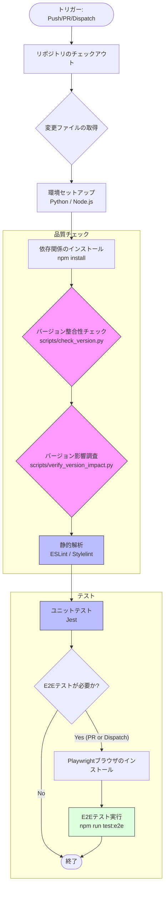
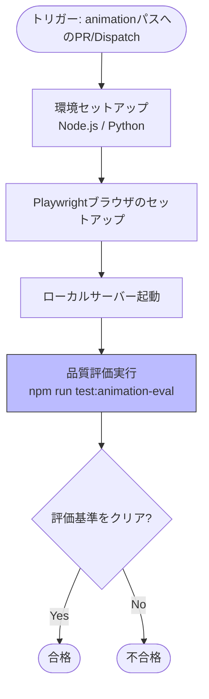
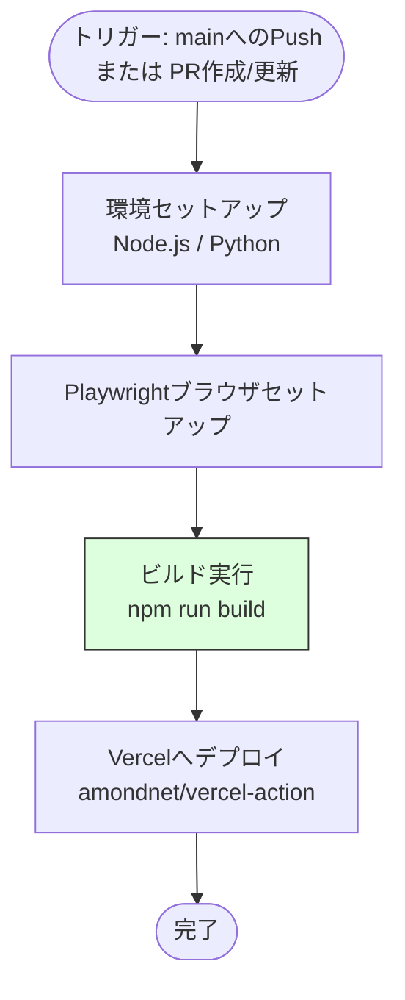
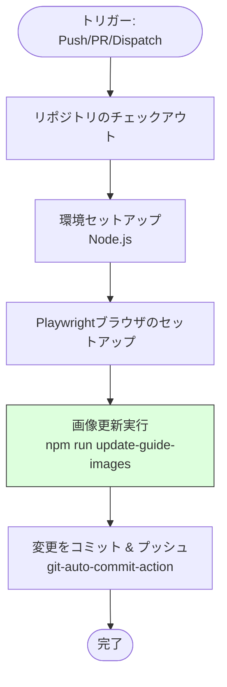
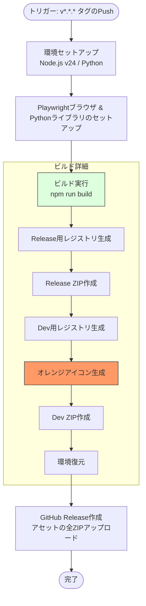
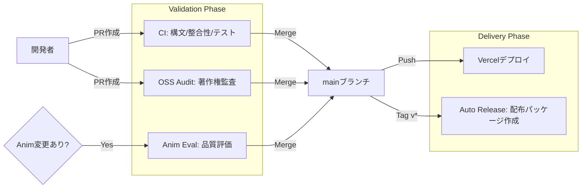

# GitHub Actions ワークフロー構成

本プロジェクトにおける CI/CD および自動化プロセスの概要と詳細をまとめます。

## 共通設定

GitHub Actions Runners における Node.js 20 の廃止に伴い、プロジェクト全体のワークフロー環境を以下のように統一しています。

- **Node.js 実行環境**: すべてのワークフローで Node.js **v24** を使用します。
- **先行オプトイン**: `FORCE_JAVASCRIPT_ACTIONS_TO_NODE24: true` 環境変数を設定し、アクションが Node.js 24 ランタイムで動作するように強制しています。
- **アクションの最新化**: `actions/checkout@v6`, `actions/setup-node@v6`, `actions/setup-python@v6`, `actions/cache@v5` 等の最新メジャーバージョンを採用しています。

## ワークフロー一覧

| ワークフロー名 | ファイル | 概要 | トリガー |
| :--- | :--- | :--- | :--- |
| **CI** | `ci.yml` | コードの品質管理、バージョン整合性チェック、テスト実行 | `main`へのPush/PR, 手動 |
| **OSS Fragment Audit** | `oss_audit.yml` | SCANOSSによる外部コード混入（スニペット盗用）の監査 | `main`へのPush/PR, 手動 |
| **Animation Quality Evaluation** | `animation_eval.yml` | アニメーションモジュールの品質（描画率、変化率）評価 | `main`へのPR (shared/js/animation/**), 手動 |
| **Update Guide Assets** | `update_guide_assets.yml` | クイックスタートガイド用スクリーンショットの自動生成と更新 | `main`へのPush/PR, 手動 |
| **Deploy to Vercel** | `deploy.yml` | 本番・開発環境への自動デプロイ | `main`へのPush |
| **Auto Release** | `release.yml` | バージョンタグ打刻時の自動ビルドおよびGitHub Release作成（高速化のためPlaywrightキャッシュ対応） | `v*.*.*`タグのPush |

---

## 自動化スクリプト

### 拡張機能パッケージの自動生成（Release & Dev）

本プロジェクトでは、製品版（Release）と開発・検証用（Dev）の2種類のパッケージを自動生成します。

- **実行タイミング**: バージョンタグ（`v*.*.*`）のプッシュ時に `release.yml` が起動し、Release 用と Dev 用の両方の ZIP ファイルを自動的に GitHub Release にアップロードします。
- **実行コマンド**: `npm run build` (内部で `scripts/create_package.py` を実行)
- **パッケージの種類**:
    - **Release版**: 公式配布用。青色アイコン、正規名称。開発専用アニメーションは物理的に除外されます。
    - **Dev版**: 開発・サポート用。オレンジ色アイコン（#ea580c）、名称に `(Dev v0.32.0)` 形式のサフィックスを付与。すべての開発用アニメーションを含みます。
- **ブランディング自動化**: `scripts/generate_png_icons.py` が SVG の背景色を動的に変更し、各サイズ（16, 32, 48, 128）の PNG アイコンを生成します。この処理はビルドプロセス (`create_package.py`) の中で自動的に行われるため、事前作業は不要です。
- **クリーンパブリッシュ**: ブラウザのキャッシュや優先度の問題を避けるため、ZIP パッケージからはソースの `icon.svg` が物理的に除外され、生成された PNG のみが含まれます。

### クイックスタートガイドのスクリーンショット自動作成

ランディングページからアクセス可能なクイックスタートガイド (`guide.html`) に掲載するスクリーンショットを自動的に作成・更新する仕組みを備えています。

- **実行コマンド**: `npm run update-guide-images`
- **内部処理**:
  1. `scripts/generate_guide_screenshots.js` が実行されます。
  2. Playwright を使用して `projects/app/app.html` を開き、内部状態（ダミーデータ等）を注入します。
  3. 各言語（JA, EN等）ごとに、主要なUIコンポーネントのスクリーンショットを要素単位 (`locator.screenshot()`) で取得します。
  4. 生成された画像は `shared/assets/guide/` に保存されます。
- **自動化**: `update_guide_assets.yml` ワークフローにより、コード変更時にこれらの画像が自動的に再生成され、リポジトリにコミットされます。
- **検証**: CI (`ci.yml`) の E2E テストフェーズにおいて、`tests/guide_verification.spec.js` が実行され、画像ファイルの存在と内容の妥当性がチェックされます。

---

## 各ワークフローの詳細

### 1. CI (`ci.yml`)

リポジトリの整合性と品質を担保する最も重要なワークフローです。変更されたファイルに応じて実行ステップを最適化しています。

#### フローチャート

#### 特徴的な条件判断
- **バージョンチェック**: `src/`, `tests/`, `scripts/` 等の重要ファイルに変更がある場合のみ実行。
- **Lint/Unit Test**: 原則として変更されたファイルのみを対象に実行（`tj-actions/changed-files` を活用）。手動実行時は全ファイルを対象。
- **E2Eテスト**: PRまたは手動実行時のみ。Push時は実行されません。

---

### 2. OSS Fragment Audit (`oss_audit.yml`)

「100% オリジナルコード」を証明するための監査フローです。

#### フローチャート

---

### 3. Animation Quality Evaluation (`animation_eval.yml`)

アニメーションモジュールの描画品質を自動評価します。

#### フローチャート

---

### 4. Deploy to Vercel (`deploy.yml`)

GitHub Actions 経由でビルドを行い、Vercel へデプロイします。
プルリクエスト時にもプレビュー環境が構築されるため、マージ前に Release/Dev 各 ZIP パッケージの動作やブランディング（オレンジアイコン等）を実機で確認することが可能です。

#### フローチャート

---

### 5. Update Guide Assets (`update_guide_assets.yml`)

ガイド用スクリーンショットを自動的に最新化し、リポジトリに反映します。

#### フローチャート

### 6. Auto Release (`release.yml`)

Node.js **v24** 環境で動作します。
このワークフローは、本番用の Release ZIP と検証用の Dev ZIP の両方を生成し、GitHub Release にアセットとしてアップロードします。

Pythonスクリプトによるアイコン生成 (`generate_png_icons.py`) のため、Node.js版のPlaywrightがインストールしたブラウザを共有する形で、Python版のPlaywrightライブラリを `pip` でインストール・セットアップします。

#### フローチャート

---

## CI/CD 全体の統合ビュー

各ワークフローがどのタイミングでどのように機能するかをまとめます。

### トリガー別の動作一覧

| イベント | CI | OSS Audit | Guide Assets | Animation Eval | Deploy | Release |
| :--- | :---: | :---: | :---: | :---: | :---: | :---: |
| **Push (main)** | ✅ (テストのみ) | ✅ | ✅ | - | ✅ | - |
| **Pull Request (main)** | ✅ (+E2E) | ✅ | ✅ | ✅ (*1) | - | - |
| **Tag (v*.*.*)** | - | - | - | - | - | ✅ |
| **Manual (Dispatch)** | ✅ | ✅ | ✅ | ✅ | - | - |

- (*1) `shared/js/animation/**` に変更がある場合のみ実行

### プロセス・フロー概略図

## ドキュメントの維持管理

本ドキュメントは、GitHub Actions のワークフローファイル（`.github/workflows/*.yml`）に変更が加えられた際、または新しいワークフローが追加された際に、自律的に更新される必要があります。
詳細は `AGENTS.md` の指示に従ってください。
