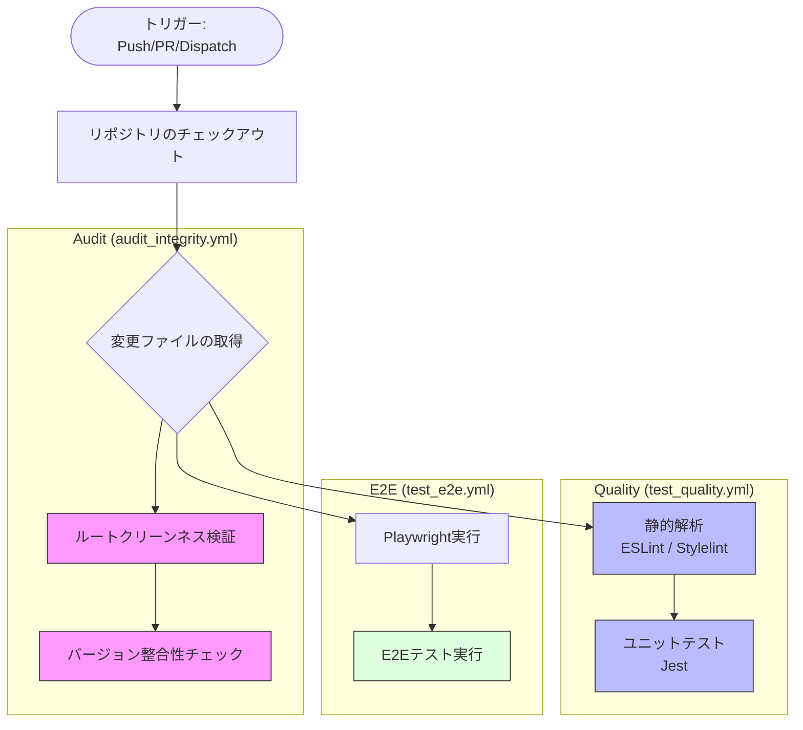
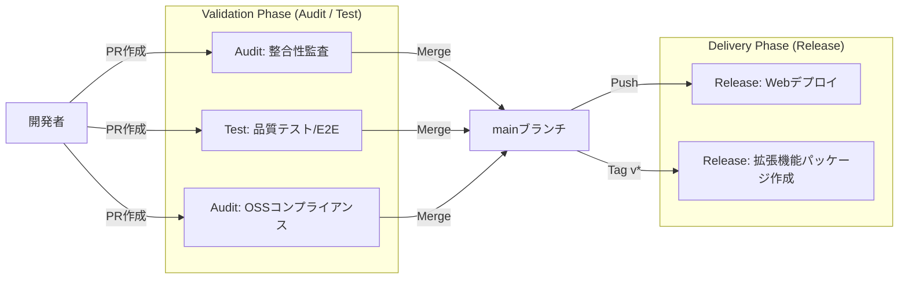

# GitHub Actions ワークフロー構成

本プロジェクトにおける CI/CD および自動化プロセスの概要と詳細をまとめます。

## 共通設定

GitHub Actions Runners における Node.js 20 の廃止に伴い、プロジェクト全体のワークフロー環境を以下のように統一しています。

- **Node.js 実行環境**: すべてのワークフローで Node.js **v24** を使用します。
- **先行オプトイン**: `FORCE_JAVASCRIPT_ACTIONS_TO_NODE24: true` 環境変数を設定し、アクションが Node.js 24 ランタイムで動作するように強制しています。
- **アクションの最新化**: `actions/checkout@v6`, `actions/setup-node@v6`, `actions/setup-python@v6`, `actions/cache@v5` 等の最新メジャーバージョンを採用しています。

## ワークフロー一覧

各ワークフローは、役割に応じて **Audit（監査）**, **Test（テスト）**, **Release（公開）**, **Update（更新）** の4つのグループに分類されています。

| グループ | ワークフロー名 | ファイル | 概要 | トリガー |
| :--- | :--- | :--- | :--- | :--- |
| **Audit** | **コードとバージョンの整合性監査** | `audit_integrity.yml` | ルートディレクトリのクリーンネス、バージョン整合性の検証 | `main`へのPush/PR, 手動 |
| **Audit** | **OSSコンプライアンス監査** | `audit_oss_compliance.yml` | SCANOSSによる外部コード混入（スニペット盗用）の監査 | `main`へのPush/PR, 手動 |
| **Test** | **コード品質テスト (Lint/Unit)** | `test_quality.yml` | ESLint, Stylelint, Jest による静的解析とユニットテスト | `main`へのPush/PR, 手動 |
| **Test** | **E2Eテスト** | `test_e2e.yml` | Playwright による End-to-End テスト | `main`へのPR, 手動 |
| **Test** | **アニメーション品質評価** | `test_animation.yml` | アニメーションモジュールの品質（描画率、変化率）評価 | `main`へのPR (*1), 手動 |
| **Release** | **Webアプリケーションのデプロイ** | `release_web_deploy.yml` | Vercelへの自動デプロイ（Landing Page, Studio等） | `main`へのPush/PR, 手動 |
| **Release** | **拡張機能パッケージの公開** | `release_extension_packages.yml` | バージョンタグ打刻時の自動ビルドおよびGitHub Release作成 | `v*.*.*`タグのPush |
| **Update** | **ガイド用スクリーンショットの更新** | `update_guide_screenshots.yml` | クイックスタートガイド用画像のリポジトリ自動反映 | `main`へのPush/PR, 手動 |

- (*1) `shared/js/animation/**` に変更がある場合のみ実行

---

## 自動化スクリプト

### 拡張機能パッケージの自動生成（Release & Dev）

本プロジェクトでは、製品版（Release）と開発・検証用（Dev）の2種類のパッケージを自動生成します。

- **実行タイミング**: バージョンタグ（`v*.*.*`）のプッシュ時に `release_extension_packages.yml` が起動し、Release 用と Dev 用の両方の ZIP ファイルを自動的に GitHub Release にアップロードします。
- **実行コマンド**: `npm run build` (内部で `scripts/create_package.py` を実行)
- **パッケージの種類**:
    - **Release版**: 公式配布用。青色アイコン、正規名称。開発専用アニメーションは物理的に除外されます。
    - **Dev版**: 開発・サポート用。オレンジ色アイコン（#ea580c）、名称に `(Dev v0.32.0)` 形式のサフィックスを付与。すべての開発用アニメーションを含みます。
- **ブランディング自動化**: `scripts/generate_png_icons.py` が SVG の背景色を動的に変更し、各サイズ（16, 32, 48, 128）の PNG アイコンを生成します。この処理はビルドプロセス (`create_package.py`) の中で自動的に行われるため、事前作業は不要です。
- **クリーンパブリッシュ**: ブラウザのキャッシュや優先度の問題を避けるため、ZIP パッケージからはソースの `icon.svg` が物理的に除外され、生成された PNG のみが含まれます。

### クイックスタートガイドのスクリーンショット自動作成

ランディングページからアクセス可能なクイックスタートガイド (`guide.html`) に掲載するスクリーンショットを自動的に作成・更新する仕組みを備えています。

- **実行コマンド**: `npm run update-guide-images`
- **内部処理**:
  1. `scripts/generate_guide_screenshots.js` が実行されます。
  2. Playwright を使用して `projects/app/app.html` を開き、内部状態（ダミーデータ等）を注入します。
  3. 各言語（JA, EN等）ごとに、主要なUIコンポーネントのスクリーンショットを要素単位 (`locator.screenshot()`) で取得します。
  4. 生成された画像は `shared/assets/guide/` に保存されます。
- **自動化**: `update_guide_screenshots.yml` ワークフローにより、コード変更時にこれらの画像が自動的に再生成され、リポジトリにコミットされます。
- **検証**: `test_e2e.yml` ワークフローにおいて、`tests/guide_verification.spec.js` が実行され、画像ファイルの存在と内容の妥当性がチェックされます。

---

## 主要なワークフローの構成

### 1. 監査とテスト (Audit & Test)

旧 `ci.yml` を機能別に分割し、並列実行と実行結果の明確化を図っています。

#### フローチャート (Audit & Quality Test)

---

### 2. 公開・配布 (Release)

#### Webアプリケーションのデプロイ (`release_web_deploy.yml`)
GitHub Actions 経由でビルドを行い、Vercel へデプロイします。

#### 拡張機能パッケージの公開 (`release_extension_packages.yml`)
Node.js **v24** 環境で動作します。本番用の Release ZIP と検証用の Dev ZIP の両方を生成し、GitHub Release にアセットとしてアップロードします。

---

## CI/CD 全体の統合ビュー

### プロセス・フロー概略図

## ドキュメントの維持管理

本ドキュメントは、GitHub Actions のワークフローファイル（`.github/workflows/*.yml`）に変更が加えられた際、または新しいワークフローが追加された際に、自律的に更新される必要があります。
詳細は `AGENTS.md` の指示に従ってください。
