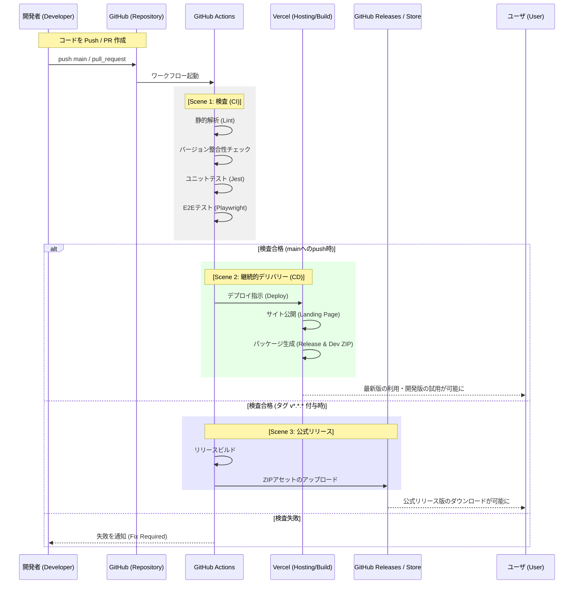
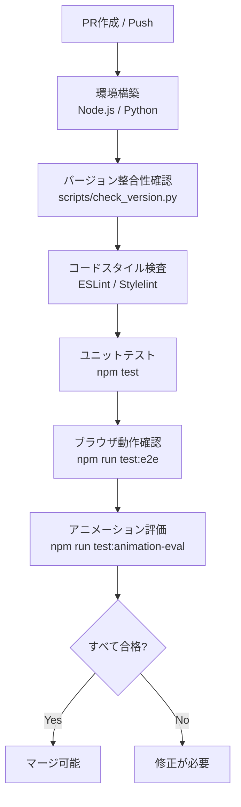
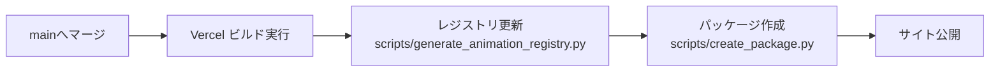
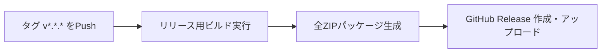

# 自動化された検査とデリバリー（CI/CD）の解説

本ドキュメントでは、本プロジェクトにおけるコードの検査、ビルド、および成果物の公開プロセスについて解説します。
GitHub Actions を活用することで、「品質の維持」と「リリースの自動化」を両立しています。

---

## 1. 基本用語の定義
GitHub Actions や CI/CD を初めて触れる開発者向けに、本プロジェクトで使用される用語を整理します。

| 用語 | 定義 | Atlassian Bamboo での対応（参考） |
| :--- | :--- | :--- |
| **CI (Continuous Integration)** | 継続的インテグレーション。コード変更の度に自動でテストや検査を行い、品質を保つ仕組み。 | Plan / Build |
| **CD (Continuous Delivery)** | 継続的デリバリー。検査済みのコードを、いつでも本番環境（Vercel 等）へ公開できる状態にする仕組み。 | Deployment Project |
| **Workflow** | GitHub Actions における一連の処理プロセス全体（`.yml` ファイル単位）。 | Plan |
| **Job** | ワークフロー内の実行単位。複数の Step で構成される。 | Stage |
| **Step** | ジョブ内の個別のタスク（コマンドの実行やアクションの呼び出し）。 | Task |
| **Runner** | 処理が実際に実行される仮想マシン（Ubuntu 等）。 | Remote Agent |
| **Secret** | パスワードやトークンなどの機密情報。GitHub 上で暗号化して管理される。 | Variables (Password type) |
| **Artifact** | 処理の過程で生成されるファイル（ZIPパッケージ等）。 | Artifact |
| **Lint (リンター)** | コードの書き方（構文やスタイル）に問題がないか自動チェックするツール。 | (コード解析タスク) |

---

## 2. 全体像：コード修正から公開まで
開発者がコードを GitHub へ送信してから、ユーザが利用可能になるまでの大まかな流れです。

---

## 3. Scene 1：品質の番人（検査プロセス）
プルリクエスト（PR）の作成時やブランチへのプッシュ時に実行されます。目的は「壊れたコードを本番環境に入れないこと」です。

### 処理フロー

- **何が引き渡されるか**: ソースコード
- **判断基準**: すべてのスクリプトとテストがエラーなしで終了すること。
- **アニメーション品質**: 新しく追加・修正されたアニメーションが、5秒以内の応答性や一定の密度を維持していること（アニメーション評価システム）。
- **結果**: GitHub 上の PR に緑色のチェックマーク（Pass）が表示される。

---

## 4. Scene 2：継続的デリバリー（配信プロセス）
`main` ブランチにコードがマージされると、自動的に Vercel を通じた公開作業が始まります。

### 処理フロー

- **処理の目的**: 最新のソースコードから、紹介ページ（ランディングページ）を更新し、インストール可能な ZIP ファイルを提供すること。
- **二種類のパッケージ生成**:
    - **Release版**: ストア申請用。青色アイコン、正規の名称。
    - **Dev版**: 開発・検証用。オレンジ色アイコン、名称に `(Dev vX.X.X)` サフィックスを付与、開発用アニメーションを同梱。
- **最後にどんな結果となるのか**:
    1. ユーザがブラウザで `https://quicklog-solo.vercel.app/` にアクセスすると最新のプレビューが試せる。
    2. 同ページの「ダウンロード」ボタンから最新の各 ZIP（Release/Dev）が入手できる。

---

## 5. Scene 3：公式リリース（配布プロセス）
バージョンタグ（例: `v0.32.0`）がリポジトリにプッシュされると、GitHub Releases にアセットが自動登録されます。

### 処理フロー

- **処理の目的**: 特定のバージョンを正式な成果物として固定し、永続的にダウンロード可能な状態にすること。
- **成果物**: 2つの ZIP ファイル（Chrome 用の Release 版および Dev 版）。

---

## 6. 効率化の効果（一般的なプロジェクトでの試算）
これらの自動化により、手動作業と比較して以下の効果が期待できます。

| 工程 | 手動で実施した場合 | 自動化後の開発者負担 | 削減効果のポイント |
| :--- | :--- | :--- | :--- |
| **動作・品質検査** | 約 30分 (全ブラウザ確認) | **0分** (待つだけ) | 確認漏れによる手戻りを防止 |
| **パッケージ作成(複数版)** | 約 20分 (Release/Dev合計) | **0分** | アイコン色変え・名称変更のミス排除 |
| **サイト・リリース公開** | 約 10分 (FTP/Upload) | **0分** | 常に最新版が公開される安心感 |
| **合計** | **約 60分 / 回** | **0分** | 本質的な開発時間に集中できる |

---

## Vercel への初回設定方法
*※すでに設定済みの場合は不要です。*

#### 1. Vercel での準備
1. [Vercel](https://vercel.com/) にログインし、プロジェクトを作成（GitHub リポジトリをインポート）。
   - Framework Preset は「Other」を選択してください（静的HTMLのみのため自動認識されます）。
2. Vercel のプロジェクト設定およびアカウント設定から以下の情報を取得します：
   - **Project ID**: プロジェクトの **Settings** > **General** セクションに記載されています。
   - **Org ID**: アカウントの **Settings** > **General** にある **Personal Account ID** (または Team ID) を使用します。
3. Vercel の **Account Settings** > **Tokens** で、新しい **Access Token** を発行します。

#### 2. GitHub リポジトリでの設定
1. GitHub リポジトリの **Settings** > **Secrets and variables** > **Actions** を開きます。
2. **New repository secret** をクリックし、以下の3つを追加します：
   - `VERCEL_TOKEN`: 発行した Access Token
   - `VERCEL_ORG_ID`: 取得した Org ID
   - `VERCEL_PROJECT_ID`: 取得した Project ID

---

> [!CAUTION]
> **免責事項 / Disclaimer**
> 本ドキュメントは、本プロジェクトの開発者が自身の環境（Vercel）で構築した際の参考情報を共有するものです。
> 開発者は Vercel の利用を特別に推奨しているわけではなく、また他のサービスを含め、本手順が将来にわたって正常に動作することを保証しません。
> 自動化設定に伴う機密情報の管理やデプロイは、すべて利用者の自己責任において行ってください。
>
> This document shares reference information from the project developer's own setup (Vercel).
> The developer does not specifically endorse Vercel, nor does the developer guarantee that these steps will continue to function correctly in the future, including for other services.
> Management of sensitive information and deployments associated with automation settings are entirely at the user's own risk.

---

## 免責事項 (Disclaimer)
本ソフトウェアは、個人によって開発されたオープンソース・プロジェクトであり、**無保証 (AS IS)** です。
利用に際して生じたいかなる損害についても、開発者は一切の責任を負いません。
MIT ライセンスの規定に基づき、「現状のまま」提供されるものとします。自己責任でご利用ください。

This software is a personal open-source project and is provided **"AS IS"** without warranty of any kind.
The developer shall not be liable for any damages (including data loss, work interruption, etc.) arising from the use of this software.
Use at your own risk, as per the MIT License.
