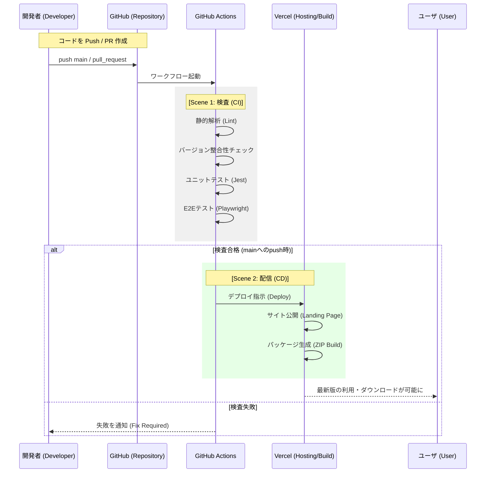
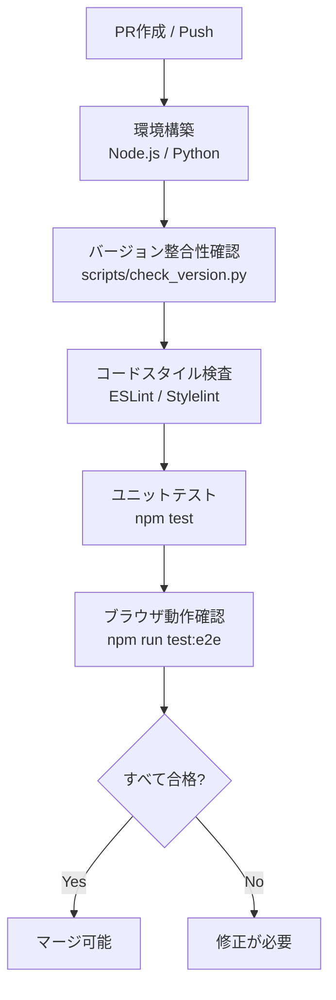
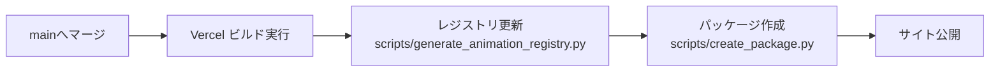

# 自動化された検査とデリバリー（CI/CD）の解説

本ドキュメントでは、本プロジェクトにおけるコードの検査、ビルド、および成果物の公開プロセスについて解説します。
GitHub Actions を活用することで、「品質の維持」と「リリースの自動化」を両立しています。

---

## 1. 基本用語の定義
GitHub Actions や CI/CD を初めて触れる開発者向けに、本プロジェクトで使用される用語を整理します。

| 用語 | 定義 | Atlassian Bamboo での対応（参考） |
| :--- | :--- | :--- |
| **CI (Continuous Integration)** | 継続的インテグレーション。コード変更の度に自動でテストや検査を行い、品質を保つ仕組み。 | Plan / Build |
| **CD (Continuous Delivery)** | 継続的デリバリー。検査済みのコードを、いつでも本番環境（Vercel 等）へ公開できる状態にする仕組み。 | Deployment Project |
| **Workflow** | GitHub Actions における一連の処理プロセス全体（`.yml` ファイル単位）。 | Plan |
| **Job** | ワークフロー内の実行単位。複数の Step で構成される。 | Stage |
| **Step** | ジョブ内の個別のタスク（コマンドの実行やアクションの呼び出し）。 | Task |
| **Runner** | 処理が実際に実行される仮想マシン（Ubuntu 等）。 | Remote Agent |
| **Secret** | パスワードやトークンなどの機密情報。GitHub 上で暗号化して管理される。 | Variables (Password type) |
| **Artifact** | 処理の過程で生成されるファイル（ZIPパッケージ等）。 | Artifact |
| **Lint (リンター)** | コードの書き方（構文やスタイル）に問題がないか自動チェックするツール。 | (コード解析タスク) |

---

## 2. 全体像：コード修正から公開まで
開発者がコードを GitHub へ送信してから、ユーザが利用可能になるまでの大まかな流れです。

---

## 3. Scene 1：品質の番人（検査プロセス）
プルリクエスト（PR）の作成時やブランチへのプッシュ時に実行されます。目的は「壊れたコードを本番環境に入れないこと」です。

### 処理フロー

- **何が引き渡されるか**: ソースコード
- **判断基準**: すべてのスクリプトとテストがエラーなしで終了すること。
- **結果**: GitHub 上の PR に緑色のチェックマーク（Pass）が表示される。

---

## 4. Scene 2：自動デリバリー（配信プロセス）
`main` ブランチにコードがマージされると、自動的に公開作業が始まります。

### 処理フロー

- **処理の目的**: 最新のソースコードから、ブラウザ拡張機能としてインストール可能な ZIP ファイルを作成し、紹介ページ（ランディングページ）を更新すること。
- **何が引き渡されるか**: ビルド済みの静的ファイル一式と ZIP パッケージ。
- **最後にどんな結果となるのか**:
    1. ユーザがブラウザで `https://quicklog-solo.vercel.app/` にアクセスすると最新のプレビューが試せる。
    2. 同ページの「ダウンロード」ボタンから最新の Chrome/Firefox 用 ZIP が入手できる。

---

## 5. 効率化の効果（一般的なプロジェクトでの試算）
これらの自動化により、手動作業と比較して以下の効果が期待できます。
*※本プロジェクトの実績値ではなく、一般的な開発プロジェクトにおける平均的な試算に基づきます。*

| 工程 | 手動で実施した場合 | 自動化後の開発者負担 | 削減効果のポイント |
| :--- | :--- | :--- | :--- |
| **動作・品質検査** | 約 30分 (全ブラウザ確認) | **0分** (待つだけ) | 確認漏れによる手戻りを防止 |
| **ZIPパッケージ作成** | 約 10分 (2ブラウザ分) | **0分** | マニフェスト書き換えミスを排除 |
| **サイト公開作業** | 約 5分 (FTP/CLI) | **0分** | 常に最新版が公開される安心感 |
| **合計** | **約 45分 / 回** | **0分** | 本質的な開発時間に集中できる |

---

## 6. 自動化を学ぶ開発者へのヒント
GitHub Actions などの CI/CD ツールを導入する際のポイントです。

1. **構成を「コード」で管理する**: YAML ファイルで定義することで、誰でも同じ手順で検査・デプロイが実行できます（Infrastructure as Code）。
2. **小さなスクリプトを活用する**: 複雑なロジックを直接 YAML に書かず、`scripts/*.py` や `scripts/*.js` に切り出すことで、ローカル環境でも同じテストが実行可能になり、デバッグが容易になります。
3. **失敗を恐れない**: CI が落ちるのは「ユーザに届く前にバグを見つけた」という成功体験です。

---

## （再掲）Vercel への初回設定方法
*※すでに設定済みの場合は不要です。*

#### 1. Vercel での準備
1. [Vercel](https://vercel.com/) にログインし、プロジェクトを作成（GitHub リポジトリをインポート）。
   - Framework Preset は「Other」を選択してください（静的HTMLのみのため自動認識されます）。
2. Vercel のプロジェクト設定およびアカウント設定から以下の情報を取得します：
   - **Project ID**: プロジェクトの **Settings** > **General** セクションに記載されています。
   - **Org ID**: アカウントの種類によって項目名が異なります。
     - **個人アカウント (Hobbyプラン)** の場合: アカウントの **Settings** > **General** にある **Personal Account ID** を使用します。
     - **チームアカウント** の場合: チームの **Settings** > **General** にある **Team ID** を使用します。
3. Vercel の **Account Settings** > **Tokens** で、新しい **Access Token** を発行します。

#### 2. GitHub リポジトリでの設定
1. GitHub リポジトリの **Settings** > **Secrets and variables** > **Actions** を開きます。
2. **New repository secret** をクリックし、以下の3つを追加します：
   - `VERCEL_TOKEN`: 発行した Access Token（`vcp_` で始まる文字列。そのまま全て入力してください）
   - `VERCEL_ORG_ID`: 取得した Org ID
   - `VERCEL_PROJECT_ID`: 取得した Project ID

   > **注意:**
   > - トークンのプレフィックス（`vcp_`）は正常なものです。削除せずに入力してください。
   > - コピー＆ペースト時に前後に余計なスペースや改行が入らないようご注意ください。
   > - シークレット名にはスペースやハイフン（`-`）は使用できません。必ずアンダースコア（`_`）を含んだ上記通りの名称にしてください。

#### 3. 自動デプロイの実行
- `main` ブランチにプッシュすると、自動的に Vercel へデプロイされます。
