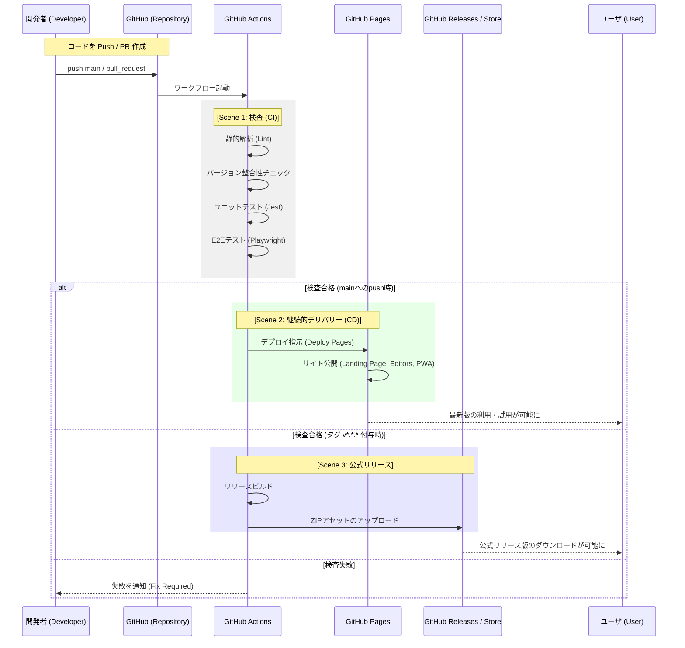
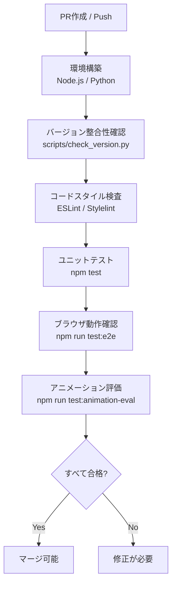
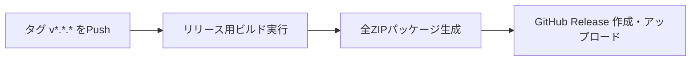

# 自動化された検査とデリバリー（CI/CD）の解説

本ドキュメントでは、本プロジェクトにおけるコードの検査、ビルド、および成果物の公開プロセスについて解説します。
GitHub Actions を活用することで、「品質の維持」と「リリースの自動化」を両立しています。

---

## 1. 基本用語の定義
GitHub Actions や CI/CD を初めて触れる開発者向けに、本プロジェクトで使用される用語を整理します。

| 用語 | 定義 | Atlassian Bamboo での対応（参考） |
| :--- | :--- | :--- |
| **CI (Continuous Integration)** | 継続的インテグレーション。コード変更の度に自動でテストや検査を行い、品質を保つ仕組み。 | Plan / Build |
| **CD (Continuous Delivery)** | 継続的デリバリー。検査済みのコードを、いつでも本番環境（GitHub Pages 等）へ公開できる状態にする仕組み。 | Deployment Project |
| **Workflow** | GitHub Actions における一連の処理プロセス全体（`.yml` ファイル単位）。 | Plan |
| **Job** | ワークフロー内の実行単位。複数の Step で構成される。 | Stage |
| **Step** | ジョブ内の個別のタスク（コマンドの実行やアクションの呼び出し）。 | Task |
| **Runner** | 処理が実際に実行される仮想マシン（Ubuntu 等）。 | Remote Agent |
| **Secret** | パスワードやトークンなどの機密情報。GitHub 上で暗号化して管理される。 | Variables (Password type) |
| **Artifact** | 処理の過程で生成されるファイル（ZIPパッケージ等）。 | Artifact |
| **Lint (リンター)** | コードの書き方（構文やスタイル）に問題がないか自動チェックするツール。 | (コード解析タスク) |

---

## 2. 全体像：コード修正から公開まで
開発者がコードを GitHub へ送信してから、ユーザが利用可能になるまでの大まかな流れです。

```mermaid
sequenceDiagram
    participant Dev as 開発者 (Developer)
    participant GH as GitHub (Repository)
    participant GHA as GitHub Actions
    participant Pages as GitHub Pages
    participant Store as GitHub Releases / Store
    participant User as ユーザ (User)

    Note over Dev, GH: コードを Push / PR 作成
    Dev->>GH: push main / pull_request
    GH->>GHA: ワークフロー起動

    rect rgb(240, 240, 240)
        Note over GHA: [Scene 1: 検査 (CI)]
        GHA->>GHA: 静的解析 (Lint)
        GHA->>GHA: バージョン整合性チェック
        GHA->>GHA: ユニットテスト (Jest)
        GHA->>GHA: E2Eテスト (Playwright)
    end

    alt 検査合格 (mainへのpush時)
        rect rgb(230, 255, 230)
            Note over GHA, Pages: [Scene 2: 継続的デリバリー (CD)]
            GHA->>Pages: デプロイ指示 (Deploy Pages)
            Pages->>Pages: サイト公開 (Landing Page, Editors, PWA)
        end
        Pages-->>User: 最新版の利用・試用が可能に
    else 検査合格 (タグ v*.*.* 付与時)
        rect rgb(230, 230, 255)
            Note over GHA, Store: [Scene 3: 公式リリース]
            GHA->>GHA: リリースビルド
            GHA->>Store: ZIPアセットのアップロード
        end
        Store-->>User: 公式リリース版のダウンロードが可能に
    else 検査失敗
        GHA-->>Dev: 失敗を通知 (Fix Required)
    end
```

---

## 3. Scene 1：品質の番人（検査プロセス）
プルリクエスト（PR）の作成時やブランチへのプッシュ時に実行されます。目的は「壊れたコードを本番環境に入れないこと」です。

### 処理フロー

```mermaid
graph TD
    Trigger[PR作成 / Push] --> Setup[環境構築<br/>Node.js / Python]
    Setup --> CheckVersion[バージョン整合性確認<br/>scripts/check_version.py]
    CheckVersion --> Lint[コードスタイル検査<br/>ESLint / Stylelint]
    Lint --> Unit[ユニットテスト<br/>npm test]
    Unit --> E2E[ブラウザ動作確認<br/>npm run test:e2e]
    E2E --> Eval[アニメーション評価<br/>npm run test:animation-eval]
    Eval --> Success{すべて合格?}
    Success -- Yes --> Merge[マージ可能]
    Success -- No --> Fix[修正が必要]
```

- **何が引き渡されるか**: ソースコード
- **判断基準**: すべてのスクリプトとテストがエラーなしで終了すること。
- **アニメーション品質**: 新しく追加・修正されたアニメーションが、5秒以内の応答性や一定の密度を維持していること（アニメーション評価システム）。
- **結果**: GitHub 上の PR に緑色のチェックマーク（Pass）が表示される。

---

## 4. Scene 2：継続的デリバリー（配信プロセス）
`main` ブランチへのプッシュで `projects/**`、`shared/**`、`index.html` のいずれかに変更がある場合、GitHub Pages へのデプロイが自動実行されます。手動実行も可能です。

### 処理フロー

```mermaid
graph LR
    Trigger[対象パスを含むmainへのプッシュ / 手動実行] --> PagesBuild[GitHub Pages デプロイ実行]
    PagesBuild --> Deploy[GitHub Pages サイト公開]
```

- **処理の目的**: 最新のソースコードから、紹介ページ（ランディングページ）、各エディタ、および Web/PWA 版を公開・更新すること。
- **最後にどんな結果となるのか**:
    1. ユーザがブラウザで `https://masanori-satake.github.io/QuickLog-Solo/` にアクセスすると最新のプレビューが試せる。
    2. 各エディタ（Category Editor, Alarm Editor, Animation Maker, Animation Studio）が直接ブラウザ上で利用できる。

---

## 5. Scene 3：公式リリース（配布プロセス）
バージョンタグ（例: `v0.32.0`）がリポジトリにプッシュされると、GitHub Releases にアセットが自動登録されます。

### 処理フロー

```mermaid
graph LR
    Trigger[タグ v*.*.* をPush] --> Build[リリース用ビルド実行]
    Build --> Artifacts[全ZIPパッケージ生成]
    Artifacts --> GHRelease[GitHub Release 作成・アップロード]
```

- **処理の目的**: 特定のバージョンを正式な成果物として固定し、永続的にダウンロード可能な状態にすること。
- **成果物**: 2つの ZIP ファイル（Chrome 用の Release 版および Dev 版）。

---

## 6. 効率化の効果（一般的なプロジェクトでの試算）
これらの自動化により、手動作業と比較して以下の効果が期待できます。

| 工程 | 手動で実施した場合 | 自動化後の開発者負担 | 削減効果のポイント |
| :--- | :--- | :--- | :--- |
| **動作・品質検査** | 約 30分 (全ブラウザ確認) | **0分** (待つだけ) | 確認漏れによる手戻りを防止 |
| **パッケージ作成(複数版)** | 約 20分 (Release/Dev合計) | **0分** | アイコン色変え・名称変更のミス排除 |
| **サイト・リリース公開** | 約 10分 (FTP/Upload) | **0分** | 常に最新版が公開される安心感 |
| **合計** | **約 60分 / 回** | **0分** | 本質的な開発時間に集中できる |

---

## GitHub Pages への初回設定方法

#### GitHub リポジトリでの設定
1. GitHub リポジトリの **Settings** > **Pages** を開きます。
2. **Source** を **GitHub Actions** に設定します。
3. `main` ブランチへのプッシュで `projects/**`、`shared/**`、`index.html` のいずれかに変更がある場合、`deploy-pages.yml` ワークフローが自動で起動します。手動実行も可能です。

---

## 免責事項 (Disclaimer)
本ソフトウェアは、個人によって開発されたオープンソース・プロジェクトであり、**無保証 (AS IS)** です。
利用に際して生じたいかなる損害についても、開発者は一切の責任を負いません。
MIT ライセンスの規定に基づき、「現状のまま」提供されるものとします。自己責任でご利用ください。

This software is a personal open-source project and is provided **"AS IS"** without warranty of any kind.
The developer shall not be liable for any damages (including data loss, work interruption, etc.) arising from the use of this software.
Use at your own risk, as per the MIT License.
