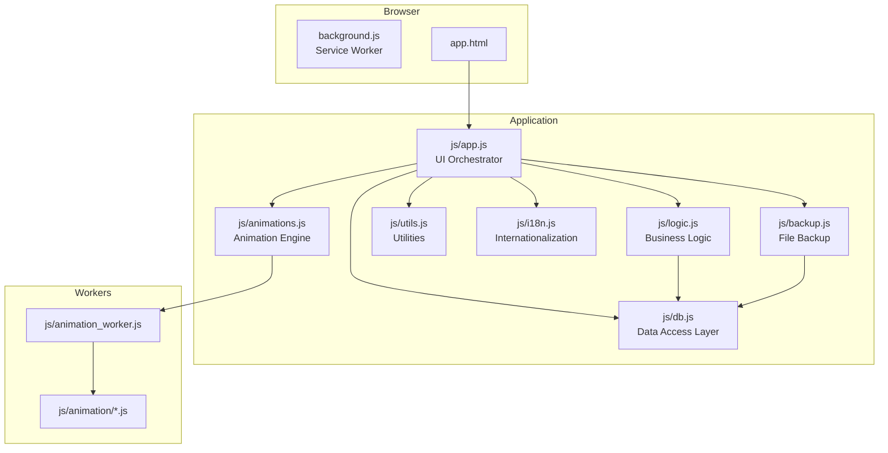
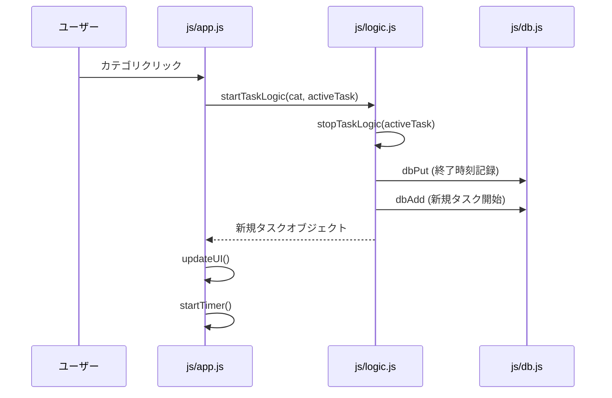
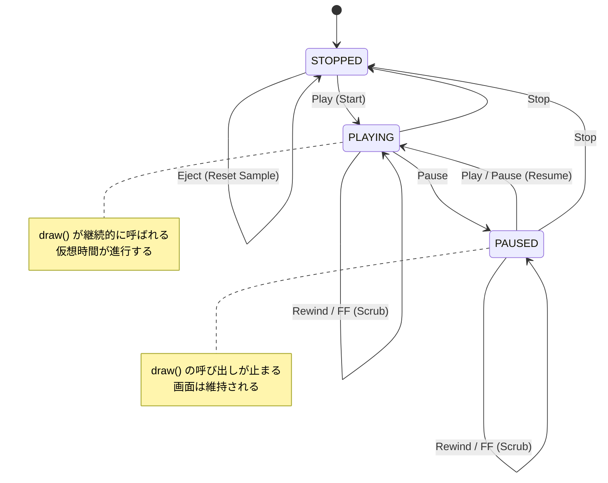

# QuickLog-Solo: 開発者ガイド

このドキュメントでは、QuickLog-Solo の内部構造、開発ワークフロー、および技術的な実装詳細について説明します。
設計思想や判断の背景については [spec.md](spec.md) および [AGENTS.md](../AGENTS.md) を参照してください。

## 0. 技術スタック
- **言語:** Vanilla JS (ES Modules)
- **スタイル:** CSS3 (Material 3 Design Tokens)
- **マークアップ:** HTML5
- **ブラウザ API:**
  - Chrome Extension Manifest V3 (Side Panel API)
  - Firefox Sidebar Action API
  - IndexedDB (Data Storage)
  - Web Workers (Animation logic isolation)
  - BroadcastChannel (State synchronization)

## 1. アーキテクチャ概要

本アプリは、外部ライブラリに依存しない Vanilla JS によるモジュール・アーキテクチャを採用しています。

### モジュール構成図



### 各モジュールの役割

-   **js/app.js (UI層):**
    -   DOM要素の取得と操作、イベントリスナーの設定。
    -   UI状態の同期（`updateUI`, `syncState`）。
    -   ユーザーへの通知（トースト、カスタム確認ダイアログ）。
    -   URLパラメータによる状態インジェクション機能（`handleTestParameters`）。
-   **js/logic.js (ロジック層):**
    -   タスクの開始・終了・一時停止の純粋な状態遷移ロジック。
    -   時間のフォーマット計算 (`formatDuration`, `formatLogDuration`)。
    -   DOMに直接触れず、テストが容易な形式で記述。
-   **js/db.js (データ層):**
    -   IndexedDB (Raw API) のカプセル化。
    -   CRUD操作、初期化、マイグレーション、クリーンアップ、自動修復。
-   **js/animations.js (描画エンジン):**
    -   Canvas 描画の統括、Web Worker (`animation_worker.js`) との通信。
-   **js/backup.js (バックアップ層):**
    -   File System Access API を使用したローカルファイルへの同期。
    -   日付ごとの NDJSON 形式での履歴保存。
-   **js/utils.js:** 共通定数、バリデーション、セキュリティ（HTMLエスケープ）。
-   **js/i18n.js / messages.js:** 多言語対応ロジックと翻訳データ。

---

## 2. 主要な振る舞い

### タスクの開始・切り替えフロー



### カテゴリのページネーション

カテゴリ数が増えた場合（17個以上）、1ページあたり16個のボタンを表示するページネーションが自動的に適用されます。
- **実装方法:** `js/app.js` 内の `currentCategoryPage` 変数で現在のページを管理。
- **操作:** `category-section` 上でのマウスホイール操作を検知し、ページを切り替え。
- **UI:** 下部に非活性なページインジケーター（ドット）を表示。

### 背景アニメーション (Canvas & Web Worker)

タスク実行中の背景アニメーションは、`js/animations.js` および Web Worker 上で実行されるモジュール群によって制御されます。
- **Web Worker:** アニメーションロジックはメインスレッドから分離された `animation_worker.js` 内で実行され、パフォーマンスの安定とセキュリティを確保します。
- **LCD スタイル:** 全てのアニメーションは 4 段階のドットサイズを持つ LCD ドットマトリクススタイルで描画されます。
- **自動遮蔽 (Exclusion Areas):** 前面のテキスト（カテゴリ名、タイマー）が隠れないよう、エンジン側で描画を回避します。
詳細な仕様は [animation_module_spec.md](animation_module_spec.md) を参照してください。

### ローカルファイルバックアップ

ブラウザのキャッシュクリア等によるデータ消失を防ぐため、File System Access API を利用してローカルディレクトリにデータを同期します。

#### 同期メカズム
- **形式:** NDJSON (Newline Delimited JSON)。1行1レコードの形式で、一部が破損しても他の行への影響を最小限に抑えます。
- **ファイル分割:** 履歴（ログ）は `YYYY-MM-DD.ndjson` の形式で、1日1ファイルに分割されます。カテゴリと設定はそれぞれ `categories.ndjson`, `settings.ndjson` に保存されます。
- **同期のタイミング:**
    - **即時 (Immediate):** データ更新を検知すると「Dirty（未保存）」状態となり、2秒後に自動的に同期が実行されます。
    - **5分 / 1時間:** 設定された間隔で定期実行されます。
- **双方向の統合 (Merge):**
    - 同期実行時、まずファイル側の内容を IndexedDB に読み込み、IndexedDB に存在しないデータのみを追加します。
    - その後、IndexedDB の最新状態をファイルに書き出します。
- **40日間保持ポリシー:**
    - IndexedDB のクリーンアップ（40日以前のデータ削除）に連動し、バックアップフォルダ内の古い `.ndjson` ファイルも自動的に削除されます。

#### UI とステータス表示
ヘッダー右側にバックアップの状態を示す円形のインジケーターが表示されます。
- **枠線のみ:** バックアップが無効。
- **緑色 (Success):** すべてのデータが同期済み。
- **オレンジ色 (Dirty):** 未保存の変更あり。この状態は視認性のため、同期完了後も最低 2 秒間は維持されます。オレンジ色のインジケーターをクリックすることで、即座に同期（Flush）を実行できます。
- **赤色 (Error):** 同期失敗、またはアクセス権限の喪失。

#### セキュリティと制限
- ブラウザのセキュリティ仕様により、ブラウザの再起動後はユーザーが明示的に「アクセスを許可する」ボタン（設定パネル内の再接続ボタン）を押すまで、フォルダへのアクセス権限が一時的に失われます。

---

## 3. QL-Animation Studio の振る舞い

### アニメーション・スタジオの状態遷移 (Cassette Deck Style)

QL-Animation Studio のテスト実行環境は、カセットテープレコーダーを模した 3 つの状態を持ちます。



#### 各状態の説明

- **STOPPED (停止中):**
    - アニメーションは実行されておらず、Canvas はクリアまたは初期状態です。
    - 設定の変更やサンプルの選択が可能です。
    - `Eject` ボタンでサンプル選択をリセットできます。
- **PLAYING (再生中):**
    - `draw()` がフレーム毎に呼び出され、アニメーションが進行します。
    - 設定変更はロックされます。
    - 内部的な「仮想経過時間」が実時間と同期して進行します。
- **PAUSED (一時停止中):**
    - `draw()` の呼び出しを一時停止し、現在の描画内容を Canvas に維持します。
    - Worker は終了せず、内部状態（変数など）は保持されます。
    - 設定変更は PLAYING 同様ロックされます。
    - `Play` または `Pause` ボタンで PLAYING に戻ります。

#### 特殊操作

- **巻き戻し (Rewind) / 先送り (Fast Forward):**
    - 実行中または一時停止中に使用可能です。
    - 10ms 間隔で 10 回 `draw()` を呼び出し、仮想時間を進退させます。
    - **並行制御:** ワーカのバックログを防ぐため、`isScrubbing` フラグによるガードと `engine.isDrawPending` の確認を行い、描画リクエストが重ならないように制御しています。
    - 操作完了後は、操作前の状態（PLAYING または PAUSED）を維持します。

#### ライフサイクル・ポリシー

- 再生ごとにアニメーションモジュールのインスタンスおよび Web Worker を新規に生成します。これにより、前回の実行状態（グローバル変数や汚染された内部状態）を引き継ぐことなく、常にクリーンな状態でテストを開始できます。

---

## 4. 設計原則と行動指針

本プロジェクトで採用している設計原則（SLAP, DRY, KISS, YAGNI, OCP）の詳細および具体的な行動指針については、[AGENTS.md](AGENTS.md) を参照してください。

---

## 5. 開発ワークフロー

### ディレクトリ構成
- `src/`: 拡張機能のソースコード一式。
  - `js/`: アプリケーションロジック。
    - `animation/`: 個別のアニメーションモジュール。
  - `css/`: アプリ用スタイルシート。
  - `assets/`: アイコン等の静的アセット。
  - `app.html`: アプリ本体のHTML。
- `index.html`: ランディングページ.
- `scripts/`: ビルドや管理用のスクリプト。
- `tests/`: テストコード。
- `docs/`: 仕様書などのドキュメント。

### バージョン管理
`npm run version:bump` コマンドにより、`src/version.json`, `package.json`, `src/manifest.*.json` を一括更新します。

### ビルドとパッケージング
`npm run build` により、以下の処理を自動実行します：
1. アニメーションレジストリ (`src/js/animation_registry.js`) の生成。
2. バージョン整合性チェック。
3. `releases/` ディレクトリへの ZIP パッケージ作成。

---

## 6. テストと品質管理

### テスト構成

-   **Jest:** テストランナー。
-   **fake-indexeddb:** Node.js 環境で IndexedDB をエミュレート。
-   **jsdom:** ブラウザ環境のエミュレート。

### 実行コマンド

```bash
# 全テストの実行
npm test

# リンターの実行
npx eslint .
npx stylelint "**/*.css"
```

### pre-commit フック

コミット時に以下のチェックが自動的に実行されます。
1.  **check-version:** `version.json`, `package.json`, およびマニフェストファイル間でのバージョン整合性チェック。
2.  **create-package:** ブラウザ別パッケージ（ZIP）の自動生成。
3.  **eslint:** JS の静的解析。
4.  **stylelint:** CSS の静的解析。
5.  **jest:** ユニットテストの実行。

---

## 7. 拡張・修正時の注意点

1.  **ドキュメントの更新:** 実装の修正や拡張を行った場合、必ず `README.md` および `README_DEV.md` を更新してください。
2.  **Vanilla JS の維持:** 新たな外部ライブラリ（npm パッケージ）の導入は、開発用ツール（devDependencies）を除き、原則禁止です。
3.  **互換性:** `js/db.js` のスキーマを変更する場合は、`setupInitialData` 内で適切なデータ移行（Migration）処理を記述してください。
4.  **定数化の徹底:** マジックナンバーや DOM ID は必ず定数化してください。

---

## 8. 関連ドキュメント

- [製品仕様書 (spec.md)](spec.md)
- [テスト計画・ケース定義書 (README_TEST.md)](README_TEST.md)
- [背景アニメーション・モジュール仕様書 (animation_module_spec.md)](animation_module_spec.md)
- [AI エージェント指針 (AGENTS.md)](../AGENTS.md)
