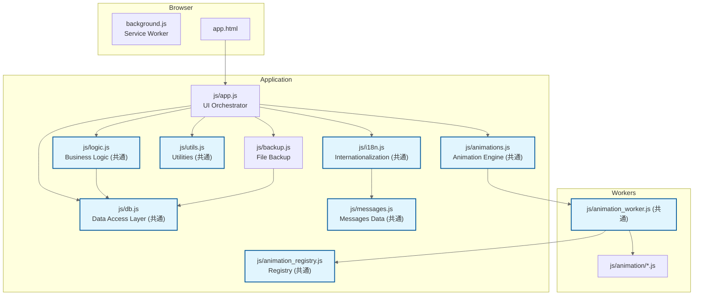
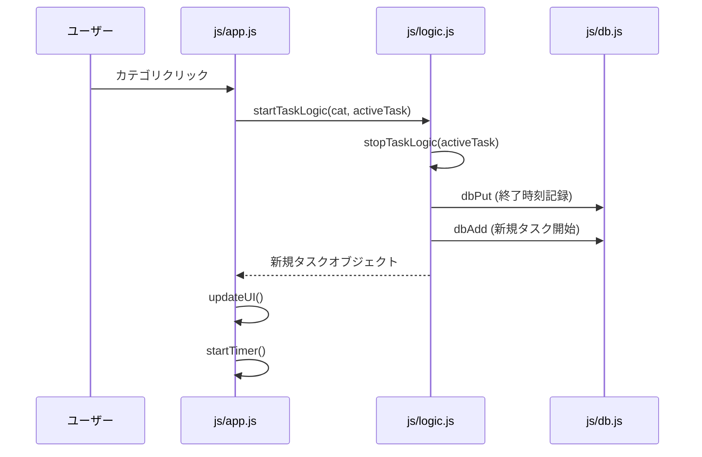
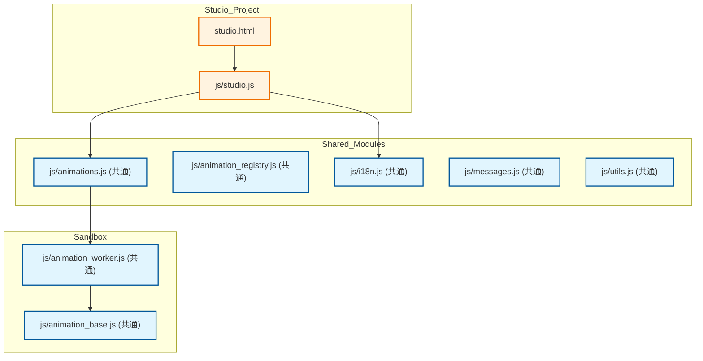
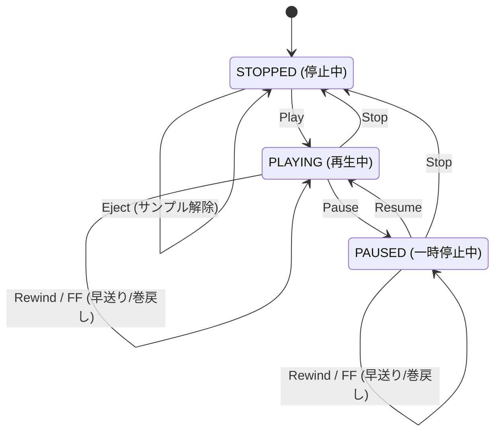
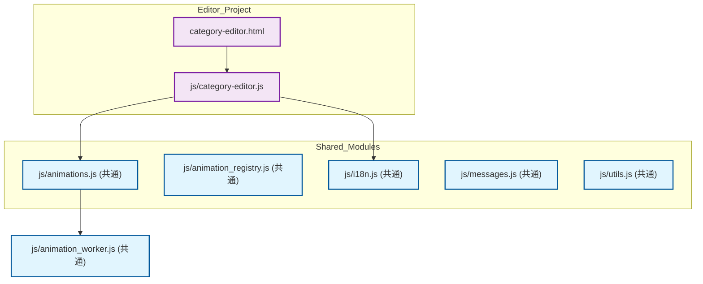
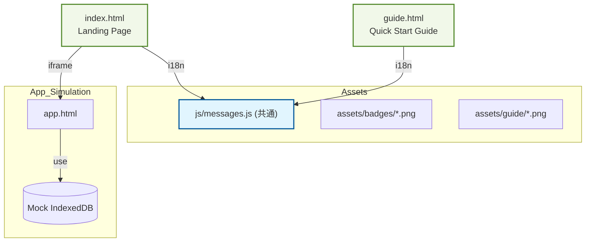

# QuickLog-Solo: 開発者ガイド

このドキュメントでは、QuickLog-Solo の内部構造、開発ワークフロー、および技術的な実装詳細について説明します。
設計思想や判断の背景については [spec.md](spec.md) および [AGENTS.md](../AGENTS.md) を参照してください。

## 0. 技術スタック
- **言語:** Vanilla JS (ES Modules)
- **スタイル:** CSS3 (Material 3 Design Tokens)
- **マークアップ:** HTML5
- **ブラウザ API:**
  - Chrome Extension Manifest V3 (Side Panel API)
  - Firefox Sidebar Action API
  - IndexedDB (Data Storage)
  - Web Workers (Animation logic isolation)
  - BroadcastChannel (State synchronization)
  - File System Access API (Local Backup)

## 1. アーキテクチャ概要

本アプリは、外部ライブラリに依存しない Vanilla JS によるモジュール・アーキテクチャを採用しています。
サブプロジェクト（Studio, Category Editor）間でのコード再利用を考慮し、一部を「共通モジュール」として定義しています。

### モジュール構成図 (メインプロジェクト)



> **注釈:** 水色のノードは **共通モジュール** です。これらはメインアプリだけでなく、Animation Studio や Category Editor でも共有されます。

### 各モジュールの役割

-   **js/app.js (UI層):**
    -   DOM要素の取得と操作、イベントリスナーの設定。
    -   UI状態の同期（`updateUI`, `syncState`）。
    -   カテゴリの描画、ページネーション、履歴表示。
    -   設定パネル（テーマ、フォント、アニメーション、アラーム設定、バックアップ管理）の制御。
    -   URLパラメータによる状態インジェクション（テスト用）。
-   **js/logic.js (ロジック層 / 共通):**
    -   タスクの開始・終了・一時停止の純粋な状態遷移ロジック。
    -   時間のフォーマット計算、レポート生成ロジック、タグ集計。
    -   DOMに依存せず、純粋なデータ処理に特化。
-   **js/db.js (データ層 / 共通):**
    -   IndexedDB (Raw API) のカプセル化。
    -   CRUD操作、初期化、マイグレーション、クリーンアップ、自動修復。
    -   複数ストア（logs, categories, settings, alarms）の管理。
-   **js/animations.js (描画エンジン / 共通):**
    -   Canvas 描画の統括、Web Worker (`animation_worker.js`) との通信。
-   **js/backup.js (バックアップ層):**
    -   File System Access API を使用したローカルファイルへの同期（NDJSON形式）。
-   **js/utils.js (共通):** 共通定数、バリデーション、HTMLエスケープ、時刻計算補助。
-   **js/i18n.js / messages.js (共通):** 多言語対応ロジックと、各言語ごとの翻訳リソース。

---

## 2. 主要な振る舞い

### タスクの開始・切り替えフロー



### オペレーターの状態遷移

オペレーター（利用者）の業務状態は、以下の図のように遷移します。

```mermaid
stateDiagram-v2
    state "待機 (IDLE)" as IDLE
    state "作業中 (WORKING)" as WORKING
    state "一時停止 (PAUSED)" as PAUSED

    [*] --> IDLE

    IDLE --> WORKING : カテゴリ選択
    WORKING --> IDLE : 終了 (Stop Marker記録)

    WORKING --> PAUSED : 一時停止
    PAUSED --> WORKING : 再開

    PAUSED --> IDLE : 終了 (Stop Marker記録)

    WORKING --> WORKING : カテゴリ切替

    note left of IDLE
        <b>待機 (IDLE)</b>
        計測停止状態
        手動終了時は
        停止マーカーを記録
    end note

    note top of WORKING
        <b>作業中 (WORKING)</b>
        業務計測中
        背景アニメーション動作
        タイマー進行
    end note

    note right of PAUSED
        <b>一時停止 (PAUSED)</b>
        待機ログ記録
        元のカテゴリを保持
        (Resumeで復帰可能)
    end note
```

#### 状態の説明とアクション
- **IDLE (待機):**
    - 計測が行われていない状態です。
    - **手動停止アクション:** ユーザーが「終了」ボタンを押してこの状態に遷移する際、`logic.js` は現在のログをクローズし、さらに「停止マーカー」（開始・終了時刻が同一で `isManualStop: true` のレコード）を IndexedDB に記録します。これは、PCの再起動やブラウザの切断後でも「どこで意図的に止めたか」を判別するために使用されます。
- **WORKING (作業中):**
    - 特定の業務カテゴリを選択し、計測を行っている状態です。
    - カテゴリを直接切り替えた場合、内部的には「前のタスクの終了」と「新しいタスクの開始」が同時に行われます。
- **PAUSED (一時停止中):**
    - 休憩や割り込みなどで、現在の作業を中断している状態です。
    - 内部的には `__IDLE__` カテゴリでログが記録されます。
    - 元のカテゴリを `resumableCategory` として保持しており、「再開」によって元の業務に素早く戻ることができます。

### カテゴリのページネーション

カテゴリ数が増えた場合（17個以上）、1ページあたり16個のボタンを表示するページネーションが自動的に適用されます。
- **実装方法:** `js/app.js` 内の `currentCategoryPage` 変数で現在のページを管理。
- **操作:** `category-section` 上でのマウスホイール操作を検知し、ページを切り替え。
- **UI:** 下部に非活性なページインジケーター（ドット）を表示。

### 背景アニメーション (Canvas & Web Worker)

タスク実行中の背景アニメーションは、パフォーマンスの安定とセキュリティを確保するため、メインスレッドから分離された Web Worker 上で実行されます。

- **LCD スタイル:** 全てのアニメーションは 4 段階のドットサイズを持つ LCD ドットマトリクススタイルで描画されます。
- **自動遮蔽 (Exclusion Areas):** 前面のテキスト（カテゴリ名、タイマー）が隠れないよう、エンジン側で描画を回避します。
- **動的制御:** `app.js` は定期的に UI 要素の `getBoundingClientRect()` を計測し、Worker へ遮蔽領域を通知します。
詳細な仕様は [animation_module_spec.md](animation_module_spec.md) を参照してください。

### ローカルファイルバックアップ

ブラウザのキャッシュクリア等によるデータ消失を防ぐため、File System Access API を利用してローカルディレクトリにデータを同期します。

#### 同期メカズム
- **形式:** NDJSON (Newline Delimited JSON)。1行1レコードの形式で、一部が破損しても他の行への影響を最小限に抑えます。
- **ファイル分割:** 履歴（ログ）は `YYYY-MM-DD.ndjson` の形式で、1日1ファイルに分割されます。カテゴリは `categories.ndjson` (NDJSON)、設定は `settings.json` (JSON) に保存されます。
- **同期のタイミング:**
    - **手動 (Manual Only):** ユーザーが明示的に「バックアップを実行する」ボタンを押した際、またはインジケーターをクリックした際に同期が実行されます。自動同期（一定間隔での実行）は行われません。
- **双方向の統合 (Merge):**
    - 同期（バックアップ実行）時、まずファイル側の内容を IndexedDB に読み込み、IndexedDB に存在しないデータのみを追加します。
    - その後、IndexedDB の最新状態をファイルに書き出します。
- **40日間保持ポリシー:**
    - IndexedDB のクリーンアップ（40日以前のデータ削除）に連動し、バックアップ実行時にバックアップフォルダ内の古い `.ndjson` ファイルも削除されます。

#### ステータス表示
バックアップの状態は、設定画面の「バックアップ」タブ内で確認できます。
- **最終バックアップ時刻:** 前回のバックアップ実行日時が表示されます。
- **ファイル数:** バックアップフォルダ内に保存されているログファイル（日分）の数が表示されます。
- **実行ボタン:** 権限が必要な場合は「保存先にアクセスしてバックアップを実行」と表示され、クリックすることで再認証と実行を同時に行えます。

#### セキュリティと制限
- ブラウザのセキュリティ仕様により、ブラウザの再起動後はユーザーが明示的に「アクセスを許可する」ボタン（設定パネル内の再接続ボタン）を押すまで、フォルダへのアクセス権限が一時的に失われます。

---

## 3. QL-Animation Studio

### アーキテクチャ図 (Studio)



### アニメーション・スタジオの状態遷移 (Cassette Deck Style)

カセットテープレコーダーを模した直感的な UI で、アニメーションモジュールの開発と検証をサポートします。



#### 特徴的な機能
- **サンドボックス実行:** `studio.js` はエディタ上のコードから動的に Blob URL を生成し、Web Worker 内でインスタンス化します。これにより、メインスレッドを汚染することなく安全にコードを実行できます。
- **パフォーマンス・スロットリング:** Web Worker からのログ出力（Console）は描画負荷を抑えるため 10fps に制限されます。また、実行時エラーが発生した際は自動的にコンソールが展開され、開発者に通知されます。
- **スクラブ操作 (Rewind/FF):** 仮想時間を操作し、アニメーションの特定のタイミングを検証できます。描画リクエストのバックログを防ぐため、`isDrawPending` フラグによる流量制御が行われます。
- **メトリクス計測:** Latency (描画遅延)、Density (描画密度)、Change Rate (ピクセル変化率) をリアルタイムで計測し、アニメーションの品質を確認できます。

---

## 4. QL-Category Editor

### アーキテクチャ図 (Category Editor)



### 主な振る舞い
- **ライブプレビュー:** 共通の `AnimationEngine` を使用し、製品版と全く同じ描画ロジックで色の組み合わせやアニメーションの挙動を確認できます。
- **NDJSON インポート/エクスポート:** クリップボードを介して、メインアプリの設定と互換性のある NDJSON 形式でカテゴリ設定を一括操作できます。
- **ドラッグ＆ドロップ:** カテゴリの並べ替えを直感的に行い、その結果を `order` 属性に反映させます。
- **ページ区切り (Page Break):** メインアプリのページネーションを制御するための特殊なカテゴリ（`SYSTEM_CATEGORY_PAGE_BREAK`）を挿入・編集できます。

---

## 5. Webサイト・資産 (Landing Page & Quick Start Guide)

### アーキテクチャ図 (Web Assets)



### ランディングページ (index.html)
- **「ブラウザで試す」機能:**
    - `iframe` 内で `app.html` を起動します。
    - 本番のデータを破壊しないよう、URLパラメータ（`?db=QuickLogSoloDB_Preview`）を使用して一時的なデータベース（Mock DB）を割り当て、環境を分離しています。
- **多言語化:** `js/messages.js` のリソースを使用し、ブラウザの言語設定に応じた自動切り替えと、手動選択をサポートしています。

### クイックスタートガイド (guide.html)
- **印刷最適化:** A4 1枚程度に収まるよう CSS `media print` を調整しており、PDF 保存や物理的な印刷に対応したレイアウトを提供します。
- **自動化された資産生成:** ガイド内で使用されるスクリーンショットは、Playwright を使用したスクリプト（`scripts/generate_guide_screenshots.js`）によって、各言語・各状態で自動的に撮影されます。これにより、UI の変更に伴うドキュメントの鮮度低下を防いでいます。

---

## 6. 設計原則と行動指針

本プロジェクトで採用している設計原則（SLAP, DRY, KISS, YAGNI, OCP）の詳細および具体的な行動指針については、[AGENTS.md](AGENTS.md) を参照してください。

---

## 7. 開発ワークフロー

### ディレクトリ構成
- `src/`: 拡張機能のソースコード一式。
  - `js/`: アプリケーションロジック。
    - `animation/`: 個別のアニメーションモジュール。
- `category-editor.html`, `studio.html`, `index.html`, `guide.html`: 各サブプロジェクト/資産のルート。
- `scripts/`: ビルド・検証・資産生成スクリプト。
- `tests/`: Jest による単体テスト。
- `docs/`: 技術仕様書、各種ガイド。

### バージョン管理
`npm run version:bump` コマンドにより、`src/version.json`, `package.json`, `src/manifest.*.json` を一括更新します。

### ビルドとパッケージング
`npm run build` により、以下の処理を自動実行します：
1. **PNGアイコン生成**: `src/assets/icon.svg` から各サイズ（16/32/48/128）の `icon.png` を生成します (`scripts/generate_png_icons.py`)。
2. **アニメーションレジストリ生成**: `src/js/animation/` 内の全モジュールをスキャンし、`src/js/animation_registry.js` を自動生成します (`scripts/generate_animation_registry.py`)。
3. **バージョン整合性チェック**: `package.json`, `version.json`, マニフェストファイル間でのバージョン番号の一致を確認します (`scripts/check_version.py`)。
4. **ZIPパッケージ作成**: ブラウザ別（Chrome, Firefox）のマニフェストを適用し、`releases/` ディレクトリに配布用 ZIP パッケージを作成します (`scripts/create_package.py`)。

### その他の管理スクリプト
- **scripts/bump_version.py**: バージョン番号をインクリメントし、関連ファイルすべてを同期更新します。
- **scripts/verify_animations.py**: アニメーションモジュールのメタデータや安全性を検証します（`npm test` 内で実行）。
- **scripts/verify_version_impact.py**: コミットメッセージの内容（feat, fix等）に応じて適切なバージョンアップが行われているかを CI 上で検証します。
- **SCANOSS (GitHub Actions)**: 業界標準の OSS 監査ツール。`src/` 内のコード断片（スニペット）を 1 億件以上の OSS データベースと照合し、ライセンス表記のないコピーコードも検出します。
- **scripts/animation_utils.py**: 複数のスクリプトで共有される、アニメーションモジュールのパースやフィルタリングのための共通ユーティリティです。
- **scripts/update_guide_images.js**: クイックスタートガイド (`guide.html`) で使用するキャプチャ画像を Playwright を使用して自動生成します。内部的に `generate_guide_screenshots.js` を呼び出します。
- **scripts/generate_guide_screenshots.js**: 特定の言語・状態でアプリを起動し、指定された座標のスクリーンショットを撮影する Playwright スクリプトです。

---

## 8. テストと品質管理

### テスト構成
- **Jest:** テストランナー。
- **fake-indexeddb:** Node.js 環境で IndexedDB をエミュレート。
- **jsdom:** ブラウザ環境のエミュレート。

### 実行コマンド
```bash
# 全テストの実行
npm test

# リンターの実行
npx eslint .
npx stylelint "**/*.css"
```

### pre-commit フック
コミット時に以下のチェックが自動的に実行されます。
1. **check-version:** `version.json`, `package.json`, およびマニフェストファイル間でのバージョン整合性チェック。
2. **create-package:** ブラウザ別パッケージ（ZIP）の自動生成。
3. **eslint:** JS の静的解析。特に関数や try-catch ブロック内での不必要な変数への再代入を避けるため、 `no-useless-assignment` ルールを遵守してください。
4. **stylelint:** CSS の静的解析。
5. **jest:** ユニットテストの実行。

---

## 9. 拡張・修正時の注意点

1. **ドキュメントの更新:** 実装の修正や拡張を行った場合、必ず関連ドキュメントを更新してください。
2. **Vanilla JS の維持:** プロダクションコードにおける外部ライブラリの導入は原則禁止です。
3. **互換性の維持:** スキーマ変更時は必ずマイグレーション処理を記述してください。

---

## 10. 関連ドキュメント

- [製品仕様書 (spec.md)](spec.md)
- [テスト計画・ケース定義書 (README_TEST.md)](README_TEST.md)
- [背景アニメーション・モジュール仕様書 (animation_module_spec.md)](animation_module_spec.md)
- [AI エージェント指針 (AGENTS.md)](../AGENTS.md)
