# QuickLog-Solo: 開発者ガイド

このドキュメントでは、QuickLog-Solo の内部構造、開発ワークフロー、および技術的な実装詳細について説明します。
設計思想や判断の背景については [spec.md](spec.md) および [AGENTS.md](../AGENTS.md) を参照してください。

## 0. 技術スタック
- **言語:** Vanilla JS (ES Modules)
- **スタイル:** CSS3 (Material 3 Design Tokens)
- **マークアップ:** HTML5
- **ブラウザ API:**
  - Chrome Extension Manifest V3 (Side Panel API)
  - Firefox Sidebar Action API
  - IndexedDB (Data Storage)
  - Web Workers (Animation logic isolation)
  - BroadcastChannel (State synchronization)
  - File System Access API (Local Backup)

## 1. アーキテクチャ概要

本アプリは、外部ライブラリに依存しない Vanilla JS によるモジュール・アーキテクチャを採用しています。
サブプロジェクト（Studio, Category Editor）間でのコード再利用を考慮し、一部を「共通モジュール」として定義しています。

### モジュール構成図 (メインプロジェクト)

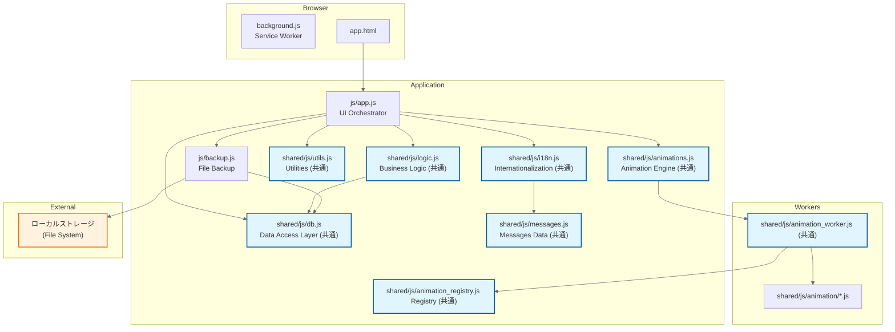

> **注釈:** 水色のノードは **共通モジュール** です。これらはメインアプリだけでなく、Animation Studio や Category Editor でも共有されます。

### 各モジュールの役割

-   **js/app.js (UI層):**
    -   DOM要素の取得と操作、イベントリスナーの設定。
    -   UI状態の同期（`updateUI`, `syncState`）。
    -   カテゴリの描画、ページネーション、履歴表示。
    -   設定パネル（テーマ、フォント、アニメーション、アラーム設定、バックアップ管理）の制御。
    -   URLパラメータによる状態インジェクション（テスト用）。
-   **js/logic.js (ロジック層 / 共通):**
    -   タスクの開始・終了・一時停止の純粋な状態遷移ロジック。
    -   時間のフォーマット計算、レポート生成ロジック、タグ集計。
    -   DOMに依存せず、純粋なデータ処理に特化。
-   **js/db.js (データ層 / 共通):**
    -   IndexedDB (Raw API) のカプセル化。
    -   CRUD操作、初期化、マイグレーション、クリーンアップ、自動修復。
    -   複数ストア（logs, categories, settings, alarms）の管理。
-   **js/animations.js (描画エンジン / 共通):**
    -   Canvas 描画の統括、Web Worker (`animation_worker.js`) との通信。
-   **js/backup.js (バックアップ層):**
    -   File System Access API を使用したローカルファイルへの同期。
    -   履歴ログ・カテゴリ情報は NDJSON形式、設定情報は JSON形式で保存。
-   **js/utils.js (共通):** 共通定数、バリデーション、HTMLエスケープ、時刻計算補助。
-   **js/i18n.js / messages.js (共通):** 多言語対応ロジックと、各言語ごとの翻訳リソース。

---

## 2. 主要な振る舞い

### タスクの開始・切り替えフロー

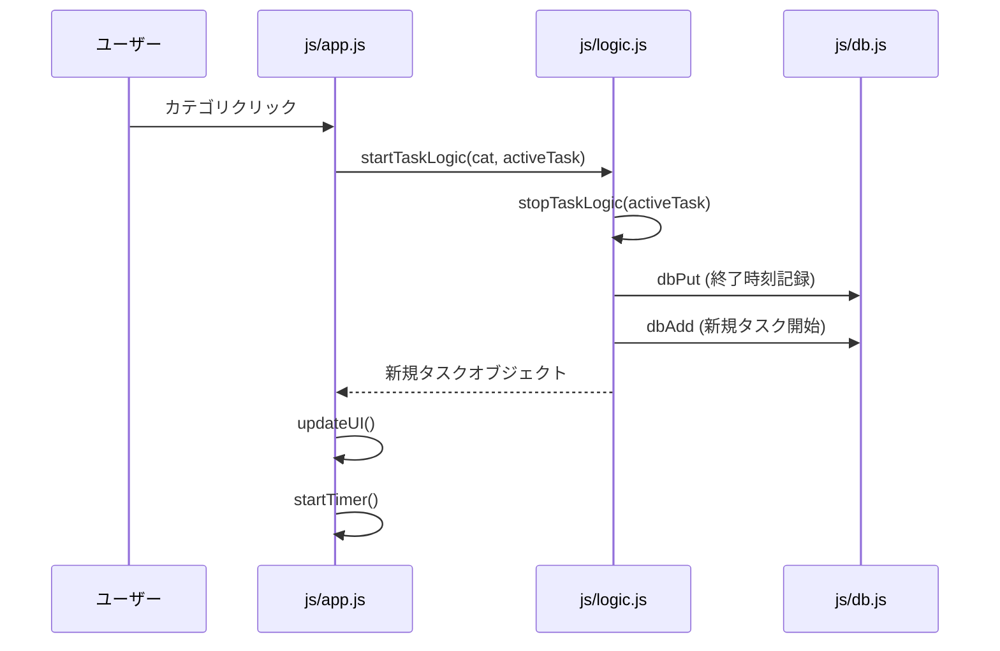

### オペレーターの状態遷移

オペレーター（利用者）の業務状態は、以下の図のように遷移します。

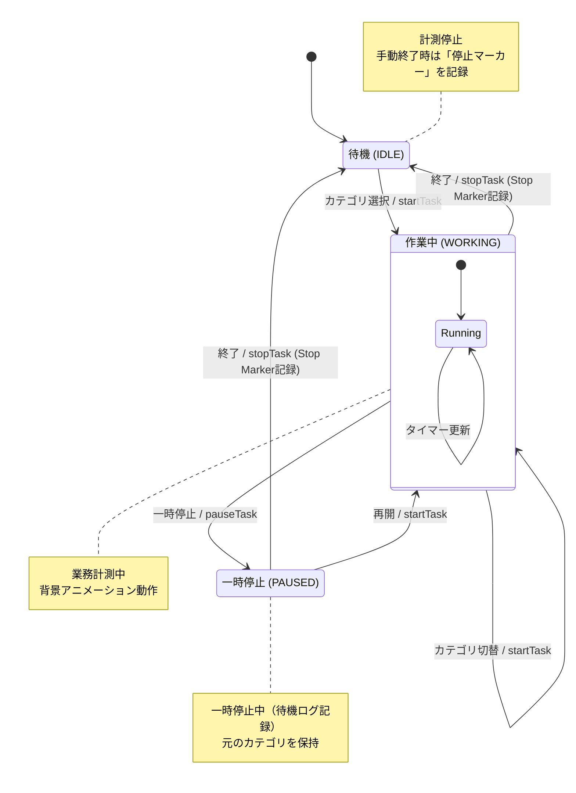

#### 状態の説明とアクション
- **IDLE (待機):**
    - 計測が行われていない状態です。
    - **手動停止アクション:** ユーザーが「終了」ボタンを押してこの状態に遷移する際、`logic.js` は現在のログをクローズし、さらに「停止マーカー」（開始・終了時刻が同一で `isManualStop: true` のレコード）を IndexedDB に記録します。これは、PCの再起動やブラウザの切断後でも「どこで意図的に止めたか」を判別するために使用されます。
- **WORKING (作業中):**
    - 特定の業務カテゴリを選択し、計測を行っている状態です。
    - カテゴリを直接切り替えた場合、内部的には「前のタスクの終了」と「新しいタスクの開始」が同時に行われます。
- **PAUSED (一時停止中):**
    - 休憩や割り込みなどで、現在の作業を中断している状態です。
    - 内部的には `__IDLE__` カテゴリでログが記録されます。
    - 元のカテゴリを `resumableCategory` として保持しており、「再開」によって元の業務に素早く戻ることができます。

### カテゴリのページネーション

カテゴリ数が増えた場合（17個以上）、1ページあたり16個のボタンを表示するページネーションが自動的に適用されます。
- **実装方法:** `js/app.js` 内の `currentCategoryPage` 変数で現在のページを管理。
- **操作:** `category-section` 上でのマウスホイール操作を検知し、ページを切り替え。
- **UI:** 下部に非活性なページインジケーター（ドット）を表示。

### 背景アニメーション (Canvas & Web Worker)

タスク実行中の背景アニメーションは、パフォーマンスの安定とセキュリティを確保するため、メインスレッドから分離された Web Worker 上で実行されます。

- **LCD スタイル:** 全てのアニメーションは 4 段階のドットサイズを持つ LCD ドットマトリクススタイルで描画されます。
- **自動遮蔽 (Exclusion Areas):** 前面のテキスト（カテゴリ名、タイマー）が隠れないよう、エンジン側で描画を回避します。
- **動的制御:** `app.js` は定期的に UI 要素の `getBoundingClientRect()` を計測し、Worker へ遮蔽領域を通知します。
詳細な仕様は [animation_module_spec.md](animation_module_spec.md) を参照してください。

### ローカルファイルバックアップ

ブラウザのキャッシュクリア等によるデータ消失を防ぐため、File System Access API を利用してローカルディレクトリにデータを同期します。

#### 同期メカズム
- **形式:** データの性質に合わせて最適な形式を採用。
    - **NDJSON (Newline Delimited JSON):** 履歴（ログ）およびカテゴリ設定で使用。1行1レコードの形式で、データ量が増えても追記が容易で、一部が破損しても他の行への影響を最小限に抑えます。
    - **JSON:** アプリケーション設定（`settings.json`）で使用。構造化されたデータの保存に適しています。
- **ファイル分割:** 履歴（ログ）は `YYYY-MM-DD.ndjson` の形式で、1日1ファイルに分割されます。カテゴリは `categories.ndjson` (NDJSON)、設定は `settings.json` (JSON) に保存されます。
- **同期のタイミング:**
    - **手動 (Manual Only):** ユーザーが明示的に「バックアップを実行する」ボタンを押した際、またはインジケーターをクリックした際に同期が実行されます。自動同期（一定間隔での実行）は行われません。
- **双方向の統合 (Merge):**
    - 同期（バックアップ実行）時、まずファイル側の内容を IndexedDB に読み込み、IndexedDB に存在しないデータのみを追加します。
    - その後、IndexedDB の最新状態をファイルに書き出します。
- **40日間保持ポリシー:**
    - IndexedDB のクリーンアップ（40日以前のデータ削除）に連動し、バックアップ実行時にバックアップフォルダ内の古い `.ndjson` ファイルも削除されます。

#### ステータス表示
バックアップの状態は、設定画面の「バックアップ」タブ内で確認できます。
- **最終バックアップ時刻:** 前回のバックアップ実行日時が表示されます。
- **ファイル数:** バックアップフォルダ内に保存されているログファイル（日分）の数が表示されます。
- **実行ボタン:** 権限が必要な場合は「保存先にアクセスしてバックアップを実行」と表示され、クリックすることで再認証と実行を同時に行えます。

#### セキュリティと制限
- ブラウザのセキュリティ仕様により、ブラウザの再起動後はユーザーが明示的に「アクセスを許可する」ボタン（設定パネル内の再接続ボタン）を押すまで、フォルダへのアクセス権限が一時的に失われます。

---

## 3. アラーム機能 (Alarms)

本アプリは、指定した時刻に通知を表示し、タスクの自動操作（終了・一時停止・開始）を行うアラーム機能を備えています。

### アーキテクチャと利用 API

アラーム機能は、UI スレッド (`app.js`) とバックグラウンドスレッド (`background.js`) が連携して動作します。

- **利用 API:**
  - **chrome.alarms**: スケジューリング（バックグラウンドでの定時実行）。
  - **chrome.notifications**: ユーザーへのプッシュ通知。
  - **BroadcastChannel**: 同一オリジン内のウィンドウ/タブ間および Service Worker との同期。
  - **chrome.runtime.sendMessage**: `BroadcastChannel` が利用できない、または不安定な環境での予備的な通信手段。

### 処理フロー

#### 1. アラームの設定・更新フロー
ユーザーが UI でアラーム設定を変更した際のフローです。

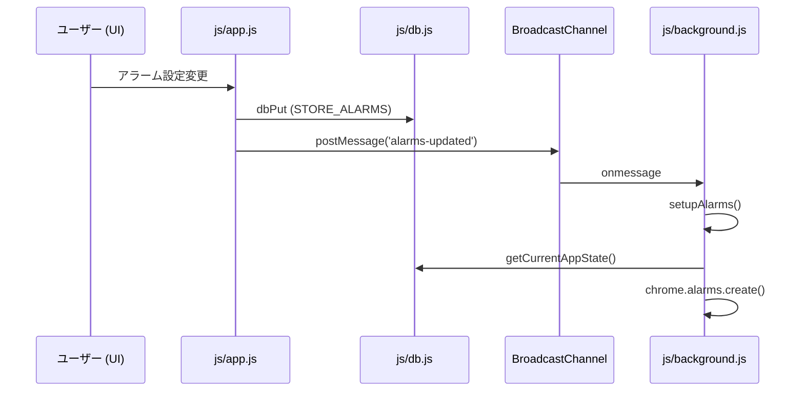

#### 2. アラーム発火時の処理フロー
設定時刻になり、`chrome.alarms` が発火した際のフローです。

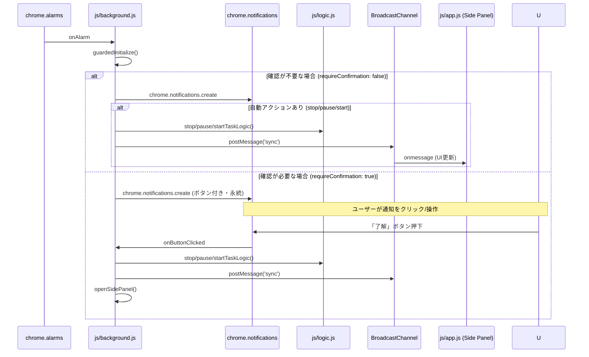

### 技術的な制限と設計上の考慮事項

- **ブラウザ拡張機能専用:** アラームおよび通知機能はブラウザ拡張機能 API に依存しているため、通常の Web サイトとして実行されている場合（プレビュー版など）は動作しません。
- **1分間隔の制限:** `chrome.alarms` は、パッケージ化された拡張機能において最小 1 分の間隔制限があります。そのため、1分未満の精密なスケジューリングには適していません。本アプリでは「時刻」指定によるデイリー実行を主目的としています。
- **Service Worker のライフサイクル:** バックグラウンド処理は Service Worker 上で動作するため、アイドル状態では停止します。アラーム発火時に自動的に起動し、`guardedInitialize()` によって DB 接続などが復旧されます。

### テストアラーム (`ql_test_alarm`)
開発およびユーザー環境の動作確認用として、テストアラーム機能が実装されています。
- **挙動:** 実行すると 1 分後に発火するようにスケジュールされます（Chrome の最小制限に準拠）。
- **目的:** 通知権限やバックグラウンドスクリプトの稼働状況を、実際の運用を待たずに即座に検証するために使用されます。

### BroadcastChannel の活用と今後の展望
現在、`BroadcastChannel` は主に以下の用途で使用されています：
- アラーム更新時の Service Worker への通知。
- 自動アクション実行時の Side Panel UI の同期。

**今後の展望:**
- **マルチウィンドウ同期:** 複数のウィンドウで Side Panel を開いている場合、一方の操作を即座に他方へ反映させる（タイマーの同期など）ための基盤として活用できます。
- **データ競合の回避:** 重い DB 書き込みが発生する際、各スレッド間でロック状態を簡易的に通知し、IndexedDB の競合を抑制する制御にも転用可能です。

---

## 4. QL-Animation Studio

### モジュール構成 (Studio)

Studio は、アニメーションモジュールの開発・検証を行うためのツールです。機能ごとに以下のモジュールに分割されています。

- **js/studio.js (メイン):** 全体の初期化、共通状態（`state`）の管理、各モジュールのオーケストレーション。サンプルのロードやテストの開始・停止制御。
- **js/editor.js (エディタ):** コードエディタ（Variables, setup, draw, interaction）の制御。シンタックスハイライト、行番号（ガター）、オートインデント、検索・置換機能。
- **js/preview.js (プレビュー):** プレビューエンジンの制御。再生/停止/一時停止/スクラブ（早送り・巻き戻し）操作、カラープリセット、速度制御、除外エリアシミュレーターのドラッグ＆ドロップ。
- **js/metrics.js (メトリクス):** 描画パフォーマンス（Latency, Density, Change Rate）の計測とメーター表示。コンソールログの収集。
- **js/io.js (入出力):** アニメーションコードのビルド、JSファイルとしてのダウンロード、既存ファイルのアップロード、PR作成ガイド。

### アーキテクチャ図 (Studio)

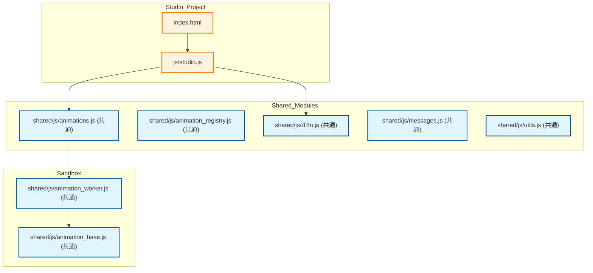

### アニメーション・スタジオの状態遷移 (Cassette Deck Style)

カセットテープレコーダーを模した直感的な UI で、アニメーションモジュールの開発と検証をサポートします。

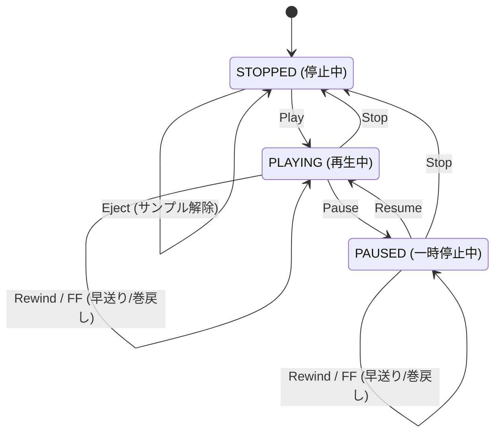

#### 特徴的な機能の実装詳細

##### 1. サンドボックス実行 (Dynamic Sandboxing)
エディタで記述された生のコードを、安全かつ即座に実行するための仕組みです。

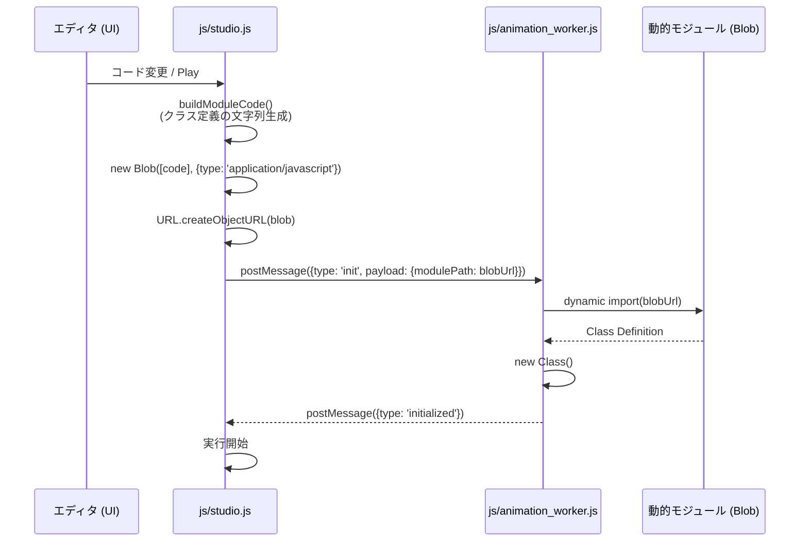

- **メリット:** サーバーへのアップロードや再ビルドを介さず、ブラウザ内だけでモジュールの動的読み込みと隔離実行が可能です。

##### 2. パフォーマンス・スロットリング (Throttling)
描画品質と開発環境のレスポンスを両立するための流量制御です。

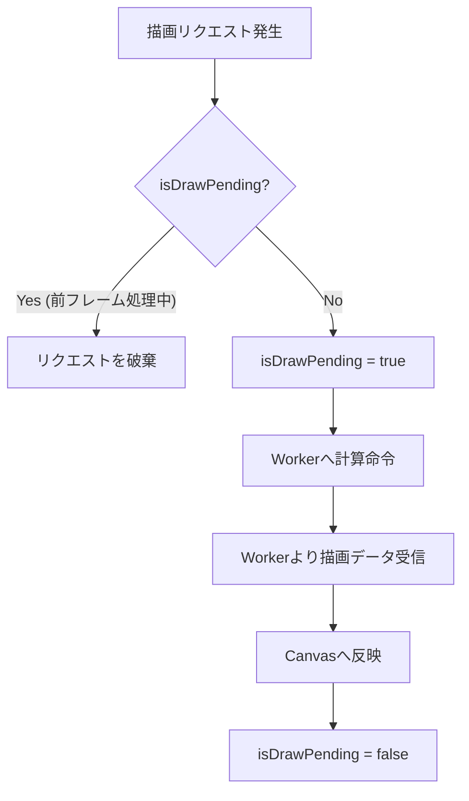

- **描画スキップ:** `animations.js` (共通) の `isDrawPending` フラグを利用。Worker からの `drawResponse` が返る前に次の描画リクエストが発生した場合、そのフレームを破棄します。これにより、重いアニメーションでもメインスレッドのイベントループが埋まるのを防ぎます。
- **仮想時間による制御:** Studio では `engine.draw` をオーバーライドし、実時間 (`performance.now()`) ではなく `virtualElapsedMs` に基づいて描画をリクエストします。これにより、低速な環境でもコマ落ちせずにアニメーションの「内容」を正確に検証できます。

##### 3. スクラブ操作 (Scrubbing / Virtual Time)
「カセットテープ」の操作感を実現するための時間軸操作です。

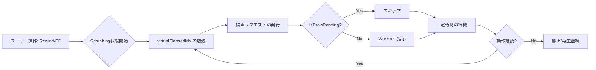

- **実装:** `rewindable: true` が設定されたモジュールでは、`elapsedMs` に完全に依存した設計を要求することで、時間を巻き戻しても描画が破綻しないようにしています。

##### 4. メトリクス計測 (Real-time Metrics)
`AnimationEngine` から得られる描画結果を統計的に分析します。

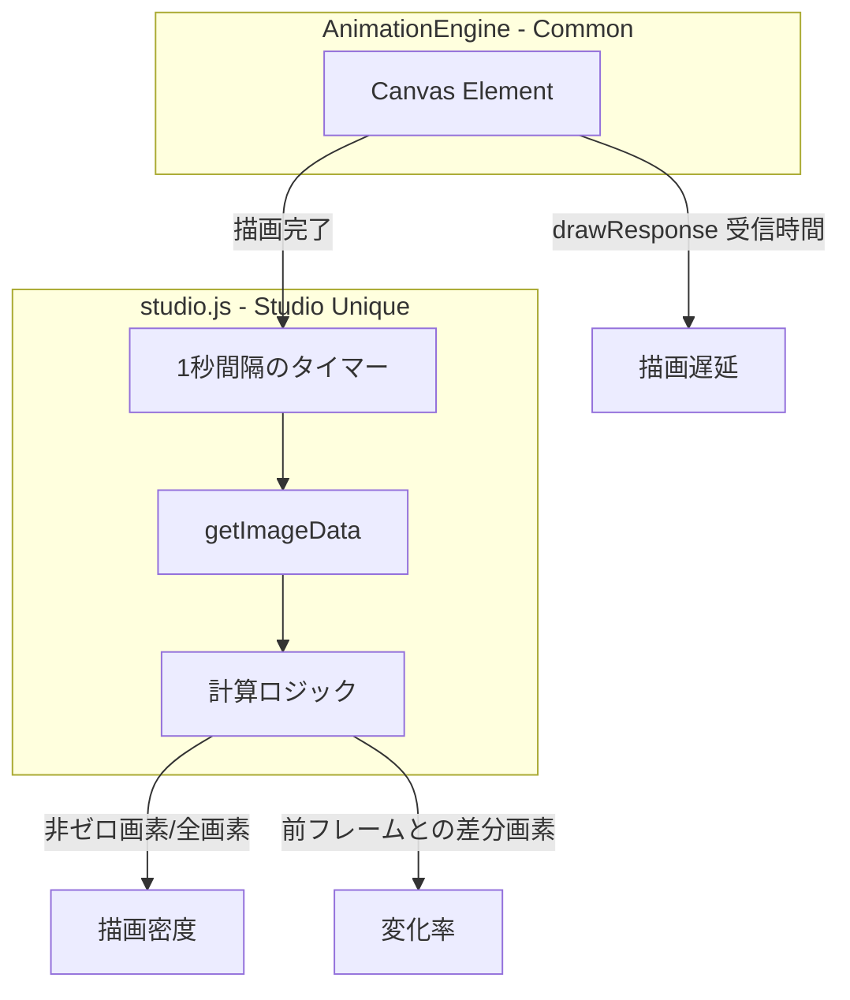

- **計測項目:**
    - **Latency (遅延):** Worker にリクエストを出してから `drawResponse` が返るまでの時間。
    - **Density (密度):** キャンバス上の点灯ドットの割合。
    - **Change Rate (変化率):** 1フレーム前と比較して、状態（色）が変化した画素の割合。

---

## 5. QL-Category Editor

### モジュール構成 (Category Editor)

Category Editor は、アプリで使用するカテゴリ設定を視覚的に編集するためのツールです。

- **js/category-editor.js (メイン):** 初期化、言語・テーマ設定、共通状態の管理、アニメーションエンジンのセットアップ。
- **js/history.js (履歴):** 履歴スタック（Undo/Redo）の管理。テキスト入力の確定タイミング（blur）に合わせた履歴記録。
- **js/ui.js (UI制御):** カテゴリリストの描画、詳細パネルのレンダリング、ドラッグ＆ドロップによる並べ替え、カラーパレット、タグ管理。
- **js/data-io.js (データ入出力):** NDJSON形式によるインポート/エクスポート、クリップボード操作、スキーマバリデーションとの連携。

### アーキテクチャ図 (Category Editor)

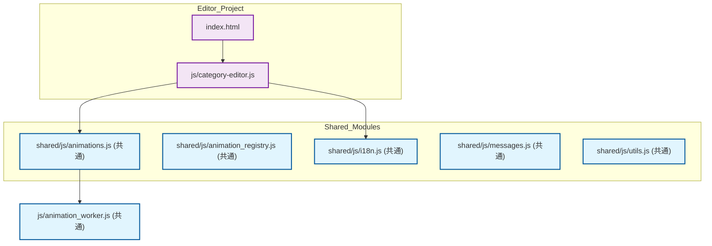

### 主な振る舞い
- **ライブプレビュー:** 共通の `AnimationEngine` を使用し、製品版と全く同じ描画ロジックで色の組み合わせやアニメーションの挙動を確認できます。
- **NDJSON インポート/エクスポート:** クリップボードを介して、メインアプリの設定と互換性のある NDJSON 形式でカテゴリ設定を一括操作できます。
- **ドラッグ＆ドロップ:** カテゴリの並べ替えを直感的に行い、その結果を `order` 属性に反映させます。
- **ページ区切り (Page Break):** メインアプリのページネーションを制御するための特殊なカテゴリ（`SYSTEM_CATEGORY_PAGE_BREAK`）を挿入・編集できます。

### Animation Engine (共通エンジン) の仕様と使用方法

`js/animations.js` に実装されている `AnimationEngine` は、メインアプリ、Studio、Category Editor のすべてで共通の描画基盤として使用されます。

#### 1. 基本的な使用方法

```javascript
import { AnimationEngine } from './js/animations.js';
import { MyAnimation } from './js/animation/my_animation.js';

// インスタンス化
const canvas = document.getElementById('my-canvas');
const engine = new AnimationEngine(canvas);

// モジュールの登録
engine.register('my-anim', MyAnimation, 'my_animation_id');

// アニメーション開始
// start(登録名, 開始時刻(ms), 色コード)
engine.start('my-anim', Date.now(), '#1976d2');

// UI遮蔽領域の設定
engine.setExclusionAreas([{ x: 10, y: 10, width: 100, height: 50 }]);

// 停止
engine.stop();
```

#### 2. 動的モジュール読み込み (Blob URL の応用)
Studio 等で、未登録のコードを即座にプレビューするために、Blob URL を使用してモジュールを動的にロードできます。

```javascript
// studio.js での応用例
const fullCode = "export default class CustomAnimation extends AnimationBase { ... }";
const blob = new Blob([fullCode], { type: 'application/javascript' });
const blobUrl = URL.createObjectURL(blob);

// Engine の内部 Worker へ Blob URL を渡して初期化
// ※Studioでは内部的に engine.start をオーバーライドして modulePath を blobUrl に差し替えています
engine.worker.postMessage({ type: 'init', payload: { modulePath: blobUrl } });
```

#### 3. 主要なAPI仕様
- **`constructor(canvas)`**: 描画対象の Canvas 要素を指定して初期化します。
- **`register(name, class, id)`**: モジュール名、クラス、および一意識別子（ファイル名に対応）を登録します。
- **`start(name, startTime, color)`**: 指定したモジュールでアニメーションを開始します。内部で Web Worker を生成し、モジュールをロードします。
- **`stop()`**: アニメーションを停止し、Worker を破棄してキャンバスをクリアします。
- **`setExclusionAreas(areas)`**: `[{x, y, width, height}, ...]` の形式で、文字などで隠すべき領域を指定します。
- **`resize()`**: 親要素のサイズに合わせてキャンバスをリサイズし、Worker へ通知します。

---

## 6. Webサイト・資産 (Landing Page & Quick Start Guide)

### アーキテクチャ図 (Web Assets)

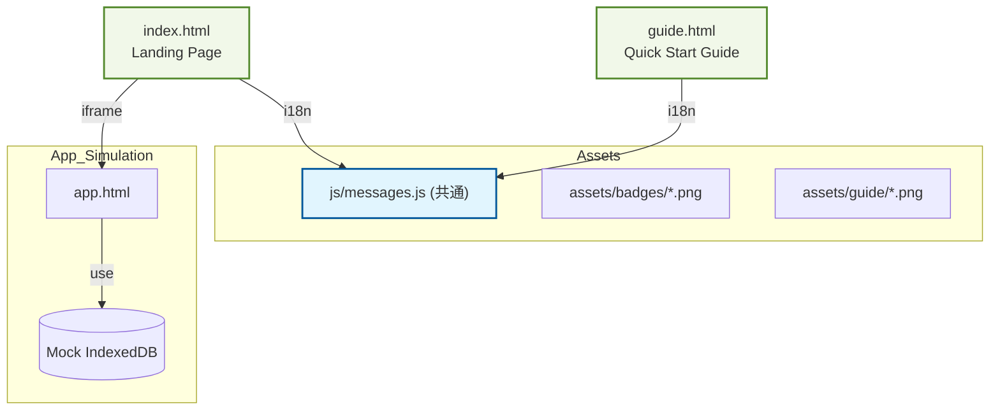

### ランディングページ (index.html)
- **「ブラウザで試す」機能:**
    - `iframe` 内で `app.html` を起動します。
    - 本番のデータを破壊しないよう、URLパラメータ（`?db=QuickLogSoloDB_Preview`）を使用して一時的なデータベース（Mock DB）を割り当て、環境を分離しています。
- **多言語化:** `js/messages.js` のリソースを使用し、ブラウザの言語設定に応じた自動切り替えと、手動選択をサポートしています。

### クイックスタートガイド (guide.html)
- **印刷最適化:** A4 1枚程度に収まるよう CSS `media print` を調整しており、PDF 保存や物理的な印刷に対応したレイアウトを提供します。
- **自動化された資産生成:** ガイド内で使用されるスクリーンショットは、Playwright を使用したスクリプト（`scripts/generate_guide_screenshots.js`）によって、各言語・各状態で自動的に撮影されます。これにより、UI の変更に伴うドキュメントの鮮度低下を防いでいます。

---

## 7. 設計原則と行動指針

本プロジェクトで採用している設計原則（SLAP, DRY, KISS, YAGNI, OCP）の詳細および具体的な行動指針については、[AGENTS.md](AGENTS.md) を参照してください。

---

## 8. 開発ワークフロー

### ディレクトリ構成
- `projects/app/`: メインプロジェクト（ブラウザ拡張機能）のソースコード一式。
- `projects/studio/`, `projects/category-editor/`, `projects/web/`: 各サブプロジェクトのルート。
- `shared/`: 各プロジェクト間で共有されるロジック、JSモジュール、CSS、資産。
- `scripts/`: ビルド・検証・資産生成スクリプト。
- `tests/`: Jest による単体テスト。
- `docs/`: 技術仕様書、各種ガイド。

### バージョン管理
`npm run version:bump` コマンドにより、`projects/app/version.json`, `package.json`, `projects/app/manifest.*.json` を一括更新します。

### ビルドとパッケージング
`npm run build` により、以下の処理を自動実行します：
1. **PNGアイコン生成**: `shared/assets/icon.svg` から各サイズ（16/32/48/128）の `icon.png` を生成します (`scripts/generate_png_icons.py`)。
2. **アニメーションレジストリ生成**: `shared/js/animation/` 内の全モジュールをスキャンし、`shared/js/animation_registry.js` を自動生成します (`scripts/generate_animation_registry.py`)。
3. **バージョン整合性チェック**: `package.json`, `projects/app/version.json`, マニフェストファイル間でのバージョン番号の一致を確認します (`scripts/check_version.py`)。
4. **ZIPパッケージ作成**: ブラウザ別（Chrome, Firefox）のマニフェストを適用し、`releases/` ディレクトリに配布用 ZIP パッケージを作成します (`scripts/create_package.py`)。

### その他の管理スクリプト
- **scripts/bump_version.py**: バージョン番号をインクリメントし、関連ファイルすべてを同期更新します。
- **scripts/verify_animations.py**: アニメーションモジュールのメタデータや安全性を検証します（`npm test` 内で実行）。
- **scripts/verify_version_impact.py**: コミットメッセージの内容（feat, fix等）に応じて適切なバージョンアップが行われているかを CI 上で検証します。
- **SCANOSS (GitHub Actions)**: 業界標準の OSS 監査ツール。プロジェクト内のコード断片（スニペット）を 1 億件以上の OSS データベースと照合し、ライセンス表記のないコピーコードも検出します。
- **scripts/animation_utils.py**: 複数のスクリプトで共有される、アニメーションモジュールのパースやフィルタリングのための共通ユーティリティです。
- **scripts/update_guide_images.js**: クイックスタートガイド (`guide.html`) で使用するキャプチャ画像を Playwright を使用して自動生成します。内部的に `generate_guide_screenshots.js` を呼び出します。
- **scripts/generate_guide_screenshots.js**: 特定の言語・状態でアプリを起動し、指定された座標のスクリーンショットを撮影する Playwright スクリプトです。

---

## 9. テストと品質管理

### テスト環境の仮想化 (Virtualization)

本プロジェクトでは、ブラウザ API に依存したコードを Node.js 環境で効率的にテストするため、以下の仮想化技術とモック戦略を採用しています。

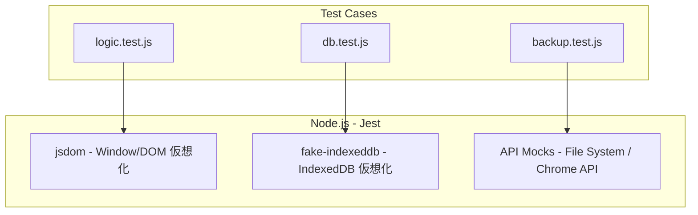

#### 仮想化の詳細
- **IndexedDB の仮想化 (`fake-indexeddb`):** 実際のデータベースを使用せず、メモリ上で IndexedDB をエミュレートします。テストごとにデータベースをリセットでき、高速でクリーンなテスト環境を提供します。
- **DOM 仮想化 (`jsdom`):** `app.js` など UI に密接なモジュールをテストする際、ブラウザの DOM 構造をメモリ上に再現します。`document.querySelector` やイベントリスナーの動作検証が可能です。
- **API のモック化 (Mocking):**
    - **File System Access API:** `backup.test.js` では、`window.showDirectoryPicker` や `FileSystemHandle` を Jest のモック関数 (`jest.fn()`) で置き換えています。これにより、実際のディスク操作を発生させずに、ファイル保存や読み込みのロジック、エラーハンドリングを検証します。
    - **Chrome/Browser Extension API:** `chrome.storage` や `chrome.alarms` などの拡張機能固有の API は、グローバルオブジェクトとしてモックを定義し、期待される動作をシミュレートします。

### テスト一覧

| 分類 | テスト項目 (ファイル名) | テストの観点・目的 | テスト方法の概要 |
| :--- | :--- | :--- | :--- |
| **単体テスト** | `logic.test.js` | 業務状態（IDLE/WORKING等）の遷移が正しいか | logic.js の純粋なロジックを Jest で検証 |
| | `db.test.js` | IndexedDB への CRUD 操作とマイグレーション | `fake-indexeddb` を用いた DB 操作検証 |
| | `utils.test.js` | バリデーション、時間計算、エスケープ処理 | 多様な入力値に対する期待値の検証 |
| **統合/UIテスト** | `app.test.js` (想定) | UI 要素の更新、イベント発火の連動 | `jsdom` 環境での DOM 操作・検証 |
| | `i18n_coverage.test.js` | 全言語で翻訳キーが不足なく存在するか | `messages.js` の構造を網羅的にチェック |
| **バックアップ** | `backup.test.js` | NDJSON/JSON 形式での保存・復元と統合 | FileSystem API をモックしてロジック検証 |
| | `abnormal_backup.test.js` | ディスク満杯や権限喪失時の異常系挙動 | 意図的に例外をスローするモックでの検証 |
| **E2Eテスト** | `sync.spec.js` | 複数ウィンドウ間での状態同期 | Playwright による複数ブラウザ操作 |
| | `settings.spec.js` | 設定変更が即座に UI と DB に反映されるか | Playwright による実ブラウザ操作自動化 |
| **品質・検証** | `animation_verification.spec.js` | アニメーションの描画パフォーマンスとエラー | 実 Worker を起動し Latency 等を計測 |
| | `dev_only_exclusion.spec.js` | リリース版に開発用アニメが含まれていないか | ビルド成果物 (ZIP) の内容スキャン |

### 実行コマンド
```bash
# 全テストの実行
npm test

# リンターの実行
npx eslint .
npx stylelint "**/*.css"
```

### pre-commit フック
コミット時に以下のチェックが自動的に実行されます。
1. **check-version:** `version.json`, `package.json`, およびマニフェストファイル間でのバージョン整合性チェック。
2. **create-package:** ブラウザ別パッケージ（ZIP）の自動生成。
3. **eslint:** JS の静的解析。特に関数や try-catch ブロック内での不必要な変数への再代入を避けるため、 `no-useless-assignment` ルールを遵守してください。
4. **stylelint:** CSS の静的解析。
5. **jest:** ユニットテストの実行。

---

## 10. 拡張・修正時の注意点

1. **ドキュメントの更新:** 実装の修正や拡張を行った場合、必ず関連ドキュメントを更新してください。
2. **Vanilla JS の維持:** プロダクションコードにおける外部ライブラリの導入は原則禁止です。
3. **互換性の維持:** スキーマ変更時は必ずマイグレーション処理を記述してください。

---

## 11. 関連ドキュメント

- [製品仕様書 (spec.md)](spec.md)
- [テスト計画・ケース定義書 (README_TEST.md)](README_TEST.md)
- [背景アニメーション・モジュール仕様書 (animation_module_spec.md)](animation_module_spec.md)
- [AI エージェント指針 (AGENTS.md)](../AGENTS.md)

---

## 12. 運用・トラブルシューティング

### CodeQL: "3 configurations not found" 警告の解消
GitHub のプルリクエストにおいて、CodeQL スキャンの結果に以下のような警告が表示されることがあります。
`Warning: Code scanning cannot determine the alerts introduced by this pull request, because 3 configurations present on refs/heads/main were not found: Default setup / language:actions / language:javascript-typescript / language:python`

**原因:**
GitHub の「Default setup」設定と `main` ブランチの状態に不整合が生じている場合に発生します。特にリポジトリの設定変更やブランチの乖離が原因となることが多いです。

**解決策:**
1. リポジトリの **Settings > Code security and analysis** を開く。
2. **CodeQL analysis** の横にある「...」ボタンをクリックし、一度 **Disable CodeQL** を選択する。
3. 数分待った後、再度同じ場所から **Set up > Default** を選択して有効化する。
4. `main` ブランチで自動的にスキャンが開始されるので、完了を待つ。
5. プルリクエストを再度確認し、警告が解消されていることを確認する。
