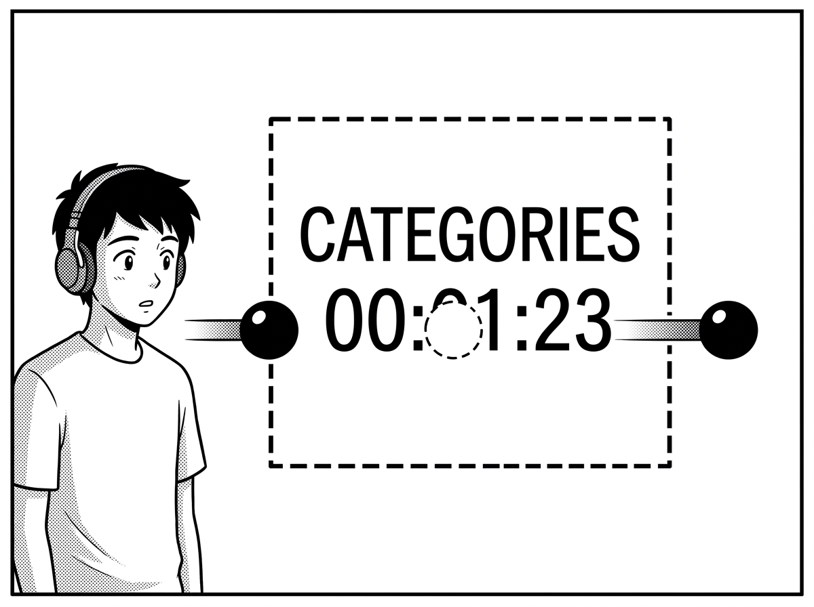
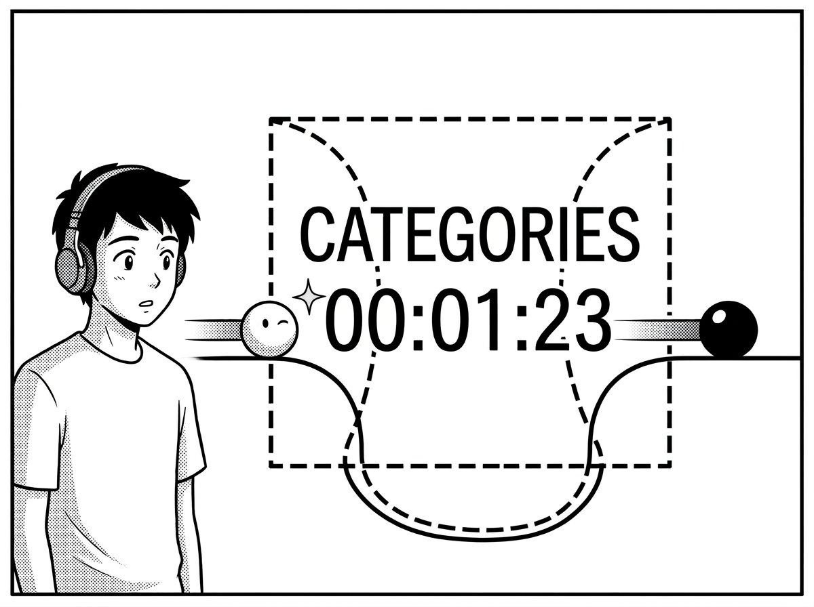
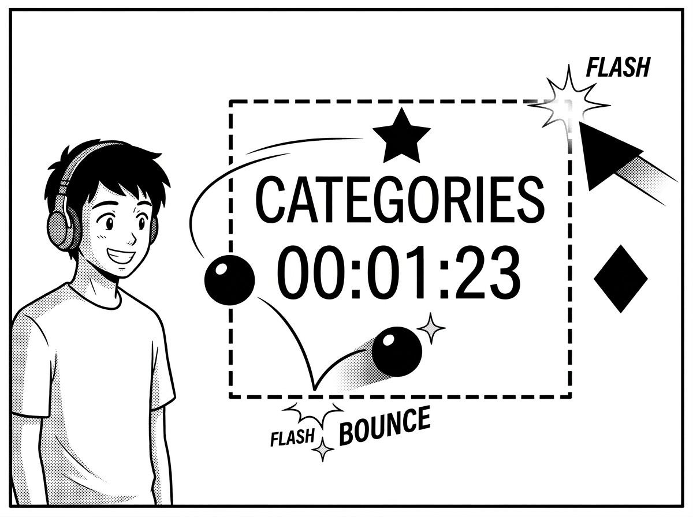

<!-- markdownlint-disable MD013 MD060 -->
# 背景アニメーション・モジュール制作ガイド

仕様バージョン: 2.0 (Multicolor Edition)

## 1. はじめに：QuickLog-Solo に命を吹き込む

QuickLog-Solo は、単なる業務メモツールではありません。
あなたのコードによって生み出されるアニメーションは、作業者の集中を助け、時には心を癒やす「ビジュアル・ヒーリング」の一部となります。

このガイドでは、技術的な仕様だけでなく、どのようにして「楽しく」「使いやすい」アニメーションを作るかのエッセンスを解説します。

---

## 2. 空間のコンセプト：FG と BG

アニメーションを設計する際、画面を 2 つのレイヤーとして捉えてください。

### BG (Background) 領域

あなたのキャンバスです。画面全体に広がり、120秒周期で時を刻みます。

### FG (Foreground) 表示領域

ユーザーにとって最も大切な「業務カテゴリ名」と「経過時間」を表示する帯状の領域です。

- **場所:** 画面の中央付近に、左右いっぱいに広がる「見えない帯」として存在します。
- **ポリシー (視認性優先):** QuickLog-Solo は「記録ツール」であるため、どんなに素晴らしいアニメーションも、この FG 領域の文字を読めなくしてはいけません。

---

## 3. FG回避の決断 (Exclusion Strategy)

FG 領域（文字の帯）とアニメーションが重なる際、どのように振る舞うかを 3 つの「戦略」から選択できます。これは、あなたの「こだわり」と「実装の難易度」に応じた決断です。

| 戦略名 | クリエイターのスタンス | 実装難易度 | 特徴 |
| :--- | :--- | :--- | :--- |
| **`'mask'`** (標準) | **「ありのままを受け入れる」** | 🌟☆☆ | FG 領域に重なるドットは自動的に消去されます。背景に徹したい場合に最適。 |
| **`'jump'`** (跳躍) | **「連続性を重視する」** | 🌟🌟☆ | FG 領域を「FG領域を飛び越える(Jump)」決断です。星や鳥を画面端から端までスムーズに動かしたい場合に最適。 |
| **`'freedom'`** (自由) | **「UI と共演する」** | 🌟🌟🌟 | 自動的な消去は行われません。FG の位置を把握し、文字を避けたり、枠線を光らせたり、UI を活かした表現が可能です。 |

### 動作イメージ

#### 1. `'mask'`：受容

「見えない範囲は、更衣室や待合室のようなもの」と考えます。
オブジェクトが中央を横切る際、FG の後ろに隠れ、通り過ぎるとまた現れます。



#### 2. `'jump'`：跳躍

「FG 領域という隙間をワープして、描いたものを全て見せたい」という決断です。
エンジンが空間を圧縮し、モジュール側には「文字の帯を除いた狭いキャンバス」を見せます。



#### 3. `'freedom'`：自由

「FG の上下の狭い空間を活かしたり、境界線に反応させたい」というマスターの決断です。
エンジンは一切の干渉をせず、全てのドットを表示します。



---

## 4. 制作を楽しくするアイデア

QuickLog-Solo の背景は、低解像度の「LCD ドットマトリクス」スタイルです。この制限を活かして、遊び心のある表現に挑戦しましょう。

- **ストーリーを持たせる:** `elapsedMs` を使って、タスク開始から 5 分、10 分と経過するごとに景色が変わるような演出。
- **インタラクション:** `onClick` を使って、クリックした場所にエサを置いたり、波紋を広げたり。
- **季節や時間帯:** ステップ（0-239）に応じて、朝・昼・晩、あるいは春夏秋冬の色合いを表現する。
- **「間」の活用:** 文字の背後で何かが起きていることを予感させる動き。

---

## 5. テクニカル・リファレンス

アニメーションモジュールは `AnimationBase` クラスを継承して作成します。

### 5.1. 静的メタデータ (`static metadata`)

エンジンの管理やUI表示に使用される情報です。

- `specVersion`: アニメーションモジュールが準拠する背景アニメーション仕様のバージョン。
  - **`'2.0'`**: マルチカラー・アルファブレンディングに完全対応した新仕様（推奨）。
  - **`'1.1'` / `'1.0'`**: 従来の単色仕様（後方互換性のため完全動作を保証）。
- `name`: アニメーション名（後述の多言語対応を参照）。
- `description`: 解説（後述の多言語対応を参照）。
- `author`: 作者名。
- `rewindable`: `true` にすると、Studioで巻き戻しが可能になります（`elapsedMs` に依存した設計が必要です）。なお、早送りは `rewindable` の値に関わらず常に可能です。
- `devOnly`: `true` に設定すると、開発中のみ表示され、正規リリース版やカテゴリエディタの選択肢からは除外されます。

#### 5.1.1. 多言語対応の形式とロジック

`name` や `description` などのメタデータは、単一の文字列、または言語コードをキーとしたオブジェクトのいずれかの形式で記述できます。

**データ構造:**

- 言語コードは ISO 639-1 (2文字) を使用します（例: `en`, `ja`, `de`, `es`, `fr`, `pt`, `ko`, `zh`）。
- 文字列の場合: すべての言語でその文字列が表示されます。
- オブジェクトの場合: 言語コードごとに異なるテキストを定義できます。

**記述のバリエーション (例):**

```javascript
// パターンA: 文字列 (シンプルに1言語、または共通の名前)
name: "Digital Rain",

// パターンB: 主要言語のみ対応
name: {
    en: "Digital Rain",
    ja: "デジタル・レイン"
},

// パターンC: フル対応
name: {
    en: "Digital Rain",
    ja: "デジタル・レイン",
    de: "Digitaler Regen",
    // ...
}
```

**フォールバックのロジック:**

ユーザーの選択言語に応じたテキストを表示する際、指定した言語のキーが存在しない場合は以下の順序で検索されます。

1. **選択言語** (例: `ja`)
2. **英語 (`en`)**
3. それでも見つからない場合は、アニメーションID（名前の場合）または空文字（説明の場合）が表示されます。

### 5.2. 構成設定 (`config`)

エンジンの振る舞いを制御する設定です。

- **`mode`**: 描画モードを選択します。
  - `'canvas'`: 一般的な HTML5 Canvas 2D API を使用します。
  - `'matrix'`: 数値または拡張オブジェクトの 2 次元配列を返してドットを表現します。
  - `'sprite'`: 座標、サイズ、および色・アルファのリストを返してドットを表現します。
- **`exclusionStrategy`**: FG 回避戦略を選択します。
  - `'mask'`, `'jump'`, `'freedom'`（詳細はセクション 3 を参照）。
- **`colorMode`** (仕様バージョン `2.0` 以降の `'canvas'` モードで有効):
  - `'mono'` (デフォルト): 描画パフォーマンスを最優先し、キャンバスの描画内容から「輝度」のみを計算して、ドットはすべてカテゴリ固有のテーマカラー（またはレトロ液晶固有色）で描画します。
  - `'multi'`: キャンバスに描かれたグラデーションや多彩な色、透明度をそのまま抽出し、マルチカラーで贅沢にドットを表現します。

> **[用語解説] オフスクリーン (Offscreen)**
>
> ユーザーに見える実際の画面とは別に、メモリ上に用意された「隠れたキャンバス」のことです。
> アニメーションはこの隠れた場所で描画（計算）され、その後ドット形式に変換されてから、実際の画面に映し出されます。

### 5.3. 主要メソッド

#### `setup(width, height)`

アニメーションの開始時および画面リサイズ時に一度だけ呼ばれる初期化メソッドです。
ここで、パーティクルの初期化や配置計算を行うのがベストです。

**引数:**

| 引数名 | 型 | 説明 |
| :--- | :--- | :--- |
| `width` | `number` | 有効な描画領域の幅。`'jump'` 戦略時は **座標マッピング** のため、FG領域を除いた幅となります。 |
| `height` | `number` | 有効な描画領域の高さ。 |

> **[用語解説] 座標マッピング (Coordinate Mapping)**
>
> `'jump'` 戦略を選んだとき、エンジンは FG 領域を「無かったこと」にして空間を詰め、モジュールに渡す `width` を調整します。
> 描画されたオブジェクトを実際の物理的な画面位置に再配置するこの仕組みを座標マッピングと呼びます。

#### `draw(ctx, params)`

毎フレーム（通常 60fps）呼ばれるメインの描画ルーチンです。
`'canvas'` モードの場合、モジュールは渡された **オフスクリーン** キャンバスの `ctx` に対して描画を行います。
エンジンは描画結果を自動的に **ラスタライズ** し、QuickLog-Solo 特有のドット形式に変換します。

> **[用語解説] ラスタライズ (Rasterization)**
>
> 線や円などの「図形データ（ベクター）」を、点（ドット）の集まりに変換する処理のことです。
> `'canvas'` モードで描いた滑らかな絵も、この工程を経て LCD ドットマトリクスらしい表現へと生まれ変わります。
>
> **[設計上の注意]**
>
> `params` には現在の描画領域の `width` や `height` は含まれません。
> これは、描画ループ内での不要な計算を避け、サイズ変更への対応を `setup()` メソッドに集約させるための意図的な設計です。
> サイズ情報が必要な場合は、`setup()` で受け取った値をクラスのプロパティに保存して利用してください。

**引数:**

| 引数名 | 型 | 説明 |
| :--- | :--- | :--- |
| `ctx` | `CanvasRenderingContext2D` | `'canvas'` モード時のみ使用する描画コンテキスト。 |
| `params` | `Object` | 以下のプロパティを含む実行時パラメータ。 |

**`params` オブジェクトのプロパティ:**

| プロパティ名 | 型 | 説明 |
| :--- | :--- | :--- |
| `elapsedMs` | `number` | アニメーション開始からの累計時間 (ミリ秒)。 |
| `progress` | `number` | 120 秒で 1 サイクルする進捗率 (0.0 ～ 1.0)。 |
| `step` | `number` | 1 サイクルを 240 分割した現在のステップ番号 (0 ～ 239)。 |
| `exclusionAreas`| `Array` | FG 領域の座標リスト `[{x, y, width, height}, ...]`。`'freedom'` 戦略時のみ有効な値が入ります。 |
| `speed` | `number` | 現在の再生速度倍率。 |

**返り値:**

仕様バージョン `2.0` では、色と透明度の動的指定に対応しています。

| モード | 型 | 説明 |
| :--- | :--- | :--- |
| `'matrix'` | `(number \| Object)[][]` | ドットの明るさ、または色・アルファ情報を指定する2次元配列。 |
| `'sprite'` | `Array<Object>` | 点灯させるドットの座標, サイズ, および色・アルファ情報のリスト。 |
| `'canvas'` | `void` | 返り値は不要です（`ctx` への直接描画が優先されます）。 |

### 5.4. インタラクション (任意)

ユーザーの操作に反応するためのメソッドです。

**引数:**

| メソッド名 | 引数 | 説明 |
| :--- | :--- | :--- |
| `onClick(x, y)` | `x`, `y` | クリックされた座標（キャンバス上の物理座標）を受け取ります。 |
| `onMouseMove(x, y)`| `x`, `y` | マウスが動いた座標を受け取ります。 |

---

## 6. バージョン 2.0 (Multicolor Edition) 独自仕様

仕様バージョン `2.0` では、ドット表現の良さを維持しつつ、アニメーションモジュール側から色（不透明度を含む）を自由に制御できる上位互換のAPIが設計されています。

### 6.1. 指定可能なカラーのフォーマット

`color` プロパティには、以下のような**すべての有効なCSSカラー指定**が指定可能です。

- 色名: `"green"`, `"red"`, `"transparent"`
- HEXカラー: `"#00ff00"`, `"#0666"`, `"#33ff3388"`
- 関数型: `rgb(0, 255, 0)`, `rgba(0, 255, 0, 0.5)`, `hsl(120, 100%, 50%)`, `hsla(120, 100%, 50%, 0.5)`

### 6.2. 各描画モードの `2.0` 仕様詳細

#### 6.2.1. `'sprite'` モード

配列の各ドットオブジェクトにオプショナルな `color` と `alpha` を指定できます。

```javascript
// 返り値の例
return [
    { x: 12, y: 24, size: 3, color: "#ff0055" },                 // 濃いピンク
    { x: 18, y: 24, size: 2, color: "rgba(0, 255, 255, 0.5)" },  // 半透明シアン
    { x: 24, y: 24, size: 1 }                                    // カテゴリ固有色へフォールバック
];
```

- `color` (省略可能): 指定がない、または undefined の場合はカテゴリ固有のカラーが適用されます。
- `alpha` (省略可能、`0.0` 〜 `1.0`): 指定された場合、不透明度を重ねて適用します。

#### 6.2.2. `'matrix'` モード

`(number | Object)` の二次元配列にて、数値（従来互換）のほか、オブジェクト `{ size: number, color?: string, alpha?: number }` を直接渡せます。

```javascript
// 返り値の例
return [
    [0, 3, { size: 2, color: "yellow", alpha: 0.8 }, 0],
    [1, { size: 3, color: "#00fffa" }, 0, 2]
];
```

- `size`: 必須（`1`=小, `2`=中, `3`=大）。
- `color` / `alpha`: `'sprite'` モードと同様に機能します。

#### 6.2.3. `'canvas'` モード

`'canvas'` モードは `config.colorMode` によって動作が変わります。
また、従来の仕様で「赤 (R) チャンネルのみを輝度判定に使用していた」偏った仕様が起源となっていましたが、グレースケール輝度による正確な算出（標準的なLuminance式）へアップグレードされました。

- **輝度判定 (Luminance)**:
  各 6x6 セルにおいて、以下の式を用いて明るさを正確に計算し、ドットサイズ（1〜3）を決定します。
  $$Luminance = 0.299 \times R + 0.587 \times G + 0.114 \times B$$
- **`config.colorMode = 'mono'` (単色モード)**:
  - 描画負荷が非常に低いです。
  - キャンバスにどんな色で描画されていても、表示されるドットはすべてカテゴリ固有のテーマカラーで統一されます。
- **`config.colorMode = 'multi'` (複数色モード)**:
  - 6x6 のセルごとに、描画された非透明ピクセルの **平均カラー (RGB)** および **平均アルファ (A)** をサンプリングして抽出し、個々のドットに適用します。
  - グラデーションや、グラフィックをそのままドット絵風にカラー表現するのに最適です。

---

### 6.3. レトロディスプレイモードとの協調

ユーザーが「レトロディスプレイモード」を有効にしている場合、`2.0` 仕様のカスタムカラーは以下のように美しく協調（Option B: カラー維持＋レトロエフェクト適用）します。

- **`retro-lcd` (レトロ液晶) モード**:
  - 指定されたカスタムカラーから輝度を計算し、液晶風に少し緑がかったトーンへ自動調色されて描画されます。
  - **液晶ゴースト (残像)**: 直前のフレームに存在したドットのカスタムカラーを保持し、そのアルファをブレンドした（例: `rgba(R,G,B, 0.25)`) 残像を描画します。
  - **3Dシャドウ (液晶の影)**: ドットのカスタムカラーに暗色アルファを乗算したシャドウが、オフセット位置に投影されます。
- **`retro-crt` (CRT) & `retro-nixie` (ニキシー管) モード**:
  - ネオン管やブラウン管の緑・オレンジに制限されず、**指定したカスタムカラーそのままでドットが美しく発光**します。
  - ドットのカスタムカラーをベースとした光の滲み（CSS `drop-shadow` によるグロー効果）が適用されるため、マルチカラーの美しいネオンサインや、カラフルな光の粒子のような極めて表現力の高いビジュアルが実現します。

---

### 6.4. 完璧な後方互換性

- メタデータの `specVersion` に `'1.0'` または `'1.1'` が指定されているアニメーション、もしくは `colorMode` が未指定の場合は、自動的に `'mono'` 挙動として動作します。
- 従来の赤色チャンネル依存の描画仕様を持つ既存のアニメーションに対しても、100%の動作互換性を維持します。

---

## 7. QL-Animation Studio で試そう

[QL-Animation Studio](https://quick-log-solo.vercel.app/studio) を使えば、ブラウザ上でコードを書きながら、リアルタイムで FG 領域との重なりや、`2.0` 仕様でのカラー表現を確認できます。
メトリクス（密度や変化率）を見ながら、最高の心地よさを追求してください。

---

## 8. 改訂履歴

- **1.0 (2024-05-20):** 初版。
- **1.1 (2024-05-24):** `exclusionStrategy` を導入。FG/BG 概念によるクリエイター向けガイドへ刷新。
- **2.0 (2024-06-03):** `colorMode` およびマルチカラー・アルファブレンディングに完全対応した API v2.0 仕様を導入。

## 免責事項 (Disclaimer)

本ソフトウェアは、個人によって開発されたオープンソース・プロジェクトであり、**無保証 (AS IS)** です。
利用に際して生じたいかなる損害（データの消失、業務の中断、PCの不具合など、本ツールやドキュメントを利用したことによるすべての損害）について、開発者は一切の責任を負いません。
MIT ライセンスの規定に基づき、「現状のまま」提供されるものとします。自己責任でご利用ください。

This software is a personal open-source project and is provided **"AS IS"** without warranty of any kind.
The developer shall not be liable for any damages (including data loss, work interruption, etc.) arising from the use of this software.
Use at your own risk, as per the MIT License.
