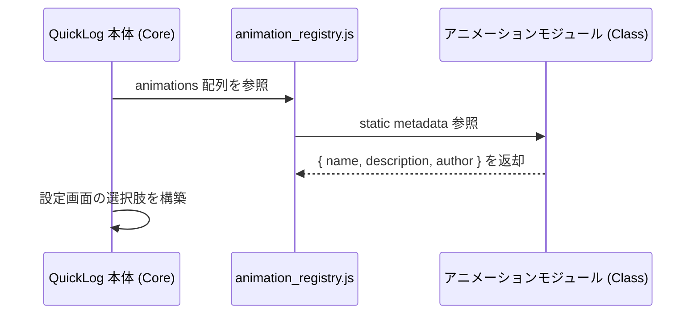
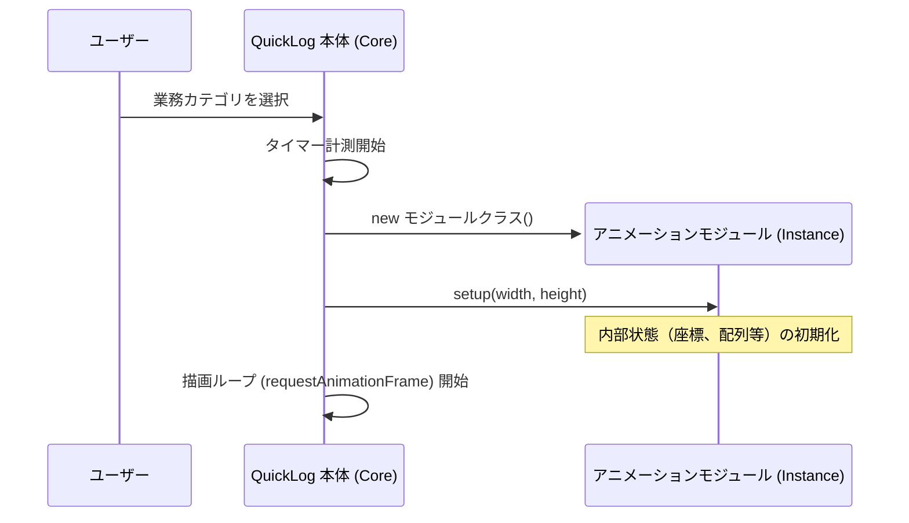
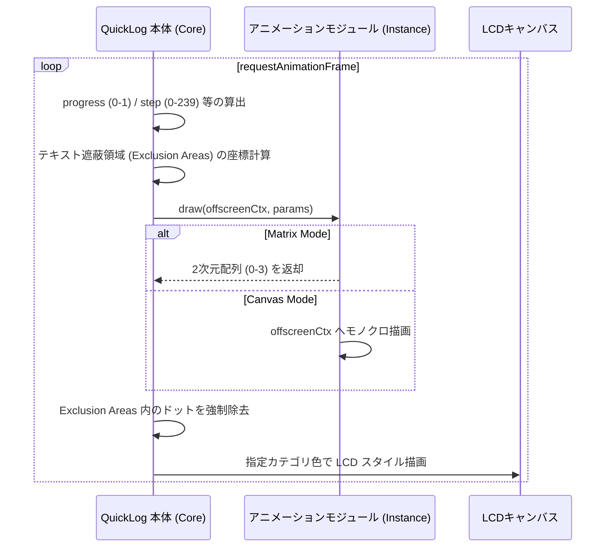
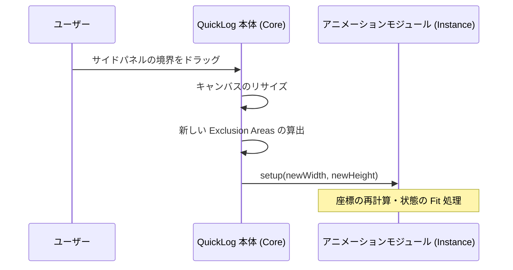
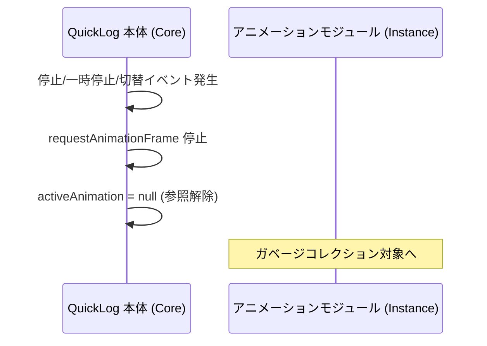

# 時間経過アニメーション モジュール I/F 仕様書

## 1. 目的
QuickLog-Solo の背景アニメーション機能をモジュール化し、外部開発者が独自のアニメーションロジックを追加・修正できるようにするためのインターフェース（I/F）を定義する。
本仕様は、「表現の自由度」と「開発のしやすさ（低ハードル）」の両立を目指す。

## 2. システム構成と役割分担

### 2.1. ディレクトリ構造と自動登録
アニメーションモジュールは `src/js/animation/` ディレクトリに個別のファイルとして格納されます。
ビルドプロセスにおいて、`scripts/generate_animation_registry.py` がこれらのファイルをスキャンし、`src/js/animation_registry.js` を自動生成します。
これにより、コアモジュールを修正することなく、新しいアニメーションを追加・削除することが可能です。

### 2.2. ライフサイクル・シーケンス図

#### アニメーション一覧の取得 (Metadata Discovery)
ユーザーが設定画面を開いた際など、インスタンス化の前にモジュールの情報を取得するフローです。


#### 初期化と開始 (Initialization)
モジュールのインスタンスは、タスク開始時に作成され、描画領域の情報がセットされます。


#### 描画ループ (Drawing Loop)
描画はブラウザの更新周期に合わせて行われます。本体側で「ドット回避領域（Exclusion Area）」を算出し、モジュールへ提供します。


#### 領域リサイズ (Viewport Resize)
サイドパネルの幅が変更された場合、インスタンスを破棄せず、`setup` を再送して状態を適合させます。


#### 終了と破棄 (Termination)
タスクの停止、一時停止、または別のアニメーションへの切り替え時にインスタンスは破棄されます。


### 2.3. QuickLog-Solo 本体（コア）の役割
- **時間計測とサイクル管理:** `Date.now()` に基づく正確な時間経過の計測、120秒（2分）を 1周期とする計時サイクル（0～239 のステップ）の算出、およびタスク開始時からの総経過時間（ミリ秒）の管理。
- **レンダリングエンジン:** モジュールから提供されたデータに基づき、LCD ドットマトリクススタイル（4段階のドットサイズ）でのキャンバス描画。
- **視認性確保（自動遮蔽）:** 業務カテゴリ名や経過時間などのテキスト表示エリアを自動的に検出し、アニメーションドットの描画を避ける「ドット回避（Exclusion Area）」処理の実行。
- **リソース管理:** アニメーションの開始・停止・リサイズ制御。

### 2.4. アニメーションモジュール（ロジック）の役割
- **状態管理:** `setup` で受け取った領域情報に基づき、内部のパーティクルや座標情報を管理する。
- **パターン生成:** `draw` メソッドを通じて提供される進捗情報（`progress`, `step`）に応じた描画を行う。
- **視認性への配慮 (推奨):** 提供される `exclusionAreas` を利用して、テキストを避けるような「賢い」アニメーションを実装できる。
- **メタデータの提供:** クラスの静的プロパティとして名前や作者情報を定義する。

## 3. インターフェース仕様

### 3.1. モジュール定義 (Metadata)
各モジュールは `AnimationBase` クラスを継承し、以下の静的プロパティを持つことが期待される。

- `static metadata`: モジュールの情報オブジェクト。
    - `name`: アニメーション名（文字列、または言語コードをキーとしたオブジェクト）。
    - `description`: 簡単な説明（多言語対応可）。
    - `author`: 開発者名。

### 3.2. 呼び出しサイクル
- **計算用ステップ:** 500ms ごとに `step` (0-239) がインクリメントされる。
- **描画周期:** `requestAnimationFrame` (通常 60fps) に同期。
- **周期の長さ:** 120秒 (2分) で 1サイクル。ただし `elapsedMs` を利用することで、2分を超える独自のストーリー展開も可能。

### 3.3. 提供される情報 (Input Parameters)

#### A. セットアップ時 (`setup(width, height)`)
- `width`: 描画領域の幅 (px)
- `height`: 描画領域の高さ (px)
※開始時およびリサイズ時に呼び出される。

#### B. 描画時 (`draw(ctx, params)`)
`params` オブジェクトを通じて以下の情報が提供される。
- `width / height`: 現在の領域サイズ。
- `elapsedMs`: タスク開始時からの総経過時間 (ms)。
- `progress`: 現在の 120秒周期の進捗率 (0.0 ～ 1.0)。
- `step`: 現在の計時ステップ (0 ～ 239)。
- `exclusionAreas`: テキスト等が表示されている遮蔽領域の配列。
    - 形式: `Array<{x: number, y: number, width: number, height: number}>`
    - **注意:** フォントの切り替えやテキスト長の変化により、描画中にサイズが変動する場合があるため、毎フレームチェックすることを推奨する。

### 3.4. 出力データ形式 (Output)
ロジックの作成を容易にするため、以下のいずれかの形式をサポートする。

#### A. マトリックス形式 (Matrix Mode) - 推奨
`draw` 関数の戻り値として、現在のステップにおけるドット配置データを返す。
- **データ構造:** 2次元配列 `Array<Array<number>>` (rows x cols)
- **各要素の値:**
    - `0`: ドットなし
    - `1`: 小ドット
    - `2`: 中ドット
    - `3`: 大ドット
- **メリット:** 座標計算に集中でき、キャンバス操作の知識がなくても実装可能。

#### B. キャンバス描画形式 (Canvas Mode)
引数の `ctx` (CanvasRenderingContext2D) に対して直接描画する（戻り値は `void`）。
- **描画ルール:** 白 (`#fff`) または `color` を用いてモノクロで描画。
- **変換処理:** 本体側でピクセルの明度を読み取り、自動的に 4段階の LCD ドットに変換する。
- **メリット:** 既存のキャンバスアニメーションライブラリや複雑な図形描画を活用可能。

## 4. 実装イメージ

```javascript
import { AnimationBase } from '../animations.js';

export default class MySmartAnimation extends AnimationBase {
    static metadata = {
        name: { en: "Bouncing Ball", ja: "跳ねるボール" },
        description: { en: "A ball that bounces off text.", ja: "テキストに当たって跳ね返るボールです。" },
        author: "Dev Name"
    };

    setup(width, height) {
        this.ball = { x: width / 2, y: height / 2, vx: 2, vy: 2 };
    }

    draw(ctx, { width, height, exclusionAreas }) {
        // ボールの移動
        this.ball.x += this.ball.vx;
        this.ball.y += this.ball.vy;

        // 壁での跳ね返り
        if (this.ball.x < 0 || this.ball.x > width) this.ball.vx *= -1;
        if (this.ball.y < 0 || this.ball.y > height) this.ball.vy *= -1;

        // exclusionAreas (テキスト領域) での跳ね返り
        exclusionAreas.forEach(area => {
            if (this.ball.x > area.x && this.ball.x < area.x + area.width &&
                this.ball.y > area.y && this.ball.y < area.y + area.height) {
                this.ball.vy *= -1; // 簡易的な反射
            }
        });

        // 描画 (Canvas Mode: モノクロで描く)
        ctx.fillStyle = '#fff';
        ctx.beginPath();
        ctx.arc(this.ball.x, this.ball.y, 5, 0, Math.PI * 2);
        ctx.fill();
    }
}
```

## 5. 視認性の担保について
本体側のレンダリングエンジンが、モジュールから受け取ったデータの描画直前に、テキスト領域と重なるドットを**強制的に**非表示にします。そのため、モジュール側で `exclusionAreas` を無視して描画しても視認性は損なわれませんが、`exclusionAreas` を活用することで、より自然で洗練された「避けるアニメーション」を構築できます。
