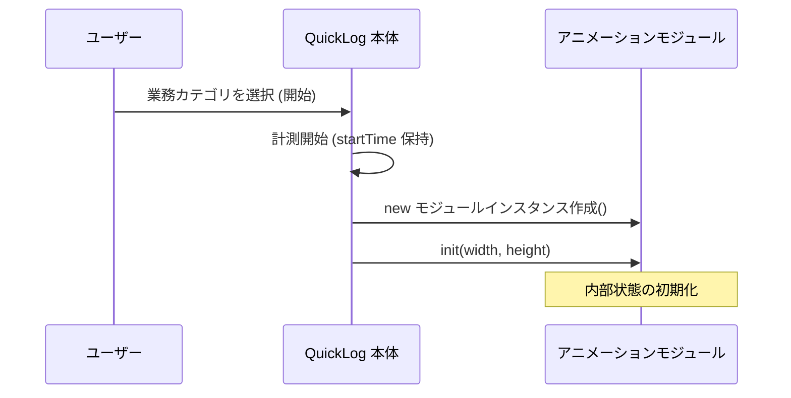
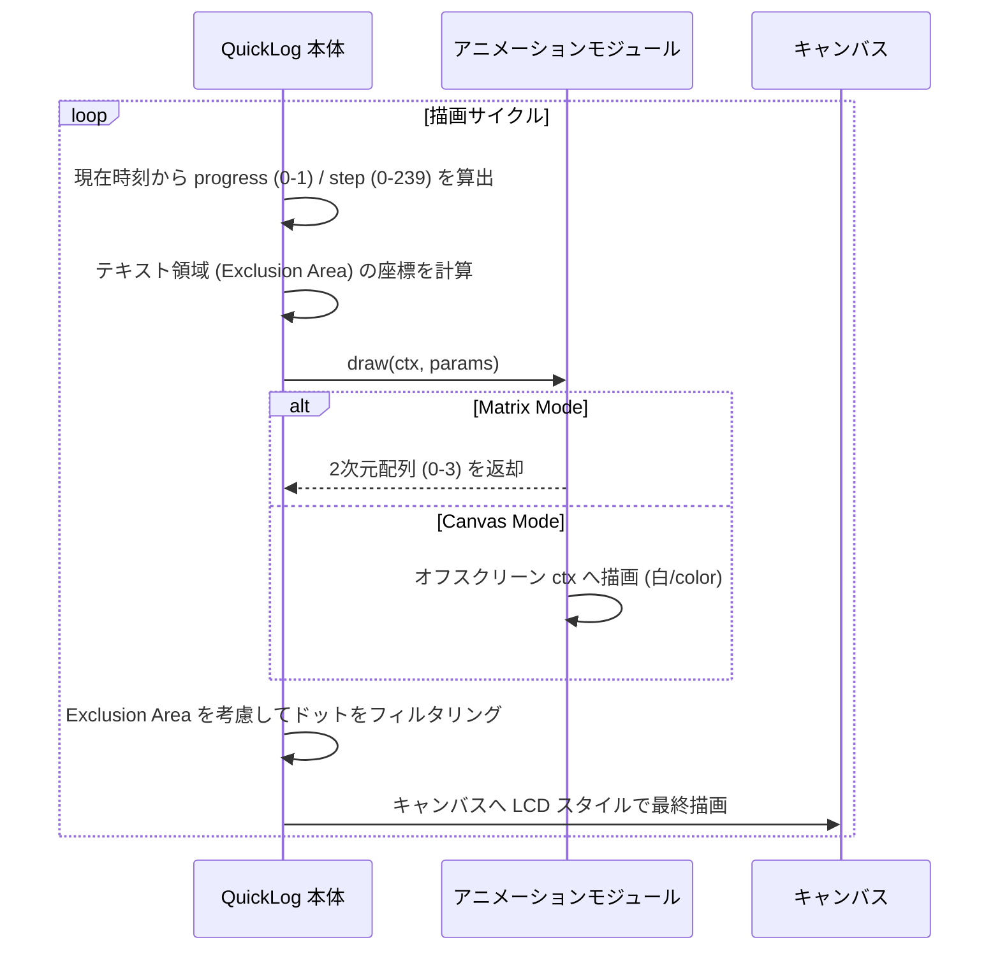

# 時間経過アニメーション モジュール I/F 仕様書

## 1. 目的
QuickLog-Solo の背景アニメーション機能をモジュール化し、外部開発者が独自のアニメーションロジックを追加・修正できるようにするためのインターフェース（I/F）を定義する。

## 2. システム構成と役割分担

### 2.1. シーケンス図

#### 初期化と開始


#### 描画ループ (requestAnimationFrame)


### 2.2. QuickLog-Solo 本体（コア）の役割
- **時間計測とサイクル管理:** `Date.now()` に基づく正確な時間経過の計測、120秒（2分）を 1周期とする計時サイクル（0～239 のステップ）の算出、およびタスク開始時からの総経過時間（ミリ秒）の管理。
- **レンダリングエンジン:** モジュールから提供されたデータに基づき、LCD ドットマトリクススタイル（4段階のドットサイズ）でのキャンバス描画。
- **視認性確保（自動遮蔽）:** 業務カテゴリ名や経過時間などのテキスト表示エリアを自動的に検出し、アニメーションドットの描画を避ける「ドット回避（Exclusion Area）」処理の実行。
- **リソース管理:** アニメーションの開始・停止・リサイズ制御。

### 2.3. アニメーションモジュール（ロジック）の役割
- **初期化:** `init` メソッドを通じて、キャンバスのサイズ（width/height）などの静的な情報を一度だけ受け取り、内部状態を初期化する。
- **パターン生成:** `update`（または `draw`）メソッドを通じて提供される情報に応じたドットの配置パターンの計算。
- **データ提供:** 指定されたタイミングにおける各座標のドットの大きさ（0～3）を本体に返す。提供方法は「マトリックス形式（2次元配列）」または「キャンバス描画」のいずれかを選択可能とする。

## 3. インターフェース仕様

### 3.1. モジュール定義
各アニメーションは以下の静的プロパティを持つクラスとして定義される。

- `static name`: アニメーションの識別名（UI等で使用）。
- `static description`: アニメーションの簡潔な説明（オプション）。

### 3.2. 呼び出しサイクル
アニメーションはブラウザの `requestAnimationFrame` に同期して描画される。
- **1ステップの間隔:** 500ms（計時ステップ算出用）
- **標準周期:** 120,000ms (120秒) / 240ステップ

### 3.3. 提供される情報 (Input)

#### A. 初期化時 (`init(width, height)`)
- `width`: 描画領域の幅 (px)
- `height`: 描画領域の高さ (px)
※リサイズ時にも再呼び出しされる。

#### B. 描画時 (`draw(ctx, params)`)
`params` オブジェクトを通じて以下の情報が提供される。
- `width`: 描画領域の幅 (px)
- `height`: 描画領域の高さ (px)
- `elapsedMs`: タスク開始時からの総経過時間 (ms)
- `progress`: 現在の周期（120秒）の進捗率 (0.0 ～ 1.0)
- `step`: 現在の計時ステップ (0 ～ 239)
- `exclusionAreas`: テキスト等が表示されている遮蔽領域（業務カテゴリ/経過時間/記号の位置）の配列。
    - 形式: `Array<{x: number, y: number, width: number, height: number}>`
    - 用途: アニメーション内のオブジェクト（ボールなど）がテキストを避ける、または反射するようなインタラクティブな表現に利用可能。

### 3.4. 出力データ形式 (Output)
ロジックの作成を容易にするため、以下のいずれかの形式をサポートする。

#### A. マトリックス形式 (Matrix Mode) - 推奨
`draw` 関数の戻り値として、現在のステップにおけるドット配置データを返す。
- **データ構造:** 2次元配列 `Array<Array<number>>` (rows x cols)
- **各要素の値:**
    - `0`: ドットなし
    - `1`: 小ドット
    - `2`: 中ドット
    - `3`: 大ドット
- **メリット:** 座標計算に集中でき、キャンバス操作の知識がなくても実装可能。

#### B. キャンバス描画形式 (Canvas Mode)
引数の `ctx` (CanvasRenderingContext2D) に対して直接描画する（戻り値は `void`）。
- **描画ルール:** 白 (`#fff`) または `color` を用いてモノクロで描画。
- **変換処理:** 本体側でピクセルの明度を読み取り、自動的に 4段階の LCD ドットに変換する。
- **メリット:** 既存のキャンバスアニメーションライブラリや複雑な図形描画を活用可能。

## 4. 実装イメージ（クラス構造）

```javascript
class MyCustomAnimation {
    /**
     * キャンバスサイズ変更時やアニメーション開始時に呼ばれる
     * @param {number} width
     * @param {number} height
     */
    init(width, height) {
        this.w = width;
        this.h = height;
        // 内部状態（パーティクルの初期位置など）の初期化
    }

    /**
     * 描画フレームごとに呼ばれる
     * @param {CanvasRenderingContext2D} ctx オフスクリーンキャンバスのコンテキスト
     * @param {Object} params
     * @param {number} params.width 描画領域の幅 (px)
     * @param {number} params.height 描画領域の高さ (px)
     * @param {number} params.elapsedMs タスク開始時からの経過時間 (ms)
     * @param {number} params.progress 120秒周期の進捗 (0.0 - 1.0)
     * @param {number} params.step 現在の計時ステップ (0 - 239)
     * @param {Array} params.exclusionAreas 遮蔽領域の配列
     * @returns {Array<Array<number>>|void} Matrix Mode の場合は配列を返し、Canvas Mode の場合は ctx に直接描画する
     */
    draw(ctx, { width, height, elapsedMs, progress, step, exclusionAreas }) {
        // 例: Canvas Mode
        ctx.fillStyle = '#fff';

        // exclusionAreas を使って、テキストを避けるような動きを実装可能
        // area: {x, y, width, height}
        exclusionAreas.forEach(area => {
            // テキスト領域を避けるロジックなど
        });

        ctx.fillRect(0, 0, width * progress, height);
    }
}
```

## 5. 視認性の担保について
本体側のレンダリングエンジンが、モジュールから受け取ったデータの描画直前に、テキスト領域と重なるドットを**強制的に**非表示にします。そのため、モジュール側で `exclusionAreas` を無視して描画しても視認性は損なわれませんが、`exclusionAreas` を活用することで、より自然で洗練された「避けるアニメーション」を構築できます。
