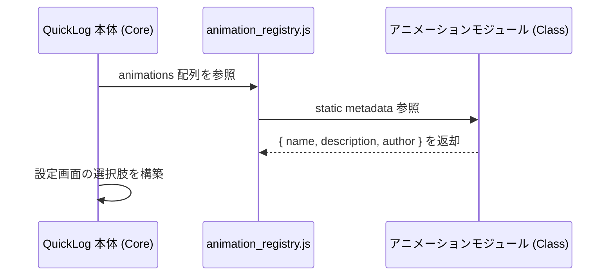
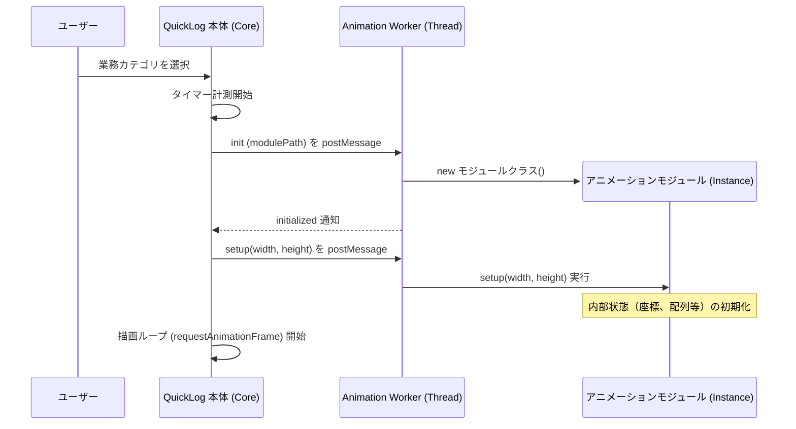
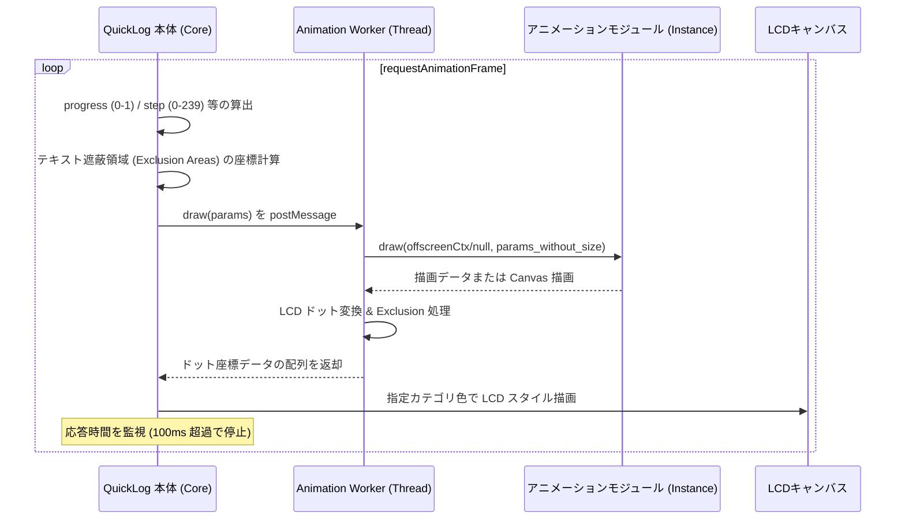
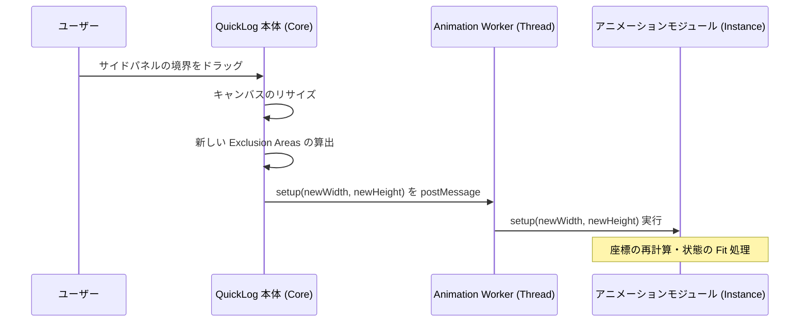
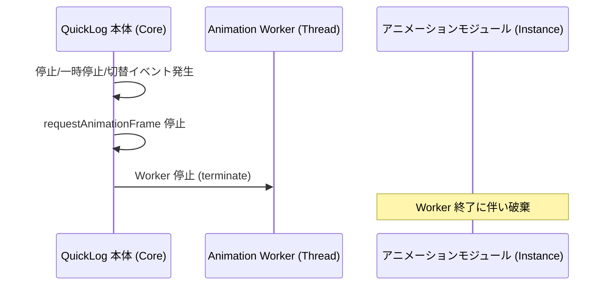

# 背景アニメーション・モジュール仕様書

仕様バージョン: 1.0

## 1. 目的
QuickLog-Solo の背景アニメーション機能をモジュール化し、外部開発者が独自のアニメーションロジックを追加・修正できるようにするためのインターフェース（I/F）および動作仕様を定義する。
本仕様は、「表現の自由度」と「開発のしやすさ（低ハードル）」の両立を目指す。

## 2. 設計思想と判断の背景 (Why)

### 2.1. LCD ドットマトリクス・スタイル
全てのキャンバスアニメーションに「LCD ドットマトリクス・スタイル（4段階のドットサイズによる低解像度表現）」を採用しているのは、最新の Material 3 デザインの中にレトロな計測機器のような温かみと、「1秒の重み」を視覚的に表現するためです。

### 2.2. 120秒（2分）サイクル
1分（60秒）ではなく2分周期にしているのは、視覚的な変化を緩やかにし、集中を妨げないためです。

### 2.3. 安全性の確保 (Worker 化と CSP)
外部開発者が提供するモジュールの悪意の有無に関わらず、利用者のデータを守るため、アニメーションロジックを Web Worker で分離し、CSP によって外部通信を遮断しています。また、実行時間の監視を行い、負荷の高いモジュールを自動停止するガードレールを設けています。

### 2.4. 視認性向上: 自動遮蔽（Exclusion Area）メカニズム
背景アニメーションと前面のテキスト（業務カテゴリ名やタイマー）が重なると視認性が著しく低下します。アニメーションロジック側にテキスト位置を意識させると実装が複雑になり、将来的なモジュール化の障壁となります。そのため、レンダリングエンジン側で「テキスト領域を自動的に検出し、その範囲内のドット描画をスキップする」仕組みを採用しました。これにより、ロジックの単純さと前面表示の視認性を両立させています。

## 3. システム構成と役割分担

### 3.1. ディレクトリ構造と自動登録
アニメーションモジュールは `src/js/animation/` ディレクトリに個別のファイルとして格納されます。
ビルドプロセスにおいて、`scripts/generate_animation_registry.py` がこれらのファイルをスキャンし、`src/js/animation_registry.js` を自動生成します。
これにより、コアモジュールを修正することなく、新しいアニメーションを追加・削除することが可能です。

### 3.2. ライフサイクル・シーケンス図

#### アニメーション一覧の取得 (Metadata Discovery)
ユーザーが設定画面を開いた際など、インスタンス化の前にモジュールの情報を取得するフローです。


#### 初期化と開始 (Initialization)
モジュールのインスタンスは、タスク開始時に作成され、描画領域の情報がセットされます。


#### 描画ループ (Drawing Loop)
描画はブラウザの更新周期に合わせて行われます。安全のため、アニメーションロジックは Web Worker 上で実行されます。


#### 領域リサイズ (Viewport Resize)
サイドパネルの幅が変更された場合、インスタンスを破棄せず、`setup` を再送して状態を適合させます。


#### 終了と破棄 (Termination)
タスクの停止、一時停止、または別のアニメーションへの切り替え時にインスタンスは破棄されます。


### 3.3. QuickLog-Solo 本体（コア）の役割
- **時間計測とサイクル管理:** `Date.now()` に基づく正確な時間経過の計測、120秒（2分）を 1周期とする計時サイクル（0～239 のステップ）の算出、およびタスク開始時からの総経過時間（ミリ秒）の管理。
- **レンダリングエンジン:** モジュールから提供されたデータに基づき、LCD ドットマトリクススタイル（4段階のドットサイズ）でのキャンバス描画。
- **視認性確保（自動遮蔽）:** 業務カテゴリ名や経過時間などのテキスト表示エリアを自動的に検出し、アニメーションドットの描画を避ける「ドット回避（Exclusion Area）」処理の実行。
- **リソース管理:** アニメーションの開始・停止・リサイズ制御。

### 3.4. アニメーションモジュール（ロジック）の役割
- **状態管理:** `setup` で受け取った領域情報に基づき、内部のパーティクルや座標情報を管理する。
- **パターン生成:** `draw` メソッドを通じて提供される進捗情報（`progress`, `step`）に応じた描画を行う。
- **視認性への配慮 (推奨):** 提供される `exclusionAreas` を利用して、テキストを避けるような「賢い」アニメーションを実装できる。
- **メタデータの提供:** クラスの静的プロパティとして名前や作者情報を定義する。

## 4. 安全性とセキュリティポリシー

本プロジェクトでは、利用者のプライバシーと安全を最優先するため、アニメーションモジュールに対して以下の制限を設けています。

### 4.1. 実行環境 (Sandbox)
- **Web Worker による分離:** すべてのアニメーションロジックは Web Worker 内で実行されます。これにより、メインスレッドの IndexedDB や DOM への直接アクセスが遮断されます。
- **スレッドセーフティの保証 (競合状態の防止):**
    JavaScript の Web Worker は独自のイベントループを持つシングルスレッド実行環境です。メインスレッド（Core）からの `setup`、`draw`、およびイベント（`onClick` 等）の要求は、Web Worker のメッセージキューに順次追加され、一つずつ順番に処理されます。
    そのため、例えば `draw` の実行中に同時に `setup` が割り込んで内部状態を破壊するといった「呼び出しの交錯（Race Condition）」は、言語の仕様上発生しません。開発者はスレッドセーフティを意識することなく、同期的なコードとしてモジュールを記述できます。
- **リソース監視 (Guardrail):** モジュールの応答時間（`postMessage` から返信まで）が一定時間（200ms）を 20回連続して超過した場合、アプリのフリーズを防ぐため、エンジンは自動的にそのアニメーションを停止します。
- **ウォームアップ期間 (Warmup Period):** 低スペック環境や JIT コンパイルに伴う初期化負荷による誤停止を防ぐため、開始直後の 180フレーム（約3秒）をウォームアップ期間とし、この期間内はリソース監視による自動停止を行いません。

### 4.2. 通信と API の制限
- **通信禁止 (No Network):** Content Security Policy (CSP) により、`fetch` や `XMLHttpRequest` による外部通信は一切禁止されています。
- **禁止キーワード:** 以下の機能を使用しているモジュールは、ビルド時の静的解析によって拒否されます：
    - 通信関連: `fetch`, `XMLHttpRequest`, `WebSocket`, `BroadcastChannel`
    - ストレージ関連: `IndexedDB`, `localStorage`, `sessionStorage`, `cookie`
    - 動的実行: `eval()`, `new Function()`

## 5. インターフェース仕様

### 5.1. モジュール定義 (Metadata & Config)
各モジュールは `AnimationBase` クラスを継承し、以下のプロパティを持つことが期待される。

#### static metadata
モジュールの情報オブジェクト（設定画面等で使用）。
- `name`: アニメーション名（文字列、または言語コードをキーとしたオブジェクト）。
- `description`: 簡単な説明（多言語対応可）。
- `author`: 開発者名。
- `devOnly`: (オプション) `true` に設定すると、開発・検証用として扱われます。これらは配布用 ZIP パッケージからは物理的に除外され、製品版のメニューにも表示されません。ただし、開発環境や紹介ページ (index.html) のプレビューでは利用可能です。
- `ignoreExclusion`: (オプション) `true` に設定すると、テキスト領域等による自動遮蔽（Exclusion）を無視してキャンバス全面に描画を行います。主に検証用モジュールで、UIの状態に関わらず確実な描画を保証するために使用します。

#### config (Instance property)
描画エンジンへの動作指示設定。
- `mode`: 描画モードの指定。
    - `'canvas'`: (デフォルト) Canvas API を使用した自由な描画。
    - `'matrix'`: 2次元配列を返すグリッド描画。
    - `'sprite'`: `{x, y, size}` の配列を返すオブジェクト描画。
- `usePseudoSpace`: 疑似空間（Pseudo-space）を使用するかどうかのフラグ。
    - `true`: 遮蔽領域（テキスト等）を「最初から存在しない」ものとして扱い、連続した一本の領域として座標計算を行えるようにします。オブジェクトが遮蔽物を飛び越えて移動するようなシンプルな実装に適しています。
    - `false`: (デフォルト) 実際のキャンバス座標を使用します。遮蔽物を避けたり、遮蔽物の上に乗ったりするような高度な演出に適しています。
- `rewindable`: 巻き戻し（過去の `elapsedMs` での描画）が可能かどうかのフラグ。
    - `true`: 巻き戻しに対応しています。`elapsedMs` や `progress` の値のみで表示内容が一意に決定できる（ステートレスな）モジュールや、時間変化に依存しないモジュールが該当します。
    - `false`: (デフォルト) 内部状態（パーティクルの位置等）がフレームごとの加算処理に依存しているため、巻き戻しに対応していません。

### 5.2. 呼び出しサイクル
- **計算用ステップ:** 500ms ごとに `step` (0-239) がインクリメントされる。
- **描画周期:** `requestAnimationFrame` (通常 60fps) に同期。
- **周期の長さ:** 120秒 (2分) で 1サイクル。ただし `elapsedMs` を利用することで、2分を超える独自のストーリー展開も可能。

### 5.3. 提供される情報 (Input Parameters)

#### A. セットアップ時 (`setup(width, height)`)
- `width`: 描画領域の幅 (px)。`usePseudoSpace: true` の場合は、遮蔽領域を除いた仮想的な幅が渡されます。
- `height`: 描画領域の高さ (px)
※開始時およびリサイズ時に呼び出される。

#### B. 描画時 (`draw(ctx, params)`)
`params` オブジェクトを通じて以下の情報が提供される。
- `elapsedMs`: タスク開始時からの総経過時間 (ms)。
- `progress`: 現在の 120秒周期の進捗率 (0.0 ～ 1.0)。
- `step`: 現在の計時ステップ (0 ～ 239)。
- `exclusionAreas`: テキスト等が表示されている遮蔽領域の配列。
    - 形式: `Array<{x: number, y: number, width: number, height: number}>`
    - **注意:** フォントの切り替えやテキスト長の変化により、描画中にサイズが変動する場合があるため、毎フレームチェックすることを推奨する。

### 5.4. 出力データ形式 (Output)
`config.mode` の設定に応じて、以下のいずれかの形式でデータを出力します。

#### A. スプライト形式 (Sprite Mode)
`draw` 関数の戻り値として、ドット（オブジェクト）の座標とサイズの配列を返します。
- **データ構造:** `Array<{x: number, y: number, size: number}>`
- **size の値:** `1` (小), `2` (中), `3` (大)
- **メリット:** 最も直感的です。`usePseudoSpace: true` と組み合わせることで、遮蔽領域を一切気にせず、好きな座標にドットを置くだけでアニメーションが完成します。

#### B. マトリックス形式 (Matrix Mode)
`draw` 関数の戻り値として、グリッド状の配置データを返します。
- **データ構造:** 2次元配列 `Array<Array<number>>` (rows x cols)
- **各要素の値:** `0`～`3` (ドットなし～大ドット)
- **メリット:** ライフゲームやテトリスのような、セル単位のロジックを実装するのに適しています。

#### C. キャンバス描画形式 (Canvas Mode)
引数の `ctx` に対して直接描画します（戻り値は `void`）。
- **描画ルール:** モノクロ（白 `#fff`）で描画します。
- **メリット:** Canvas API の全ての機能（曲線、グラデーション、画像の描画等）を利用でき、最も表現力が高いモードです。

### 5.5. インタラクション (Events)
必要に応じて、以下のメソッドを実装することでユーザー操作に反応できます。

- `onClick(x, y)`: キャンバスがクリックされたときに呼び出されます。
- `onMouseMove(x, y)`: マウスが移動したときに呼び出されます。
※ `usePseudoSpace: true` の場合、`x` 座標は自動的に仮想空間の座標に変換されます。

## 6. 実装例

### 例1: Sprite Mode + Pseudo-space (基本)
遮蔽領域を気にせず、画面を横切るだけの星を描画します。

```javascript
import { AnimationBase } from '../animations.js';

export default class ShootingStar extends AnimationBase {
    static metadata = {
        name: "Shooting Star",
        author: "QuickLog-Solo"
    };

    config = { mode: 'sprite', usePseudoSpace: true };

    setup(width, height) {
        this.stars = Array(10).fill(0).map(() => ({
            x: Math.random() * width,
            y: Math.random() * height,
            speed: 1 + Math.random() * 3
        }));
    }

    draw(ctx, { width }) {
        return this.stars.map(star => {
            star.x = (star.x + star.speed) % width;
            return { x: star.x, y: star.y, size: 2 };
        });
    }
}
```

### 例2: Canvas Mode + Interaction (応用)
クリックした場所に円を描画します。

```javascript
import { AnimationBase } from '../animations.js';

export default class Ripple extends AnimationBase {
    static metadata = { name: "Ripple", author: "Dev" };

    ripples = [];

    onClick(x, y) {
        this.ripples.push({ x, y, r: 0 });
    }

    draw(ctx) {
        ctx.strokeStyle = '#fff';
        this.ripples.forEach((rp, i) => {
            rp.r += 2;
            ctx.beginPath();
            ctx.arc(rp.x, rp.y, rp.r, 0, Math.PI * 2);
            ctx.stroke();
        });
        this.ripples = this.ripples.filter(rp => rp.r < 100);
    }
}
```

## 7. 視認性の担保について
本体側のレンダリングエンジンが、モジュールから受け取ったデータの描画直前に、テキスト領域と重なるドットを**強制的に**非表示にします。そのため、モジュール側で `exclusionAreas` を無視して描画しても視認性は損なわれませんが、`exclusionAreas` を活用することで、より自然で洗練された「避けるアニメーション」を構築できます。

---

## 8. 関連ドキュメント

- [製品仕様書 (spec.md)](spec.md)
- [開発者ガイド (README_DEV.md)](README_DEV.md)
- [テスト計画・ケース定義書 (README_TEST.md)](README_TEST.md)
- [AI エージェント指針 (AGENTS.md)](../AGENTS.md)

---

## 9. 品質評価システム (Evaluation System)

ユーザーの期待に応える「動きのある」アニメーションを維持するため、全てのアニメーションモジュールは自動評価テストをパスする必要があります。

### 9.1. 評価基準
以下の項目を自動的に計測し、基準を下回るアニメーションは「退屈」または「不具合」としてビルド時に拒否されます。

- **初期応答性 (Initial Activity):** 作業開始から所定時間（デフォルト5秒）以内に最初の描画が行われること。
- **継続性 (Sustained Activity):** 開始後一定時間経過後も変化し続けていること。
- **密度 (Average Density):** 表示領域に平均して一定以上のドット（非ゼロピクセル）が表示されていること。
- **変化量 (Entropy/Change Rate):** フレーム間で表示されているドットの位置や状態が一定割合以上変化していること。

### 9.2. パラメータの調整
評価のしきい値は `tests/animation_eval_config.js` で管理されており、必要に応じて微調整が可能です。

---

## 10. QL-Animation Studio (Playground)

開発者がブラウザ上でアニメーションモジュールを試行錯誤しながら作成できる [QL-Animation Studio](../src/studio.html) を提供しています。
このスタジオでは、既存のサンプルをベースにコードを修正し、リアルタイムで動作確認やパフォーマンス計測（密度、変化量等）を行うことができ、そのまま PR 用のファイルをダウンロードすることが可能です。

---

## 11. 改訂履歴

- **1.0 (2024-05-20):** 初版。モジュール仕様の基本構造、描画モード、およびセキュリティポリシーを定義。
