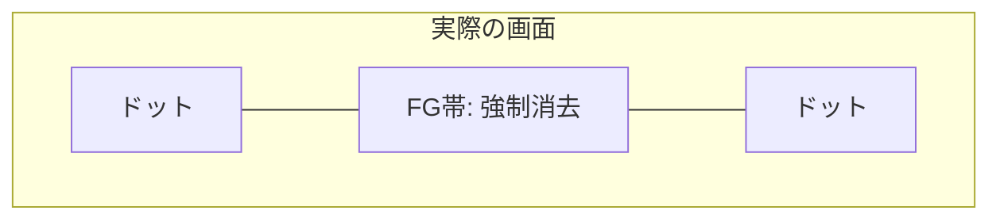
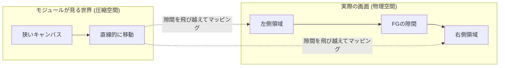
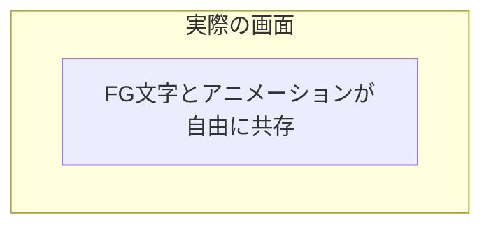

# 背景アニメーション・モジュール制作ガイド

仕様バージョン: 1.1 (Creative Edition)

## 1. はじめに：QuickLog-Solo に命を吹き込む
QuickLog-Solo は、単なる業務メモツールではありません。あなたのコードによって生み出されるアニメーションは、作業者の集中を助け、時には心を癒やす「ビジュアル・ヒーリング」の一部となります。

このガイドでは、技術的な仕様だけでなく、どのようにして「楽しく」「使いやすい」アニメーションを作るかのエッセンスを解説します。

---

## 2. 空間のコンセプト：FG と BG

アニメーションを設計する際、画面を 2 つのレイヤーとして捉えてください。

### BG (Background) 領域
あなたのキャンバスです。画面全体に広がり、120秒周期で時を刻みます。

### FG (Foreground) 表示領域
ユーザーにとって最も大切な「業務カテゴリ名」と「経過時間」を表示する帯状の領域です。
- **場所:** 画面の中央付近に、左右いっぱいに広がる「見えない帯」として存在します。
- **ポリシー (視認性優先):** QuickLog-Solo は「記録ツール」であるため、どんなに素晴らしいアニメーションも、この FG 領域の文字を読めなくしてはいけません。

---

## 3. 回避の決断 (Exclusion Strategy)

FG 領域（文字の帯）とアニメーションが重なる際、どのように振る舞うかを 3 つの「戦略」から選択できます。これは、あなたの「こだわり」と「実装の難易度」に応じた決断です。

| 戦略名 | クリエイターのスタンス | 実装難易度 | 特徴 |
| :--- | :--- | :--- | :--- |
| **`'mask'`** (標準) | **「ありのままを受け入れる」** | 🌟☆☆ | FG 領域に重なるドットは自動的に消去されます。背景に徹したい場合に最適。 |
| **`'jump'`** (跳躍) | **「連続性を重視する」** | 🌟🌟☆ | FG 領域を「存在しない隙間」として飛び越えます。星や鳥を画面端から端までスムーズに動かしたい場合に最適。 |
| **`'freedom'`** (自由) | **「UI と共演する」** | 🌟🌟🌟 | 自動的な消去は行われません。FG の位置を把握し、文字を避けたり、枠線を光らせたり、UI を活かした表現が可能です。 |

### 動作イメージ

#### 1. `'mask'`：受容
「見えない範囲は、更衣室や待合室のようなもの」と考えます。
オブジェクトが中央を横切る際、FG の後ろに隠れ、通り過ぎるとまた現れます。


#### 2. `'jump'`：跳躍
「FG 領域という隙間をワープして、描いたものを全て見せたい」という決断です。
エンジンが空間を圧縮し、モジュール側には「文字の帯を除いた狭いキャンバス」を見せます。


#### 3. `'freedom'`：自由
「FG の上下の狭い空間を活かしたり、境界線に反応させたい」というマスターの決断です。
エンジンは一切の干渉をせず、全てのドットを表示します。


---

## 4. 制作を楽しくするアイデア

QuickLog-Solo の背景は、低解像度の「LCD ドットマトリクス」スタイルです。この制限を活かして、遊び心のある表現に挑戦しましょう。

- **ストーリーを持たせる:** `elapsedMs` を使って、タスク開始から 5 分、10 分と経過するごとに景色が変わるような演出。
- **インタラクション:** `onClick` を使って、クリックした場所にエサを置いたり、波紋を広げたり。
- **季節や時間帯:** ステップ（0-239）に応じて、朝・昼・晩、あるいは春夏秋冬の色合いを表現する。
- **「間」の活用:** 文字の背後で何かが起きていることを予感させる動き。

---

## 5. テクニカル・リファレンス

### 5.1. モジュール定義
`AnimationBase` を継承し、以下のプロパティを設定します。

```javascript
export default class MyArt extends AnimationBase {
    static metadata = {
        name: "My Creation",
        author: "Creator Name",
        rewindable: true // 巻き戻し操作に対応するか
    };

    config = {
        mode: 'sprite', // 'canvas', 'matrix', 'sprite'
        exclusionStrategy: 'jump' // 'mask', 'jump', 'freedom'
    };

    setup(width, height) { /* 初期化 */ }
    draw(ctx, params) { /* 描画ロジック */ }
}
```

### 5.2. 提供される情報 (`params`)
- `elapsedMs`: 開始からの経過時間 (ms)。
- `progress`: 120秒周期の進捗 (0.0 ～ 1.0)。
- `step`: 計時ステップ (0 ～ 239)。
- `exclusionAreas`: FG 領域の座標とサイズ。`'jump'` の場合は空配列。

---

## 6. QL-Animation Studio で試そう
[QL-Animation Studio](../src/studio.html) を使えば、ブラウザ上でコードを書きながら、リアルタイムで FG 領域との重なりを確認できます。
メトリクス（密度や変化率）を見ながら、最高の心地よさを追求してください。

---

## 11. 改訂履歴
- **1.0 (2024-05-20):** 初版。
- **1.1 (2024-05-24):** `exclusionStrategy` を導入。FG/BG 概念によるクリエイター向けガイドへ刷新。
