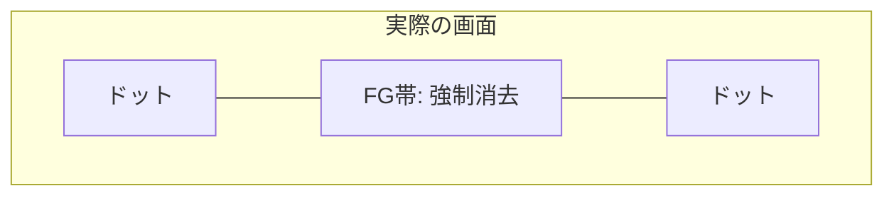
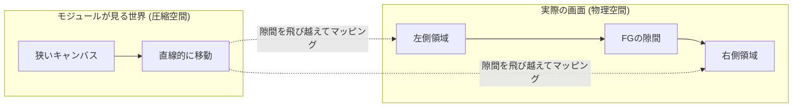
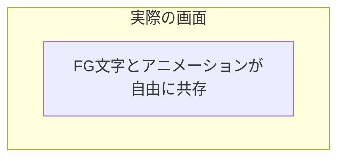

# 背景アニメーション・モジュール制作ガイド

仕様バージョン: 1.1 (Creative Edition)

## 1. はじめに：QuickLog-Solo に命を吹き込む
QuickLog-Solo は、単なる業務メモツールではありません。あなたのコードによって生み出されるアニメーションは、作業者の集中を助け、時には心を癒やす「ビジュアル・ヒーリング」の一部となります。

このガイドでは、技術的な仕様だけでなく、どのようにして「楽しく」「使いやすい」アニメーションを作るかのエッセンスを解説します。

---

## 2. 空間のコンセプト：FG と BG

アニメーションを設計する際、画面を 2 つのレイヤーとして捉えてください。

### BG (Background) 領域
あなたのキャンバスです。画面全体に広がり、120秒周期で時を刻みます。

### FG (Foreground) 表示領域
ユーザーにとって最も大切な「業務カテゴリ名」と「経過時間」を表示する帯状の領域です。
- **場所:** 画面の中央付近に、左右いっぱいに広がる「見えない帯」として存在します。
- **ポリシー (視認性優先):** QuickLog-Solo は「記録ツール」であるため、どんなに素晴らしいアニメーションも、この FG 領域の文字を読めなくしてはいけません。

---

## 3. FG回避の決断 (Exclusion Strategy)

FG 領域（文字の帯）とアニメーションが重なる際、どのように振る舞うかを 3 つの「戦略」から選択できます。これは、あなたの「こだわり」と「実装の難易度」に応じた決断です。

| 戦略名 | クリエイターのスタンス | 実装難易度 | 特徴 |
| :--- | :--- | :--- | :--- |
| **`'mask'`** (標準) | **「ありのままを受け入れる」** | 🌟☆☆ | FG 領域に重なるドットは自動的に消去されます。背景に徹したい場合に最適。 |
| **`'jump'`** (跳躍) | **「連続性を重視する」** | 🌟🌟☆ | FG 領域を「FG領域を飛び越える(Jump)」決断です。星や鳥を画面端から端までスムーズに動かしたい場合に最適。 |
| **`'freedom'`** (自由) | **「UI と共演する」** | 🌟🌟🌟 | 自動的な消去は行われません。FG の位置を把握し、文字を避けたり、枠線を光らせたり、UI を活かした表現が可能です。 |

### 動作イメージ

#### 1. `'mask'`：受容
「見えない範囲は、更衣室や待合室のようなもの」と考えます。
オブジェクトが中央を横切る際、FG の後ろに隠れ、通り過ぎるとまた現れます。

#### 2. `'jump'`：跳躍
「FG 領域という隙間をワープして、描いたものを全て見せたい」という決断です。
エンジンが空間を圧縮し、モジュール側には「文字の帯を除いた狭いキャンバス」を見せます。

#### 3. `'freedom'`：自由
「FG の上下の狭い空間を活かしたり、境界線に反応させたい」というマスターの決断です。
エンジンは一切の干渉をせず、全てのドットを表示します。

---

## 4. 制作を楽しくするアイデア

QuickLog-Solo の背景は、低解像度の「LCD ドットマトリクス」スタイルです。この制限を活かして、遊び心のある表現に挑戦しましょう。

- **ストーリーを持たせる:** `elapsedMs` を使って、タスク開始から 5 分、10 分と経過するごとに景色が変わるような演出。
- **インタラクション:** `onClick` を使って、クリックした場所にエサを置いたり、波紋を広げたり。
- **季節や時間帯:** ステップ（0-239）に応じて、朝・昼・晩、あるいは春夏秋冬の色合いを表現する。
- **「間」の活用:** 文字の背後で何かが起きていることを予感させる動き。

---

## 5. テクニカル・リファレンス

アニメーションモジュールは `AnimationBase` クラスを継承して作成します。

### 5.1. 静的メタデータ (`static metadata`)
エンジンの管理やUI表示に使用される情報です。

- `specVersion`: 仕様バージョン (現在は '1.0')。
- `name`: アニメーション名（文字列または言語コードをキーとしたオブジェクト）。
- `description`: 解説（文字列またはオブジェクト）。
- `author`: 作者名。
- `rewindable`: `true` にすると、Studioで巻き戻し・早送りが可能になります（`elapsedMs` に依存した設計が必要です）。

### 5.2. 構成設定 (`config`)
エンジンの振る舞いを制御する設定です。

- **`mode`**: 描画モードを選択します。
  - `'canvas'`: 一般的な HTML5 Canvas 2D API を使用します。
  - `'matrix'`: 数値の 2 次元配列を返してドットを表現します。
  - `'sprite'`: 座標とサイズのリストを返してドットを表現します。
- **`exclusionStrategy`**: FG 回避戦略を選択します。
  - `'mask'`, `'jump'`, `'freedom'`（詳細はセクション 3 を参照）。

> **[用語解説] オフスクリーン (Offscreen)**
> ユーザーに見える実際の画面とは別に、メモリ上に用意された「隠れたキャンバス」のことです。アニメーションはこの隠れた場所で一度描画（計算）され、その後エンジンによってドット形式に変換されてから、実際の画面に映し出されます。

### 5.3. 主要メソッド

#### `setup(width, height)`
アニメーションの開始時および画面リサイズ時に一度だけ呼ばれます。
- `width`, `height`: 現在の有効な描画領域の幅と高さ。
- ここで、パーティクルの初期化や配置計算を行うのがベストです。

#### `draw(ctx, params)`
毎フレーム（通常 60fps）呼ばれるメインの描画ルーチンです。

> **[設計上の注意]**
> `params` には現在の描画領域の `width` や `height` は含まれません。これは、描画ループ内での不要な計算を避け、サイズ変更への対応を `setup()` メソッドに集約させるための意図的な設計です。サイズ情報が必要な場合は、`setup()` で受け取った値をクラスのプロパティに保存して利用してください。

**引数:**
- `ctx`: `CanvasRenderingContext2D`。`'canvas'` モードの時のみ使用します。
- `params`: 以下のプロパティを含むオブジェクト。
  - `elapsedMs`: アニメーション開始からの累計時間 (ミリ秒)。
  - `progress`: 120 秒で 1 サイクルする進捗率 (0.0 ～ 1.0)。
  - `step`: 1 サイクルを 240 分割した現在のステップ番号 (0 ～ 239)。
  - `exclusionAreas`: FG 領域のリスト `[{x, y, width, height}, ...]`（`'freedom'` 戦略時のみ有効な値が入ります）。
  - `speed`: 現在の再生速度倍率。

> **[用語解説] ラスタライズ (Rasterization)**
> 線や円などの「図形データ（ベクター）」を、点（ドット）の集まりに変換する処理のことです。`'canvas'` モードで描いた滑らかな絵も、この工程を経て QuickLog-Solo らしいドット絵へと生まれ変わります。

**返り値:**
- `'matrix'` モードの場合: `number[][]` (0: 消灯, 1: 小, 2: 中, 3: 大)。
- `'sprite'` モードの場合: `Array<{x, y, size}>`。
- `'canvas'` モードの場合: 返り値は不要です。

> **[用語解説] 座標マッピング (Coordinate Mapping)**
> `'jump'` 戦略を選んだとき、エンジンは FG 領域を「無かったこと」にして空間を詰め、モジュールに渡す `width` を調整します。描画されたドットを実際の画面の正しい位置に再配置するこの仕組みを座標マッピングと呼びます。

### 5.4. インタラクション (任意)
- `onClick(x, y)`: クリックされた座標を受け取ります。
- `onMouseMove(x, y)`: マウスが動いた座標を受け取ります。

---

## 6. QL-Animation Studio で試そう
[QL-Animation Studio](../src/studio.html) を使えば、ブラウザ上でコードを書きながら、リアルタイムで FG 領域との重なりを確認できます。
メトリクス（密度や変化率）を見ながら、最高の心地よさを追求してください。

---

## 7. 免責事項 (Disclaimer)
本ソフトウェアおよび本仕様に基づいて制作されたモジュールの動作によって生じたいかなる損害についても、開発者は一切の責任を負いません。制作したモジュールの公開・配布は、制作者自身の責任において行ってください。

---

## 8. 改訂履歴
- **1.0 (2024-05-20):** 初版。
- **1.1 (2024-05-24):** `exclusionStrategy` を導入。FG/BG 概念によるクリエイター向けガイドへ刷新。
