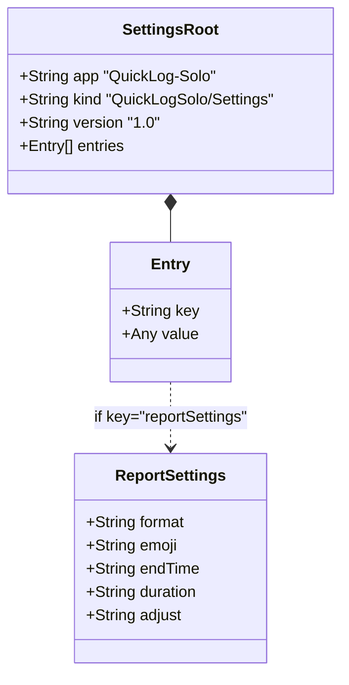
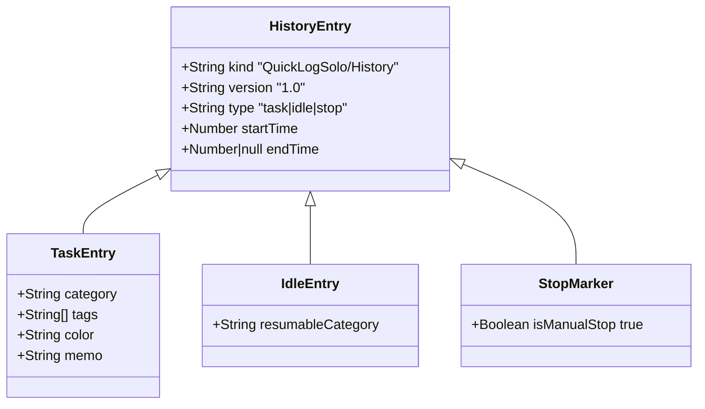
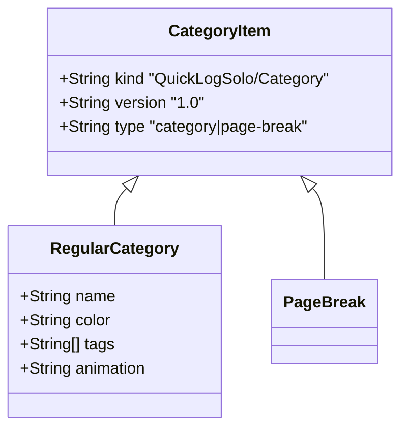

# QuickLog-Solo データスキーマ定義

本ディレクトリでは、QuickLog-Solo がバックアップ、インポート、エクスポートに使用するデータの JSON スキーマを定義しています。
これらのスキーマは、将来的な実装の改善を見据えた「あるべき姿」として設計されており、現在の実装よりも構造化された形式を採用しています。

全てのデータは `kind` プロパティ（データ種別）、`version` プロパティ（スキーマバージョン）、および `type` プロパティ（詳細種別）を持つことで、他のデータと明確に識別・検証できるようになっています。

## バージョニング方針

本スキーマの `version` は以下のルールに従って更新されます。

| バージョン形式 | 更新ルール |
| :--- | :--- |
| **メジャー (X.0)** | 後方互換性を維持できない破壊的な変更が行われた場合にカウントアップ。 |
| **マイナー (0.Y)** | 後方互換性が維持される追加や改善が行われた場合にカウントアップ。 |

---

## スキーマ一覧

### 1. 設定データ (`settings.schema.json`)

`settings.json` ファイルに使用されるスキーマです。ファイル全体が 1 つのオブジェクトとして構成されます。

#### 構造ダイアグラム

#### フィールド定義
| プロパティ | 型 | 必須 | 説明 |
| :--- | :--- | :---: | :--- |
| `app` | string | ○ | アプリケーション識別子 (`"QuickLog-Solo"`) |
| `kind` | string | ○ | データ種別 (`"QuickLogSolo/Settings"`) |
| `version` | string | ○ | スキーマバージョン |
| `entries` | array | ○ | 設定項目の配列 |

#### 設定項目 (`entries`) の詳細
| key | value の型 | 説明 |
| :--- | :--- | :--- |
| `theme` | string | テーマ設定 (`system`, `light`, `dark`) |
| `font` | string | 使用フォント名 (CSS形式) |
| `defaultAnimation` | string | 標準（共通）の背景アニメーション ID |
| `language` | string | 表示言語 (`auto`, `ja`, `en`, `de`, `es`, `fr`, `pt`, `ko`, `zh`) |
| `reportSettings` | object | 日報出力の詳細設定（フォーマット、絵文字、丸め設定等） |

#### 日報設定 (`reportSettings`) の詳細
| プロパティ | 型 | 説明 |
| :--- | :--- | :--- |
| `format` | string | 出力フォーマット (`markdown`, `wiki`, `html`, `csv`, `text-plain`, `text-table`) |
| `emoji` | string | 絵文字の扱い (`keep`: あり, `remove`: なし) |
| `endTime` | string | 終了時刻の表示 (`none`: なし, `show`: あり) |
| `duration` | string | 所要時間の表示位置 (`none`: なし, `right`: 右, `bottom`: 下) |
| `adjust` | string | 時間の丸め単位（分） (`none`: しない, `5`, `10`, `15`, `30`, `60`) |

---

### 2. 履歴ログデータ (`history.schema.json`)

日ごとの履歴バックアップファイル (`YYYY-MM-DD.ndjson`) で使用されるスキーマです。1行に1つのオブジェクトが格納されます。

#### 構造ダイアグラム

#### 共通フィールド
| プロパティ | 型 | 必須 | 説明 |
| :--- | :--- | :---: | :--- |
| `kind` | string | ○ | データ種別 (`"QuickLogSolo/History"`) |
| `version` | string | ○ | スキーマバージョン |
| `type` | string | ○ | ログの種類 (`"task"`, `"idle"`, `"stop"`) |
| `startTime` | number | ○ | 開始時刻 (UNIX タイムスタンプ、ミリ秒) |
| `endTime` | number/null | - | 終了時刻 (UNIX タイムスタンプ、ミリ秒) |

#### 種類別の追加フィールド
| 種類 (`type`) | プロパティ | 型 | 説明 |
| :--- | :--- | :--- | :--- |
| **task** | `category` | string | **(必須)** カテゴリ名 |
| | `tags` | string[] | タグの配列 |
| | `color` | string | 記録時のテーマ色 |
| | `memo` | string | ユーザーによる補足メモ (最大100文字) |
| **idle** | `resumableCategory`| string | 復帰対象のカテゴリ名 |
| **stop** | `isManualStop` | boolean | **(必須: true)** 手動停止フラグ |

---

### 3. カテゴリデータ (`category.schema.json`)

カテゴリのエクスポートやバックアップファイル (`categories.ndjson`) で使用されるスキーマです。

#### 構造ダイアグラム

#### フィールド定義
| プロパティ | 型 | 必須 | 説明 |
| :--- | :--- | :---: | :--- |
| `kind` | string | ○ | データ種別 (`"QuickLogSolo/Category"`) |
| `version` | string | ○ | スキーマバージョン |
| `type` | string | ○ | カテゴリの種類 (`"category"`, `"page-break"`) |
| `name` | string | △ | 表示名 (type=category時のみ。かつ必須) |
| `color` | string | △ | テーマ色 (type=category時のみ。かつ必須) |
| `tags` | string[] | - | デフォルトのタグ配列 (type=category時のみ) |
| `animation` | string | - | アニメーション ID (type=category時のみ。無しは `"none"`) |

---

## 免責事項 (Disclaimer)

本ドキュメントおよびスキーマは、データの構造を説明するためのものであり、将来のアップデートにより予告なく変更される場合があります。

This documentation and schemas are provided for informational purposes regarding data structures and are subject to change without notice due to future updates.
