# 製品仕様書・設計指針: QuickLog-Solo (ミニマリスト向け・サイドパネル型作業メモツール)

## 1. プロジェクトのビジョン
- **コンセプト:** 「1秒で記録、1秒で集計、1秒で安心」。
- **ターゲット:** 業務記録を負担に感じるが、ツールの透明性や安全性に厳しい技術者。
- **製品のポジショニング:** 本ツールは高度な「工数管理システム」ではなく、あくまで個人のための「作業メモ（記録）ツール」です。付箋にメモを書くような気軽さで作業時間を記録し、必要な時に一瞬で集計できる体験を提供することに特化しています。

## 2. コア・フィロソフィー (Core Philosophy)
本プロジェクトは、以下の 4 つの柱を最上位の価値として設計されています。

- **持続可能性 (Sustainability):** 外部サーバーや API に依存せず、オフライン（ブラウザ内）で完結すること。ブラウザやタブが閉じられても、計測状態が確実に復元・継続される「レジリエンス（回復力）」を備えていること。
- **ミニマリズム (Minimalism):** 「必要十分（Less is More）」。過剰な機能追加を避け、特定のワークフロー（作業記録）の摩擦を最小化すること。
- **透明性 (Transparency):** データの保存先（IndexedDB）や通信が行われないことを技術的に保証し、ユーザーが安心して利用できること。
- **長期保守性 (Longevity & Maintainability):** 外部フレームワークやライブラリを一切使用せず、標準的な Web API (Vanilla JS) のみで構築する「ピュアで一生モノの設計（Pure & Long-life Design）」。10年後も今と同じように動作し、メンテナンス可能であることを目指します。

## 3. 設計思想と判断の背景 (Why)
本プロジェクトにおける主要な意思決定の背景を以下にまとめます。

### 3.1. 技術選定とアーキテクチャ
- **Vanilla JS & フレームワーク禁止 (Sustainable Architecture):** 依存関係の複雑化（Dependency Hell）と、ビルドツールの更新に伴うメンテナンスコストを排除するためです。実行時に必要な npm パッケージの追加は一切禁止されており、ビルド不要で直接ブラウザで動作する「ピュアな Vanilla JS」を維持します。また、ブラウザ拡張機能のセキュリティレビューの透過性を高める目的もあります。
- **IndexedDB & Local File System (Privacy First):** 外部への通信を CSP により遮断し、プライバシーを確保。データはブラウザ内の IndexedDB に保存され、バックアップ時はローカルファイルシステムに保存されます。
- **DB・同期の分離 (Isolation):** URL パラメータ `?db=` を指定することで独立した DB インスタンスを利用可能。BroadcastChannel 名に DB 名を組み込み、混線を防止します。
- **パス・ポータビリティ標準:** ローカル、Vercel、拡張機能の全環境で動作させるため、アセット参照は常に相対パス（先頭スラッシュなし）を使用します。

### 3.2. モジュール構成とアーキテクチャ (Architecture)

本アプリは、外部ライブラリに依存しない Vanilla JS によるモジュール・アーキテクチャを採用しています。

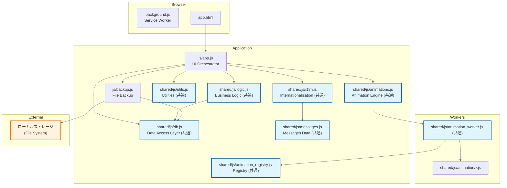

### 3.3. UI/UX デザイン
- **Material 3 (M3) Tonal Palette:** 単一のアクセントカラーではなくトナルパレットを使用することで、アクセシビリティを確保しつつカテゴリごとの識別性を向上させています。
- **モーダルボタンの形状一貫性:** `.confirm-btns` コンテナ内のすべてのボタン（「適用」「キャンセル」等）は、`border-radius: var(--md-sys-shape-full)` を適用し、Material 3 の一貫した角丸デザインを維持します。
- **body への CSS 変数定義:** テーマ切り替え時に変数が確実に上書き・伝播されるようにするため、`:root` ではなく `body` に定義しています。
- **グリフの選定ポリシー:** 「Local Only」を誤解させないため、クラウドを想起させる「雲（cloud）」や「同期（sync）」のアイコンを禁止し、物理ストレージをイメージさせる `hard_drive` 等を採用しています。
- **ページネーション (8x2 グリッド):** サイドパネルの限られたスペースで、ボタン配置を固定し、マッスルメモリー（筋肉の記憶）による素早い打刻を支援します。マウスホイールによるページ切り替えをサポートします。カテゴリ数が 17 個以上の場合、1ページあたり 16 個のボタンを表示するページネーションが自動適用されます。
- **タイポグラフィ:** 全言語で一貫した外観を維持し、OS 標準フォントへの不適切なフォールバック（日本語環境での明朝体など）を防ぐため、Web フォントを徹底しています。
- **言語セレクターの標準化:** 国旗絵文字をプラットフォーム間で一貫して表示するため、CSS のフォントスタックには 'Noto Color Emoji' を優先的に含めます。また、翻訳リソース（i18n key）には国旗絵文字と名称の両方を記述します。
- **UI 言語の標準順序:** ユーザーが一貫したメンタルモデルを維持できるよう、1. English, 2. 日本語, 3. Deutsch, 4. Español, 5. Français, 6. Português, 7. 한국어, 8. 简体中文 の順序を標準としています。
- **UI レイアウトの堅牢性:** 多言語対応でテキスト長が変動してもレイアウトが崩れないよう、`min-width: 0` や `ellipsis` を徹底しています。
- **モーダルイベント伝播の抑制:** モーダルの閉じるボタン等のクリックハンドラでは `e.stopPropagation()` を使用し、グローバルなクリックリスナーへの波及を防ぎます。
- **フォールスルー・パターン:** 背景アニメーションへの干渉と前面テキストの操作を両立させるため、コンテナに `pointer-events: none` を設定し、必要な要素のみ `auto` で有効化しています。
- **プライバシーバッジ (Privacy Badge):** 「Local Only」方針を強調し、ユーザーに安心感を与えるためヘッダーに表示します。視認性とデザインの調和を両立させるため、背景色 `var(--md-sys-color-surface-container)`、テキスト色 `var(--md-sys-color-primary)`、角丸 12px を使用。レスポンシブ対応として、画面幅 900px 以下ではラベルを非表示にし、`verified_user` アイコンのみを表示することで、限られた水平スペースを有効活用します。
- **設定 UI (v0.31.0):** タブを Material Symbols アイコンに刷新し、水平スペースを確保。`data-i18n-title` による多言語ツールチップでアクセシビリティを維持。
- **ローカライズされたツールチップ標準:** アイコンのみのボタンには `data-i18n-title` 属性を付与し、`i18n.js` を介してアクセシブルな多言語ツールチップを提供します。

### 3.4. データ管理と記録ロジック
- **40日間 & 100件表示:** パフォーマンス維持と「直近の振り返り」への特化のため。履歴表示を 100 件に絞ることで DOM 負荷を抑え、動作を軽快に保ちます。
- **履歴編集の時系列整合性 (Temporal Consistency):** 履歴の開始時刻を編集した際、直前のログが連続している場合は、その終了時刻も自動的に同期されます。削除時も同様に、次のログの開始時刻が削除箇所の開始点まで詰められます。この更新は `CONTIGUITY_TOLERANCE_MS` (1000ms) の許容範囲内で再帰的に伝播し、意図的な停止（手動終了）を除いて、連続する記録間に隙間が生じないように制御されます。
- **一時停止状態の同期:** `updateHistoryStartTime` や `deleteHistoryItem` による履歴の変更が、実行中または一時停止中のタスクに影響する場合、`STORE_SETTINGS` 内の `SETTING_KEY_PAUSE_STATE` も同時に更新されます。これにより、`syncState()` 呼び出し後に UI のタイマーや経過時間が古いデータ（stale data）を使用することを防止します。
- **履歴編集 UI 標準:** 履歴編集モーダルは、`height: auto` のヘッダーベースのレイアウトを採用。編集対象が通常のログか停止マーカー（`isManualStop`）かに応じて、タイトル（「履歴の編集」/「終了の編集」）とラベル（「開始時刻」/「終了時刻」）を動的に切り替えます。
- **終了ロジック (待機ログ) と `isManualStop`:** 日報作成時の視認性向上と、手動/自動終了の判別のためです。「停止マーカー」を記録することで、再起動後も「どこで意図的に止めたか」を判別可能にします。停止マーカー（開始・終了時刻が同一）の編集時は両方の時刻が同期され、削除時は後続の時系列整合性を維持するためにその開始時刻まで詰められます。

#### タスクの開始・切り替えフロー

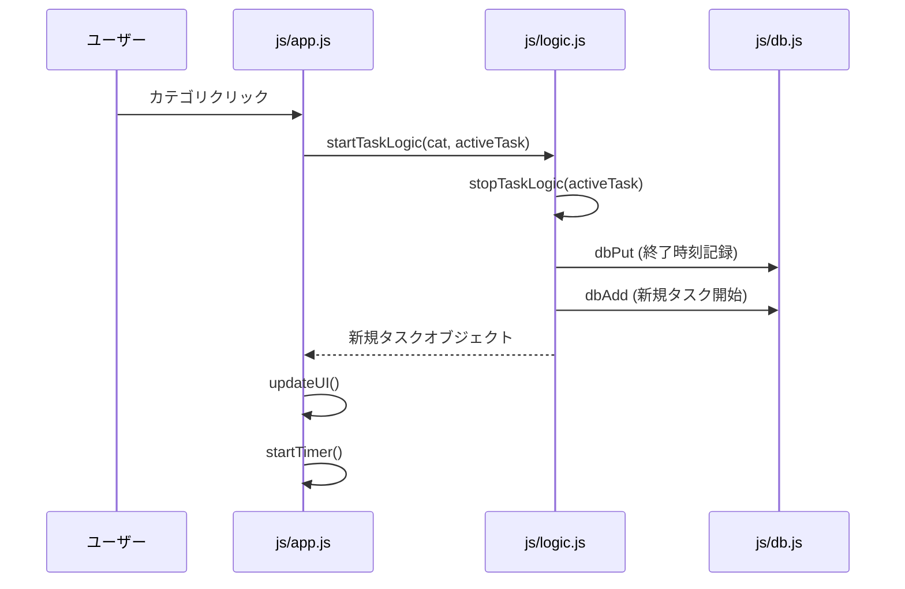

#### 状態遷移モデル (Operator State)

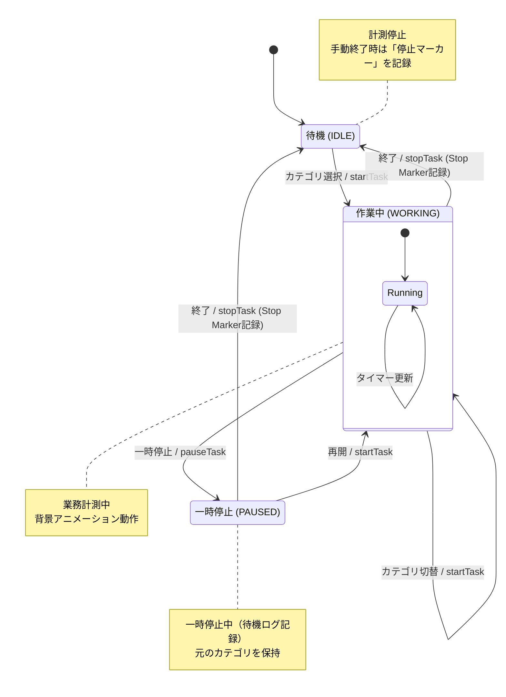

- **重複マーカーの防止:** 停止ボタンの連打等により、同じタイムスタンプを持つ停止マーカーが重複して記録されるのを防ぐロジックを備えています。
- **内部文字列の永続性とローカライズ:** データ互換性のため、`__IDLE__` などの不変な ID を使用し、UI 表示時のみ翻訳関数を通しています。
- **インポート時の視覚的フィードバック:** インポート操作時、ローディング表示を確実に視認させ、処理が行われたという信頼感を醸成するため、あえて 500ms のディレイ (`IMPORT_FEEDBACK_DELAY_MS`) を設けています。このディレイは、インポート処理が瞬時に終わる場合でも、ユーザーが「何かが行われた」と認識できるようにするための意図的な設計判断です。
- **インポート制限 (DoS 対策):** クリップボード（NDJSON）は 1MB/1000行、CSV 履歴は 5MB/50,000行に制限し、リソース枯渇を防止します。
- **履歴の再現性:** ログに打刻時点のカテゴリ色を保存し、カテゴリ削除後も当時の色で表示します。
- **デモ履歴生成:** ログが空の状態で起動した際、擬似的な業務履歴を自動生成し、初めてのユーザーでも機能を理解しやすくします。
- **透明性の明示:** 「About」タブにて、データの保存先（IndexedDB）や通信仕様（Local Only）を明示し、IndexedDB 内の統計情報（ログ件数、カテゴリ数）を表示します。

### 3.5. アラーム・通知機能
- **アラーム機能への統合:** 以前の「日付変更時の自動停止」設定を廃止し、アラーム機能の一部として統合しました。新規インストール時に 23:59 の「作業終了」アラームをデフォルトで有効化することで、柔軟性とコードの簡素化を両立しています。
- **アラームデータの移行と互換性:** `initDB` 時のマイグレーションスクリプトにより、旧形式のアラームは `type: 'daily_business'` およびデフォルトのスケジュール設定を伴う高度な形式に自動アップグレードされます。
- **高度なスケジュール管理:** 4種類のタイプ（平日、毎週、毎月指定日、毎月末相対）をサポート。グローバルな「稼働日」設定に基づき、祝祭日等の調整（なし、前営業日、翌営業日、スキップ）が可能です。
- **スケジュールのガードレール:** ユーザー設定の矛盾（例：1日の「前営業日」調整の禁止）を UI 側で制御し、実行不能なスケジュールの登録を防止します。
- **データ交換標準:** サイドパネルのインポート/エクスポートは `alarms` と `businessDays` を含みますが、インポート時は既存カテゴリ保護のため `categories` は無視されます。一方、Alarm Editor との連携では完全なデータ移行のため全ストアが対象となります。
- **デフォルトアラームの固定:** 初期設定の 10 番目のアラームは、世界共通の理解を助けるため、ローカライズを介さない "Stop Task" という固定メッセージで構成され、デフォルトで有効化されています。
- **確認待ちモード:** 各アラームに「確認」オプションを設定可能。有効な場合、ユーザーが「了解」を押すまでアクションの実行を保留し、通知を維持します。
- **カテゴリ開始アクションのキー:** アラーム設定において「カテゴリを開始する」アクションのラベルには、`alarm-label-action-category` という翻訳キーを使用します。

#### アラーム発火時の処理フロー (Alarms Flow)

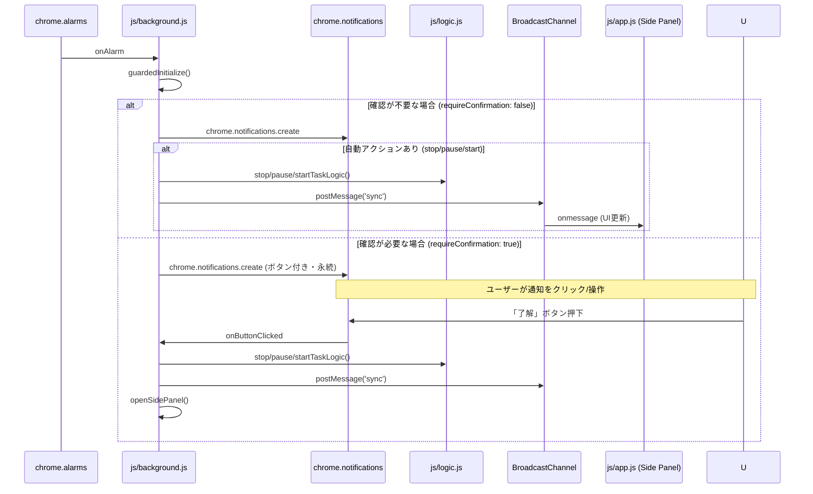

### 3.6. 背景アニメーション (Visual Healing)
- **2分周期のサイクル:** 視覚的な変化を緩やかにし、集中を妨げないためです。
- **レイヤー構造 (FG/BG):** 前面 (FG) と背景 (BG) を定義し、視認性と表現力を両立。
- **透過性の維持:** アニメーション動作中、前面要素の背景色を CSS `!important` で強制的に透過させます。
- **Web Worker によるサンドボックス化:** 外部モジュールの実行リスクからユーザーデータを保護し、UI の応答性を維持します。
- **パフォーマンス最適化:** `TypedArray` と行優先インデックス（`y * width + x`）を使用することでキャッシュ効率を高め、GC 負荷を低減します。
- **負荷監視 (ガードレール):** 低スペック環境での安定性のため、描画遅延が継続した場合に自動停止します。起動直後の 3 秒間は監視対象外（ウォームアップ）としています。
- **自動遮蔽 (Exclusion Areas):** 前面のテキスト（カテゴリ名、タイマー）が隠れないよう、エンジン側で描画を回避します。
- **動的制御:** `app.js` は定期的に UI 要素の `getBoundingClientRect()` を計測し、Worker へ遮蔽領域を通知します。

## 4. システム構成 (What)
- **形態:** ブラウザ拡張機能 (Chrome/Edge: サイドパネル)
- **技術:** HTML5, CSS3, JavaScript (Vanilla JS)。Web Worker によるアニメーション分離。
- **ストレージ:** ブラウザ内 IndexedDB (Local Only)。
- **配布:** Chrome Web Store または ZIP パッケージによる手動インストール。
- **技術スタック:** ES Modules, Material 3, Chrome Extension Manifest V3, BroadcastChannel, File System Access API.

## 5. 主要機能 (MVP)
### 5.1. 打刻・記録ロジック
- カテゴリを選択して「開始」で計測。新しいタスクの開始により前のタスクを自動終了。
- 終了ボタン（⏹）による終了時は、開始時刻を非表示にし終了時刻のみを表示する特別なフォーマットを採用。
- **状態表示:** 実行中 (▶/Green), 一時停止中 (⏸/Orange - 点滅), 終了済み (⏹/Red)。

### 5.2. 出力機能 (クリップボードコピー)
- **日報コピー:** Markdown, Wiki, HTML Table, CSV, TSV, Text 形式をサポート。時刻アジャスト（5/10分単位の丸め）が可能。
- **日報設定 UI ロジック:** 「経過時間」ドロップダウンの選択肢は、選択されたレポート形式に応じて動的に変化します。CSV および TSV 形式では「なし」と「あり」（内部的には `right`）に制限されます。その他の形式（Markdown, Wiki 等）では「なし」「右側」「下部」を選択可能です。CSV/TSV への切り替え時、既存の「下部」設定は自動的に「あり」に変換されます。
- **経過時間フォーマット:**
    - **レポート出力:** formatLogDuration により、1時間以上の場合は「1h 5m」（10分未満はスペースあり）、「1h15m」（10分以上はスペースなし）という視覚的なリズムを持った形式で出力されます。内部的には 1秒/1分単位での四捨五入処理が行われます。
    - **リアルタイム表示:** formatDuration は、100時間を超える長時間計測時も 123:45:06 のように HH:MM:SS 形式を維持した文字列を直接返します。
- **タグ集計:** カテゴリに紐付いたタグごとの合計時間を算出。集計対象から、進行中のタスク（`endTime` がないもの）、停止マーカー（`isManualStop`）、待機ログ（`__IDLE__`）、および所要時間が 0 以下のログを明示的に除外することで、正確な工数計算を保証します。また、`totalWorkDuration`（総作業時間）は、複数のタグが紐付いている場合でも各ログの所要時間を一度だけ加算し、重複カウントを防止します。
- **タグ集計の表示順序と構成:** 集計結果は、個別のタグがアルファベット順に並び、その下に「(タグ無し)」、最下部に「作業時間」が固定で表示されます。これら 2 つの特殊行は、集計時間が 0 の場合でも常に表示され、個別のコピーボタンを備えます。
- **タグ集計のコピー基準:** 各項目のコピー機能は、所要時間文字列（例：「1:30」）のみをクリップボードにコピーします。ユーザーによる二次利用（スプレッドシートへの貼り付け等）を容易にするため、タグ名や区切り文字（| 等）を含めることは禁止されています。
- **集計ラベルのローカライズ標準:** `no-tags`（タグ無し）キーの翻訳は、ユーザー定義のタグ名と視覚的に区別するため、全 8 言語において必ず丸括弧で囲みます（例：`(No Tags)`, `(タグ無し)`）。`total-work-time` キーは、総作業時間行の標準識別子として使用されます。
- **コピー操作の標準化:** クリック時はトースト通知のみを表示（ボタンテキストは不変）。ホバー時は M3 トナル・インバージョンを適用。
- **TSV/CSV エクスポート標準:** 日報コピーにおける TSV/CSV 出力は、ユーザー設定（「なし」 vs 「あり」）に基づき、`endTime` および `duration` カラムを条件付きで含めます。CSV/TSV 形式では「経過時間（Duration）」を「下部」に表示するオプションはサポートされません。
- **データエスケープ標準:** エクスポートやレポート生成において、区切り文字（カンマ/タブ）、改行、またはダブルクォートを含むフィールドは、Excel 等との互換性を維持するため全体をダブルクォートで囲みます。また、フィールド内のダブルクォートは `""` のように二重化してエスケープします。

### 5.3. バックアップとデータ保守
- **ローカルファイルバックアップ:** File System Access API を使用。ログは日別 NDJSON (`YYYY-MM-DD.ndjson`)、カテゴリは `categories.ndjson`、設定は `settings.json` 形式。
- **3段階のデータインポートバリデーション:**
    - **レベル 1 (Fatal):** ファイルが空、または全体が破損している場合に中断。
    - **レベル 2 (Partial):** 一部の行が JSON として不正な場合、正常な行のみ読み込むか選択。
    - **レベル 3 (Field):** フィールド（名前の長さや色）が不正な場合、デフォルト値適用かスキップか選択。
- **データマッピング標準:** インポートおよび復元処理において、旧バージョンからの移行やプロパティの変更（例: color の有無）を吸収し、データ整合性を維持するための明示的なマッピング定義を備えています。

#### バックアップの同期メカニズム
- **形式:**
    - **NDJSON (Newline Delimited JSON):** 履歴（ログ）およびカテゴリ設定で使用。1行1レコードの形式で、データ量が増えても追記が容易で、一部が破損しても他の行への影響を最小限に抑えます。
    - **JSON:** アプリケーション設定（`settings.json`）で使用。構造化されたデータの保存に適しています。
- **ファイル分割:** 履歴（ログ）は `YYYY-MM-DD.ndjson` の形式で、1日1ファイルに分割されます。
- **双方向の統合 (Merge):** 同期（バックアップ実行）時、まずファイル側の内容を IndexedDB に読み込み、IndexedDB に存在しないデータのみを追加します。その後、IndexedDB の最新状態をファイルに書き出します。
- **40日間保持ポリシー:** IndexedDB のクリーンアップに連動し、バックアップフォルダ内の古い `.ndjson` ファイルも削除されます。

## 6. 運用 (Security, Quality, Asset Policy)
### 6.1. セキュリティと堅牢性
- **セキュリティ標準 (textContent の徹底):** 動的な UI 翻訳やユーザー入力の表示において、原則として `innerHTML` を禁止し `textContent` を使用することで XSS リスクを排除します。これは AI エージェントおよび開発者が遵守すべき最優先の実装原則です。
- **動的 i18n 属性の更新標準:** プログラムから要素のテキストを更新する場合、`textContent` を設定する前に `setAttribute` で `data-i18n` 属性を適切なキーに更新します。これにより、グローバルな言語切り替え時にも正しい状態の翻訳が維持されます。
- **例外ルールの明文化:** `QL-Animation Studio` の PR ガイド表示に限り、`data-i18n-html` による信頼済み翻訳文字列の描画だけを例外として許可します。この例外は CI のポリシーチェックで allowlist 管理し、他ファイルへの `innerHTML` 拡散を防ぎます。
- **デプロイ戦略とパス解決 (Vercel):** `cleanUrls: false` および `trailingSlash: true` を明示的に設定。サブディレクトリ（`projects/app/` 等）から `shared/` アセットを解決するため、`vercel.json` ににて Rewrite ルールを適用しています。サブプロジェクト（`/alarm-editor/` 等）へのアクセスは `redirects` によりクリーンな URL を維持しつつ、物理ディレクトリへマッピングされます。
- **URL パラメータのバリデーション:** `db`（英数字・アンダースコア）や `lang` 等の動的パラメータは、正規表現と長さ制限（最大50文字）によって厳格に検証されます。
- **Firefox サポートの廃止:** メンテナンスコストと利用状況を鑑み、Firefox 向けサポートを完全廃止しました。
- **ルートディレクトリのクリーンネス:** ルートディレクトリに AI エージェント等が生成する一時的なスクリプト (`verify_*.py`, `reproduce_*.py`) が混入しないよう CI で厳格にチェックしています。これらのファイルは `.gitignore` により Git 管理から除外されます。
- **バージョンバンプと CI 強制:** `projects/app/` または `shared/` 内の変更は、CI の `scripts/verify_version_impact.py` をパスするためにバージョンバンプを必要とします。機能追加 (`feat:`) コミットにはマイナーバンプ、修正 (`fix:`) コミットにはパッチバンプが必須です。
    - **バージョンインパクトの例外:** `shared/js/locales/` または `projects/alarm-editor/` への変更のみである場合は、メインアプリのバージョンバンプを必要としません。
- **CI 無限ループ防止:** 自動生成アセット（スクリーンショット等）をコミットするワークフローでは、`push` トリガーの `paths-ignore` フィルタでそれらを除外し、無限ループを防止します。
- **PR ブランチの整合性:** 依存関係の更新などで `main` との乖離が生じた場合、`git checkout origin/main -- .` を使用してファイル状態を同期し、意図しないリバートを防止します。
- **CI 言語監査への対応:** プルリクエストのタイトルや説明文に日本語が含まれない場合、CI の言語監査 (`language_check.py`) が失敗します。この場合、GitHub 上で PR のタイトルや説明を直接修正することで監査をパスさせることができます。
- **内部定数のカプセル化:** `DB_VERSION` などの内部定数は、外部からの不正な変更や誤用を防ぐため、エクスポートせずモジュール内に閉じ込めます。
- **脆弱性管理と依存関係:** プロダクション依存関係ゼロを維持しつつ、推移的依存関係（`picomatch` 等）の脆弱性を修正する場合、それらを `devDependencies` に明示的に追加することで、本番環境への影響を避けつつセキュリティパッチを適用します。
- **透明性レポート標準:** `transparency.html` は、ユーザーの懸念を平易な言葉で解決する「懸念優先（Concern-First）」構造を採用しています。
- **二系統ビルド戦略:** 配布用の「Release版（青）」と検証用の「Dev版（橙）」を区別。Release版からは `devOnly: true` が設定されたアニメーションを物理的に除外します。Chrome / Edge 用のみを生成します。
- **ポリシー・ガードの自動化:** CI (`audit.yml`) および `pre-commit` にて思想と実装の乖離を早期に検出します。
- **サイドパネル UI 起動の同期性:** ブラウザの制限を回避するため、`chrome.sidePanel.open` はイベントリスナー内で直ちに同期的に実行しなければなりません。

#### GitHub Actions ワークフロー設計

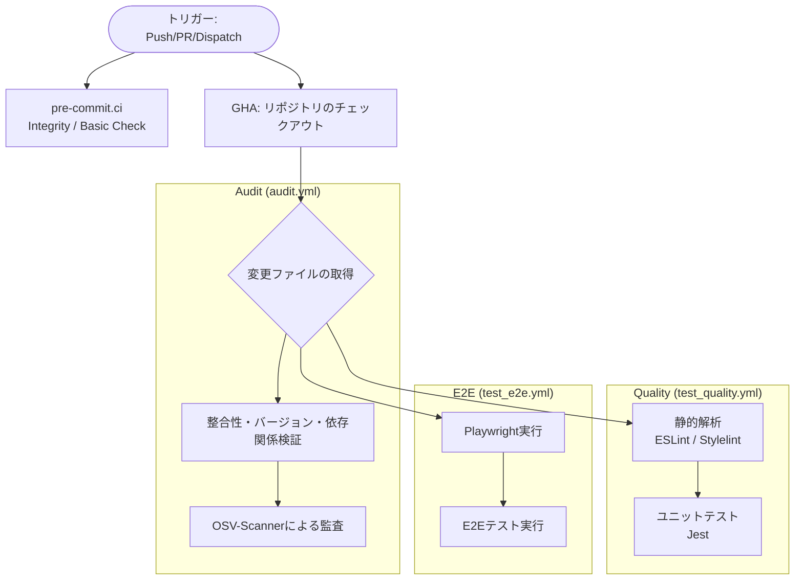

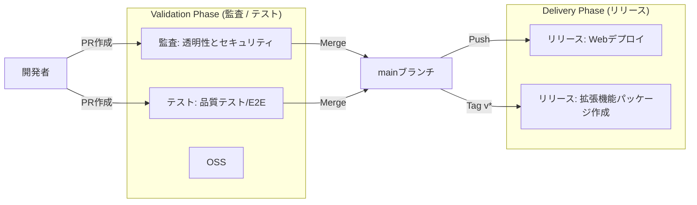

- **CodeQL: "3 configurations not found" 警告の解消:** GitHub の「Default setup」設定と `main` ブランチの状態に不整合が生じている場合に発生します。リポジトリの Settings で一度 CodeQL を Disable にし、再度 Enable にすることで解消します。
- **E2E セレクタの曖昧さ回避:** Playwright 等のテストにおいて、`.close-btn` のような汎用的なクラス名への依存を避け、`.history-edit-close-btn` のような固有のクラスを使用することで、ロケータの衝突を防止します。

### 6.2. 品質管理と翻訳標準
- **コード保守性標準:** デッドコード、未使用変数、冗長なロジックは速やかに削除します。テスト目的でのみエクスポートされる関数には、JSDoc コメント `Exported for testing purposes only.` を付与します。本番環境のログからは、内部状態の追跡のみを目的とした `console.log` を排除し、DBステータスやアラーム実行などの重要なマイルストーンのみを残します。
- **モジュール初期化のスコープ管理:** サブプロジェクトにおいて、`init` 関数内でのみ使用されるモジュールはローカル変数として定義します。複数の関数で共有されるモジュール（UIMod 等）は、適切なスコープを維持するためモジュールレベルで保持します。
- **ブラウザモジュールのテスト標準:** DOM 操作を伴うユニットテストでは `jsdom` 環境を使用します。`window.location` 等のグローバルオブジェクトは `Object.defineProperty` 等で適切にモック化し、テスト間の独立性を確保します。
- **ブラウザ拡張機能の国際化標準:** `projects/app/_locales/` 以下の標準的なディレクトリ構造を使用します。`manifest.chrome.json` では `__MSG_` プレースホルダーを使用し、`extensionName`、`extensionDescription`、`actionTitle` を必須キーとして定義します。
- **日本語用語の標準化:** 「カテゴリ」、「インポート/エクスポート」、「終了」、「時刻アジャスト」、「アラーム・通知機能」といった用語を標準化しています。
- **多言語翻訳標準:**
    - **ローカライズされたツールチップ:** アイコンのみのボタンには `data-i18n-title` を付与し、`i18n.js` を介してアクセシブルな多言語ツールチップを提供します。
    - **リセットボタンの呼称標準:** フッター等の簡潔な「リセット」には `btn-reset` キーを使用し、「カテゴリと設定の初期化」といった詳細な操作には `btn-reset-all` を使用して、文脈に応じた明示性を確保します。
    - **高速フィードバック (pre-commit.ci):** リポジトリの整合性や基本的なポリシーチェックを `pre-commit.ci` に委譲することで、プルリクエストに対する高速なフィードバックを実現しています。静的解析やユニットテストなどの環境依存の検証は GitHub Actions で確実に実行されます。
    - **E2E テストの構造化:** 機能別に分割し、日付変更の影響を避けるため固定時刻を使用することでテストの安定性を高めています。
    - 日本語 (`ja.js`) を意図（Intent）の正典（Source of Truth）とします。
    - 全 8 言語において、英語 (`en`) と同等のキーを網羅することを保証します。
- **Mermaid 図の ID ユニーク化:** GitHub でのレンダリング不具合を防ぐため、シーケンス図等の参加者 ID をグローバルにユニークに保ちます。
- **E2E テストの安定性と多言語検証:** リロード後のイベントリスナー付着待ちとして 500ms 待機を標準化。`tests/verify_i18n_display.spec.js` により、URL パラメータを介した言語切り替えと表示の妥当性を自動検証します。
- **データ整合性:** `initDB` 実行時に、終了時刻のないタスクや古い待機ログを自動修復します。

### 6.3. ドキュメント・アセット方針
- **技術図解の画像化:** Mermaid 形式ではレンダリング結果が環境に依存したり、視覚的な一貫性が損なわれる可能性がある場合、静的な画像（`docs/images/` 配下）への差し替えを推奨します。
- **README バッジの優先順位:** ユーザー向け情報（Version -> License -> Privacy -> Manifest -> Web Store）を最優先とし、開発者/保守情報（Crowdin -> Audit -> pre-commit -> Test -> Deploy）を後続させることで、エンドユーザーへの配慮を視覚的に明示します。

## 7. サブプロジェクト

### 7.1. QL-Category Editor
- **目的:** 広い画面でのカテゴリ詳細編集。
- **モジュール・アーキテクチャ:** ロジックは `category-editor.js`, `history.js`, `ui.js`, `data-io.js` に適切に分割され、メンテナンス性を確保しています。
- **ウェブベース移行 (v0.32.0):** Vercel ホストのウェブ版へ移行。データ連携はクリップボード (NDJSON) を介して実施。

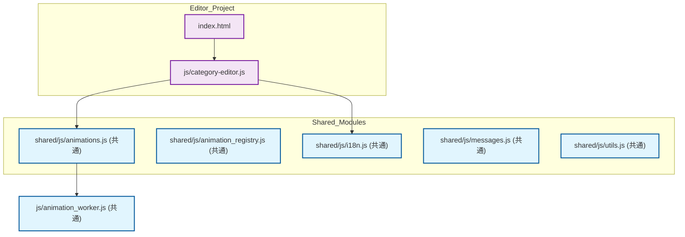

- **レイアウトデザイン:** 編集画面において、リストペインと編集ペインの境界に負の余白（negative margin）を持つ `.edit-pane-divider` を配置することで、視覚的な T-ジャンクションを形成し、領域の明確な分離を表現しています。
- **UI の差分更新 (Granular Updates):** パフォーマンス向上のため、リスト全体を再描画せずに特定の項目のみを更新する `updateListItem(idx)` 関数を備えています。
- **ボタンレイアウト:** ヘッダーボタンは [ゴミ箱]、[+] の順で、8px 間隔で配置。
- **一括編集時のタグ管理:** 複数選択時、共通するタグ（積集合）のみを表示しアルファベット順にソート. 一括追加時は重複を避け末尾に追加、一括削除時は全選択対象から削除。
- **タグボックス (Tag Box):** 全カテゴリから抽出されたユニークなタグを一覧表示。ドラッグ＆ドロップによる一括追加をサポート。
- **タグ置換 (Tag Replace):** 特定タグの置換・削除を行う専用インターフェース。
- **テスト容易性:** `window.state` を通じて内部状態を露出し、E2E テストからの直接操作を可能にしています。

### 7.2. QL-Alarm Editor
- **目的:** 高度なアラーム設定の視覚的編集とワークスペース管理。
- **UI 構成:** 360px 固定幅のマスターリストと柔軟な詳細ペインによる Master-Detail レイアウトを採用。
- **詳細ペインのレイアウト:** 「基本設定」と「スケジュール設定」は 2 カラムのグリッドで配置され、「アクション設定」は「基本設定」の直下に 24px の間隔（M3 スペース）を空けて配置されます。
- **セマンティック・カラー:** 曜日チップにおいて、日曜日（Red: `--app-color-sunday`）、土曜日（Blue: `--app-color-saturday`）、および選択された平日（Purple: `tertiary`）というセマンティックな CSS 変数を使用し、機能色（error 等）の誤用を避けています。
- **独立データベース:** `QuickLogSoloAlarmEditorDB` という隔離された IndexedDB を使用し、メインアプリのデータへの干渉を防止。
- **タイミング同期:** アラームのスケジュールタイプ変更時には、直ちに `renderAlarmList()` を呼び出し、リストペインのアイコンと詳細設定の同期を保証します。
- **言語永続性:** 言語変更時は `history.replaceState` により URL の `?lang=` パラメータを更新し、リロード時も選択言語を維持します。
- **マスターリストの強化:**
    - リスト項目には、状態表示用の読み取り専用ベルアイコン (`.alarm-status-icon`) を配置します。
    - ネイティブの HTML5 API を使用したドラッグ＆ドロップによる並べ替えをサポートします。
    - 無題のアラームに対する動的な番号付けは、カスタムメッセージがあるものをスキップし、上からの視覚的な位置に基づいて順次（1, 2, ...）リセットされます。
    - 詳細ペインには、個別のリセットボタン (`alarm-reset-btn`) を「有効」トグルの左側に配置します。
- **Undo/Redo のスコープと実装:**
    - アラーム関連の設定（アラーム、稼働日）のみが履歴スナップショットの対象となります。言語やテーマなどのユーザー設定は、Undo 操作による予期せぬ変動を防ぐため、履歴から除外されます。
    - すべての履歴操作（Undo/Redo）は、ページの再読み込みによるデータ消失を防ぐため、`saveAllAlarms` 等を通じて IndexedDB に即座に永続化されます。
    - Undo/Redo ボタンのクリックハンドラは、リストと詳細の両方をリフレッシュするために中央集権的な UI 同期（`state.onHistoryChange` 等）をトリガーします。
    - キーボードショートカット（Ctrl+Z, Ctrl+Shift+Z）をサポート。
    - 破壊的操作時は `location.reload()` を呼び出し履歴スタックを破棄。

### 7.3. QL-Animation Studio (β版)
- **目的:** アニメーションモジュールの開発・検証環境。

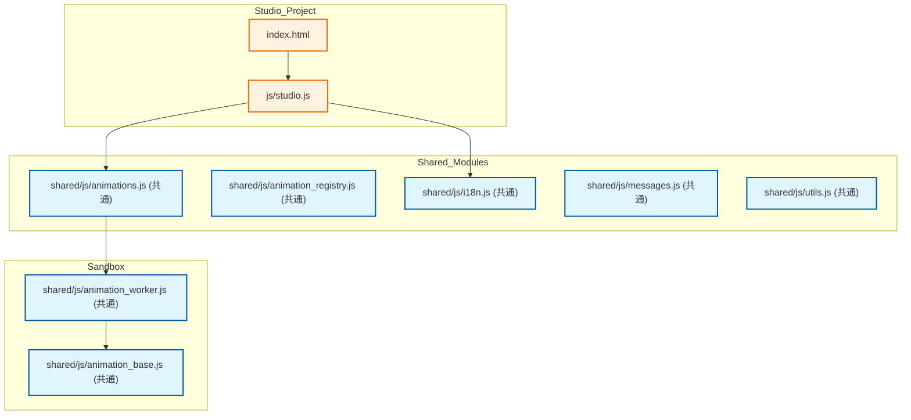

- **状態遷移 (Cassette Deck Style):**
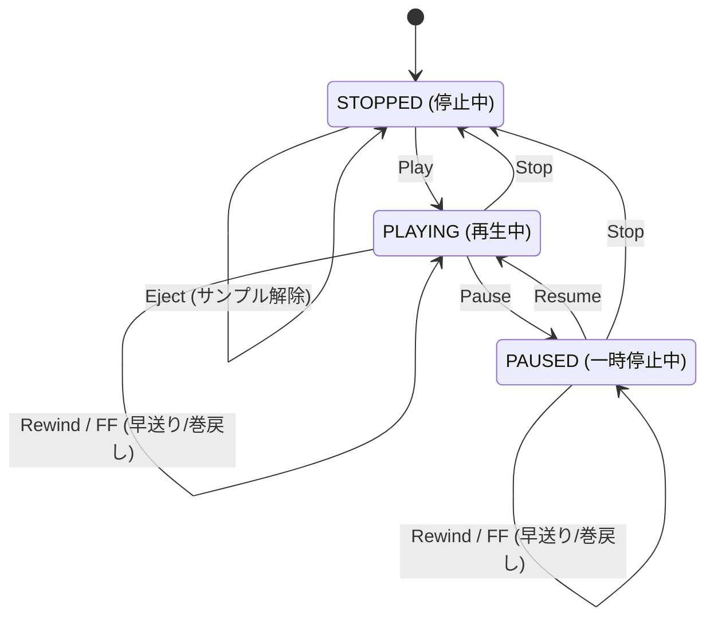

- **特徴:** 行番号付きエディタ、カセットデッキ風操作 UI（早送り/巻き戻し）、メトリクス計測（描画密度・変化率）。
- **レイアウトの安定性:** 説明文エリアの高さは 3.5 行分に固定（`calc(1.4em * 3.5)`）されています。
- **サンドボックス実行 (Dynamic Sandboxing):** Blob URL を使用した動的インポートにより、安全かつ即座に自作コードを実行可能。

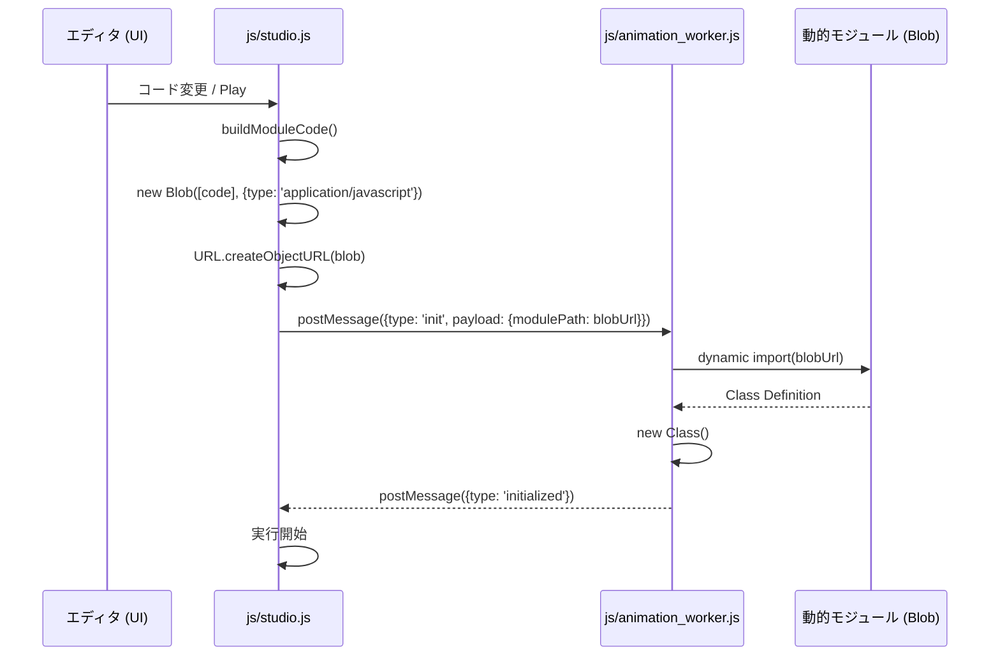

- **パフォーマンス・スロットリング (Throttling):** `isDrawPending` フラグを利用し、前フレームの処理が終わるまで次フレームをスキップします。

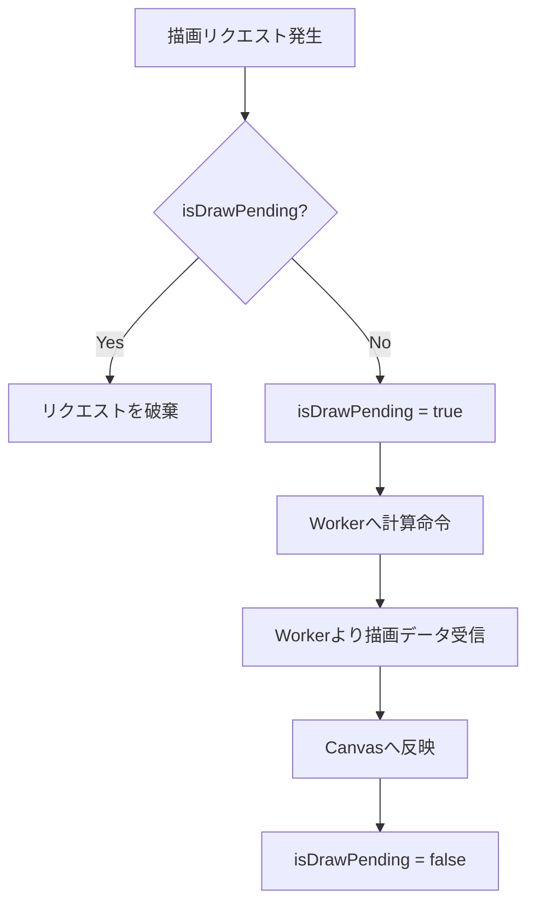

- **スクラブ操作 (Scrubbing / Virtual Time):** 仮想時間 (`virtualElapsedMs`) に基づく制御で、低速環境でも正確な検証が可能。

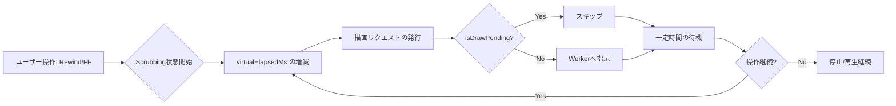

- **メトリクス計測 (Real-time Metrics):** 描画密度、変化率、遅延をリアルタイムで分析。

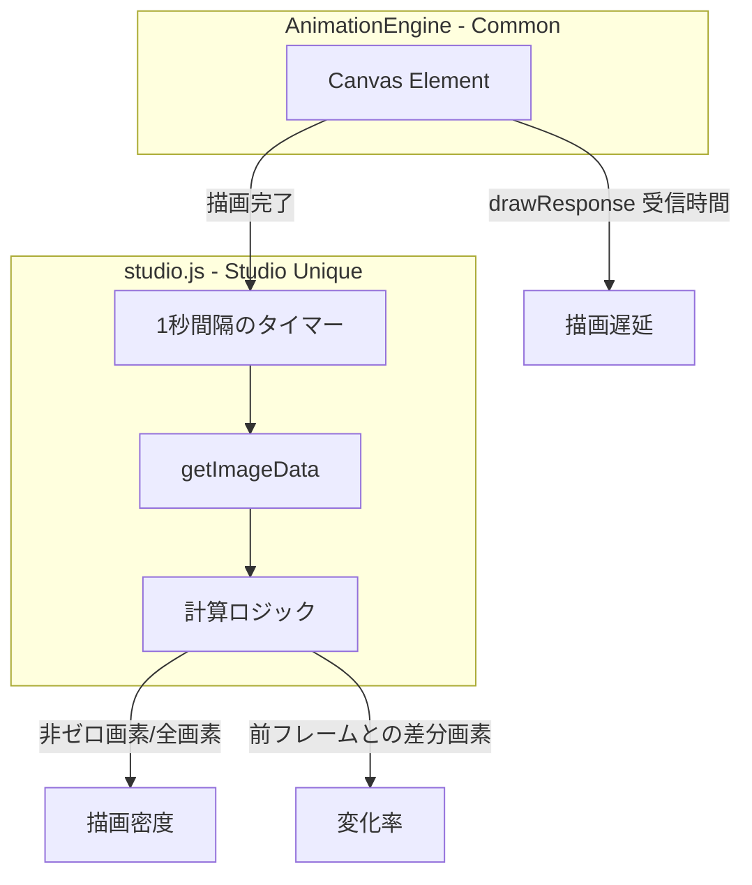

## 8. 紹介・配布ページ (Landing Page) ポリシー

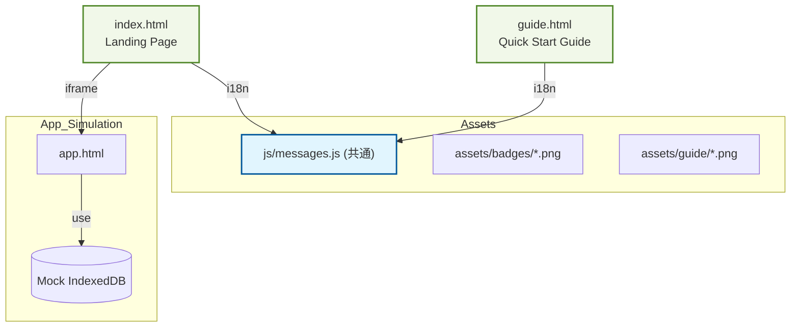

- **試用環境の分離:** `iframe` 内で `app.html` を起動する際、`?db=QuickLogSoloDB_Preview` パラメータを使用して環境を分離。
- **内部リンクの多言語対応:** `updateLink` ヘルパー関数を使用して現在の `lang` パラメータを引き継ぎ。
- **クイックスタートガイド (guide.html):** 各言語・各状態で Playwright により自動撮影されたスクリーンショットを掲載。印刷最適化 (`media print`) も実施。

## 9. 関連ドキュメント
- [開発者ガイド (README_DEV.md)](README_DEV.md)
- [テスト計画・ケース定義書 (README_TEST.md)](README_TEST.md)
- [背景アニメーション・モジュール仕様書 (animation_module_spec.md)](animation_module_spec.md)
- [GitHub Actions ワークフロー構成 (README_ACTIONS.md)](README_ACTIONS.md)
- [AI エージェント指針 (AGENTS.md)](../AGENTS.md)

## 付録: テストと品質管理詳細 (Testing & Quality)

### テスト環境の仮想化 (Virtualization)

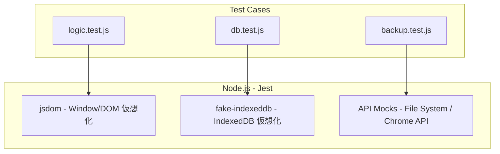

- **IndexedDB の仮想化 (`fake-indexeddb`):** 実際のデータベースを使用せず、メモリ上で IndexedDB をエミュレート。
- **DOM 仮想化 (`jsdom`):** `app.js` など UI に密接なモジュールをテストする際、ブラウザの DOM 構造を再現。
- **API のモック化 (Mocking):** File System Access API や Chrome API は Jest のモック関数で置き換え。

### 詳細テストケース一覧

#### ユニットテスト (Jest)

| カテゴリ | 対象 | ケース概要 | 期待される結果 |
| :--- | :--- | :--- | :--- |
| ロジック | `logic.js` | HH:MM:SSフォーマット, 四捨五入丸め, タスク開始/終了/一時停止 | 正確な文字列/オブジェクトが返る |
| データ | `db.js` | ストア作成, CRUD操作, 初期データ生成, 不整合修復 | IndexedDB の整合性が保たれる |
| 同期 | `backup.js` | バックアップ状態遷移, ファイル書き出し, ロック処理 | File System Access API と連携する |
| その他 | `utils.js` | HTML/CSVエスケープ, バリデーション | XSSやCSV崩れを防止する |
| i18n | `i18n.js` | 翻訳キーの全言語網羅性 | `en` と同等のキーが全言語にある |
| バックグラウンド | `background.js` | アラーム発火時の通知・アクション実行 | 状態に応じた通知が表示される |

#### E2E・ビジュアルテスト (Playwright)

| カテゴリ | ファイル | ケース概要 |
| :--- | :--- | :--- |
| 正常系 | `ui_settings.spec.js` | 設定の永続化検証 |
| 正常系 | `analysis.spec.js` | 日報生成・タグ集計の正確性検証 |
| 正常系 | `data_io.spec.js` | カテゴリ・履歴の入出力整合性検証 |
| 正常系 | `sync.spec.js` | 複数タブ間の状態同期検証 |
| 正常系 | `test_pattern_verification.spec.js` | 重ね合わせ透過度検証 |
| 堅牢性 | `history_import.spec.js` | 破損CSVインポートの堅牢性検証 |
| 堅牢性 | `robustness.spec.js` | 言語永続性と極端に長いカテゴリ名への耐久性検証 |
| 多言語 | `verify_i18n_display.spec.js` | 多言語表示の妥当性自動検証 |
| サブプロジェクト | `category_editor_undo_redo.spec.js` | カテゴリエディタの Undo/Redo 検証 |
| サブプロジェクト | `animation_evaluation.spec.js` | アニメーション品質評価（密度、変化量） |
| サブプロジェクト | `studio_verification.spec.js` | スタジオ基本動作検証 |

## 免責事項 (Disclaimer)
本ソフトウェアは、個人によって開発されたオープンソース・プロジェクトであり、**無保証 (AS IS)** です。
利用に際して生じたいかなる損害（データの消失、業務の中断、PCの不具合など、本ツールやドキュメントを利用したことによるすべての損害）について、開発者は一切の責任を負いません。
MIT ライセンスの規定に基づき、「現状のまま」提供されるものとします。自己責任でご利用ください。

This software is a personal open-source project and is provided **"AS IS"** without warranty of any kind.
The developer shall not be liable for any damages (including data loss, work interruption, etc.) arising from the use of this software.
Use at your own risk, as per the MIT License.
