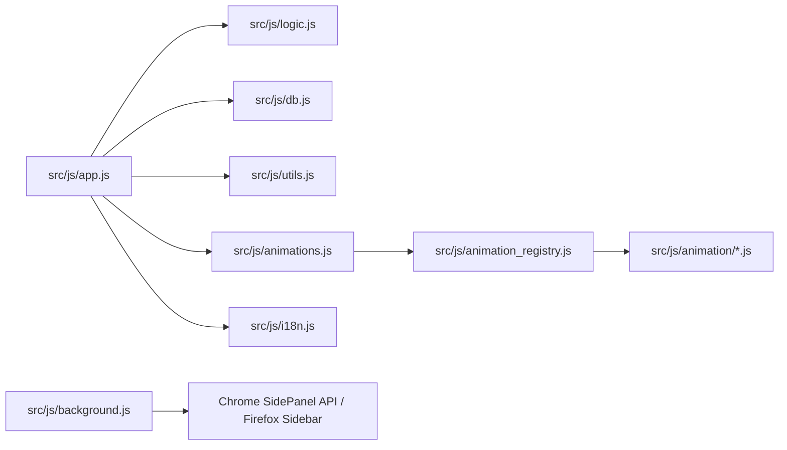

# 開発仕様書: QuickLog-Solo (ミニマリスト向け・サイドパネル型作業メモツール)

## 1. プロジェクトのビジョン
- **コンセプト:** 「1秒で記録、1秒で集計、1秒で安心」。
- **ターゲット:** 業務記録を負担に感じるが、ツールの透明性や安全性に厳しい技術者。
- **製品のポジショニング:** 本ツールは「作業メモツール」であり、エンタープライズ向けの「工数管理システム」とは一線を画す。高度な分析や外部連携を排し、個人の記録体験を最大化することに特化する。
- **設計思想・判断の背景:** 詳細については [AGENTS.md](../AGENTS.md) を参照すること。

## 2. システム構成
- **形態:** ブラウザ拡張機能 (Chrome/Edge: サイドパネル, Firefox: サイドバー)
- **技術:** HTML5, CSS3, JavaScript (Vanilla JSのみ、フレームワーク禁止)。Web Worker によるアニメーションロジックのサンドボックス化。
- **ストレージ:** ブラウザ内 IndexedDB (Local Only)。外部送信は一切行わない（CSP により技術的に強制）。
- **配布:** 各ブラウザストアまたはデベロッパーモードによるインストール。

## 3. 主要機能 (MVP)
### A. 打刻・記録ロジック
- カテゴリを選択して「開始」を押すと、現在時刻を打刻し、即座に履歴の先頭に表示される。
- 新しいタスクの「開始」により、前のタスクの終了時刻を自動記録。
- 停止ボタン（⏹）による終了時は、履歴の開始時刻を非表示にし、終了時刻のみを表示する特別なフォーマットを採用。
- 同時に実行できるタスクは常に1つのみ。
- **タブ間継続:** ブラウザのタブを切り替えてもサイドパネルの状態は維持され、計測が継続される。

### B. カテゴリ管理
- ユーザーがカテゴリを追加・削除・編集可能。設定は永続化される。
- ドラッグ＆ドロップによる表示順序の変更が可能。
- ページネーション（1ページ16項目、8x2グリッド）をサポート。マウスホイールで切り替え可能。
- カテゴリーデータのJSON形式でのインポート/エクスポートが可能。インポート時は「追記」または「すべて削除して上書き」を選択可能。

### C. 出力機能 (クリップボードコピー)
- ヘッダーのボタン（📋, 📊）から、日報形式や工数集計結果のコピーが可能。

### D. データライフサイクル
- **保持期間:** 直近40日間。
- **自動削除:** 起動時に40日を超えたデータを自動消去し、メンテナンスフリーを実現。
- **手動保守:** ログデータのCSVエクスポート/インポート、およびカテゴリーデータのJSONインポート/エクスポート機能を備える。

### E. サイドバー・サイドパネル機能
- 各ブラウザのサイドバー（またはサイドパネル）APIを利用し、常にブラウザの横で動作。
- Chrome/Edge: `side_panel` API
- Firefox: `sidebar_action` API

## 4. UI/UX デザイン・透明性設計
- **レイアウト:** サイドパネルに最適化された垂直レスポンシブデザイン。
- **Material 3:** Google の Material 3 に完全準拠したデザイントークン管理。ヘッダーの操作ボタン等は Material 3 IconButtons (Material Symbols 使用) として実装される。
- **透明性:** 設定内の「About」タブにて、保存先や通信仕様（Local Only）を明示。

## 5. 運用上の制約
- 外部API（Microsoft Graph等）は不使用。
- シンプルさと軽量動作を最優先。

## 6. ドキュメント管理ポリシー
- セッション内で判断された事項は、常に本ドキュメント（spec.md）に反映・更新する。
- プルリクエスト (PR) におけるやり取りはすべて**日本語**で行う。

## 7. 紹介・配布ページ (Landing Page) ポリシー
- **目的:** 導入を検討しているメンバーに対し、ツールの概要、ポリシー、使い方を分かりやすく簡潔に伝える。
- **デザイン:** Material 3 デザインシステムに基づき、アプリ本体と共通のデザイントークンを使用する。
- **構成:**
  - 1ページ構成（遷移なし）を基本とする。
  - 最新バージョンへのリンク（ブラウザで試す）と、拡張機能パッケージ（.zip）のダウンロードリンクを設ける。
  - 視覚的メリハリ（タイポグラフィの強弱）をつけ、簡潔な言葉で表現する。
- **ビジュアル:** 表現力を補うためにグリフ文字（Material Symbols）を活用し、画像を使用する場合はシルエットなどのシンプルなものに限定する。

## 8. 追加合意事項
### 背景アニメーション (Canvas-based LCD Style)
- **経過時間表示:** リアルタイム表示（HH:MM:SS）。`Date.now()`を使用し精度を確保。
- **背景アニメーション:** 実行中エリア（`#control-section`）の背景に `<canvas>` を使用してアニメーションを描画。
  - **スタイル:** LCD ドットマトリクス・スタイル。4段階（なし、小、中、大）のドットサイズで monochromatic な低解像度表現を行う。
  - **周期:** 120秒（2分）サイクル。
  - **バリエーション:** 標準的な進捗表示に加え、ゲーム（Tennis, Car Drive）、生き物（Cats, Migrating Birds）、RPG風演出（Hero Pot）、オーディオビジュアル（Spectrum）など、インタラクティブで多様な全21種類をサポート。
  - **拡張性:** アニメーションはモジュール化されており、`src/js/animation/` 配下にファイルを追加するだけで自動的にレジストリに登録されるプラグイン形式を採用。
  - **アニメーションの安全性:** 外部開発者のモジュールがメインスレッドのデータにアクセスしたり、外部通信したりすることを防ぐため、Web Worker での実行と CSP による制限を適用。
- **確認ダイアログ:** アプリ内カスタムダイアログを実装。ボタン（OK/キャンセル）は M3 ガイドラインに従い、等幅のグリッドレイアウトで配置される。
- **色の判別性向上:** Material 3 Tonal Palette に基づき、14色のカラーバリエーションを提供。
- **レイアウトの堅牢性:** 多言語対応に伴うテキスト長の変化に対応するため、重要な UI 要素（`#pause-btn`, `#end-btn`, `.category-btn`, `.log-name` 等）には `min-width: 0`, `overflow: hidden`, `text-overflow: ellipsis` を適用し、レイアウト崩れを防止する。
- **履歴の再現性:** ログに打刻時点のカテゴリ色を保存し、カテゴリ削除後も当時の色で履歴を表示可能にする。
- **履歴表示制限:** 直近100件まで表示。
- **視覚的堅牢性:** 背景アニメーション（Clock, Coffee Drip 等）は、UI テキスト領域（Exclusion Area）との重なりを避けるために動的な再配置や水平シフトを行い、視認性を確保する。
- **キャンバスの堅牢性:** 非表示状態での初期化など、キャンバスの寸法がゼロの場合に描画エラーが発生しないようガードを設ける。

### DB・同期の分離 (Isolation)
- **カスタムDB:** URL パラメータ `?db=` を指定することで、独立した IndexedDB インスタンスを利用可能。
- **同期の分離:** 状態同期に使用する `BroadcastChannel` 識別子にデータベース名を組み込むことで、ランディングページ上のプレビューと拡張機能本体、または異なる DB インスタンス間での状態の混線を防止する。
- **内部文字列の永続性:** IndexedDB に保存されるシステム予約文字列（`SYSTEM_CATEGORY_IDLE` 等）は、データ互換性のために非言語依存の値（例: `__IDLE__`）とする。これらは UI 表示時のみ各言語に翻訳される。

### ログの経過時間フォーマット
- `formatLogDuration(ms)` による丸め処理を適用。
- **60秒未満:** 「Ns」形式（例: 30s）。秒単位で四捨五入。
- **60秒以上 60分未満:** 「Nm」形式（例: 45m）。分単位で四捨五入（例: 59.5s -> 1m）。
- **60分以上:** 「Nh Nm」または「Nh」形式。
  - 10分未満の分はスペースを挟む（例: 1h 5m）。
  - 10分以上の分はスペースなし（例: 1h15m）。
  - 分が 0 の場合は時間のみ表示（例: 2h）。

### 状態表示
- 実行中: ▶ (Green)
- 待機中/一時停止中: ⏸ (Orange) - 点滅演出あり。
- 停止中: ⏹ (Red)

### セキュリティポリシー (文字列入力)
- **XSS対策:** `textContent` または適切なエスケープを使用。
- **DoS対策:** 入力文字列（カテゴリ名等）の最大長を50文字に制限。
- **予約語の保護:** システム予約文字列（`__IDLE__` 等）をカテゴリ名として使用することを禁止する。

### バージョニングポリシー
- `[メジャー].[マイナー].[パッチ]` 形式で `src/version.json`, `package.json`, `src/manifest.*.json` で管理。
- **自動採番:** Conventional Commits (`feat:`, `fix:`, `BREAKING CHANGE:`) に基づき、`scripts/bump_version.py` によって自動的に採番・更新される。
- **整合性チェック:** `scripts/check_version.py` によって各ファイルのバージョン一致が確認される。
- **影響度検証:** `scripts/verify_version_impact.py` によって、変更内容に対して適切なバージョンアップが行われているかが CI 上で自動検証される。

### 静的デプロイメント (Vercel)
- **vercel.json:** `outputDirectory: "."` および `cleanUrls: true` を設定し、ルートの `index.html` および `src/` 配下のアセットが正しく参照されるように構成する。

## 9. 開発・品質管理ポリシー
### 設計原則・行動指針
AI エージェントとしての詳細な行動指針および設計原則の適用については [AGENTS.md](../AGENTS.md) を遵守すること。

### ディレクトリ構造・モジュール構造
- **src/:** 拡張機能のソースコード一式。
    - **js/:** アプリケーションロジック (`app.js`, `logic.js`, `db.js`, `utils.js`, `animations.js`, `i18n.js`, `messages.js` 等)。
    - **css/:** アプリ用スタイルシート (`style.css`, `m3-theme.css`, `landing.css`)。
    - **assets/:** アイコン等の静的アセット。
    - **app.html:** アプリ本体のHTML。
- **scripts/:** ビルド、パッケージング、整合性チェック用のスクリプト。
- **releases/:** 各ブラウザ向けの配布用パッケージ（ZIP）の出力先。
- **docs/:** 仕様書、開発ガイドライン等のドキュメント。
- **tests/:** Jest による単体テストおよび Playwright による E2E テスト。

### 品質保証
- **Jest:** ロジック層とDB層の単体テスト。
- **Playwright:** E2E/視覚的検証。
- **i18n カバレッジ:** `tests/i18n_coverage.test.js` により、全てのサポート言語で翻訳キーの整合性が保たれていることを保証する。
- **リンター:** ESLint (Manifest V3 globals 対応) & Stylelint。
- **データ整合性の自動修復:** `initDB` 実行時に、終了時刻のない「孤立したタスク」や古い「待機ログ」を自動的にクリーンアップ・修復する。

### パッケージングの自動化
- `scripts/create_package.py` を使用して、各ブラウザ（Chrome/Firefox）向けに最適化された ZIP パッケージを自動生成する。
- 生成されたパッケージは `releases/` ディレクトリに出力され、Git 管理からは除外される。
- `npm run build` コマンドによって、バージョンチェックおよびアニメーションレジストリ生成と併せて一括実行される。
