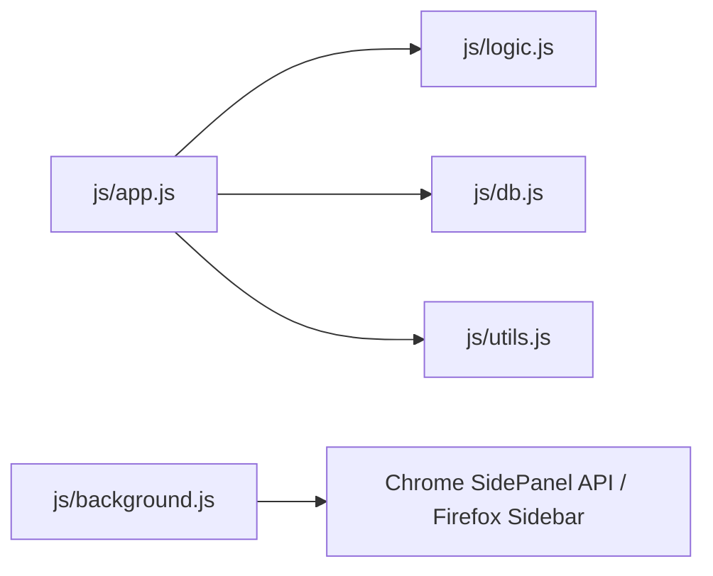

# 開発仕様書: QuickLog-Solo (ミニマリスト向け・サイドパネル型工数管理ツール)

## 1. プロジェクトのビジョン and 設計思想
- **コンセプト:** 「1秒で記録、1秒で集計」。
- **ターゲット:** 業務記録を負担に感じるが、ツールの透明性や安全性に厳しい技術者。
- **設計指針:** 「必要十分（Less is More）」。過剰な機能追加を避け、特定のワークフローの摩擦を最小化する。
- **透明性:** データの保存先や通信仕様を明示し、ユーザー（技術者）の不安を解消する。

## 2. システム構成
- **形態:** ブラウザ拡張機能 (Chrome/Edge: サイドパネル, Firefox: サイドバー)
- **技術:** HTML5, CSS3, JavaScript (Vanilla JSのみ、フレームワーク禁止)。
- **ストレージ:** ブラウザ内 IndexedDB (Local Only)。外部送信は一切行わない。
- **配布:** 各ブラウザストアまたはデベロッパーモードによるインストール。

## 3. 主要機能 (MVP)
### A. 打刻・記録ロジック
- カテゴリを選択して「開始」を押すと、現在時刻を打刻し、即座に履歴の先頭に表示される。
- 新しいタスクの「開始」により、前のタスクの終了時刻を自動記録。
- 停止ボタン（⏹）による終了時は、履歴の開始時刻を非表示にし、終了時刻のみを表示する特別なフォーマットを採用。
- 同時に実行できるタスクは常に1つのみ。
- **タブ間継続:** ブラウザのタブを切り替えてもサイドパネルの状態は維持され、計測が継続される。

### B. カテゴリ管理
- ユーザーがカテゴリを追加・削除・編集可能。設定は永続化される。
- ドラッグ＆ドロップによる表示順序の変更が可能。
- ページネーション（1ページ16項目、8x2グリッド）をサポート。マウスホイールで切り替え可能。
- カテゴリーデータのJSON形式でのインポート/エクスポートが可能。インポート時は「追記」または「すべて削除して上書き」を選択可能。

### C. 出力機能 (クリップボードコピー)
- ヘッダーのボタン（📋, 📊）から、日報形式や工数集計結果のコピーが可能。

### D. データライフサイクル
- **保持期間:** 直近40日間。
- **自動削除:** 起動時に40日を超えたデータを自動消去し、メンテナンスフリーを実現。
- **手動保守:** ログデータのCSVエクスポート/インポート、およびカテゴリーデータのJSONインポート/エクスポート機能を備える。

### E. サイドバー・サイドパネル機能
- 各ブラウザのサイドバー（またはサイドパネル）APIを利用し、常にブラウザの横で動作。
- Chrome/Edge: `side_panel` API
- Firefox: `sidebar_action` API

## 4. UI/UX デザイン・透明性設計
- **レイアウト:** サイドパネルに最適化された垂直レスポンシブデザイン。
- **Material 3:** Google の Material 3 に完全準拠したデザイントークン管理。
- **透明性:** 設定内の「About」タブにて、保存先や通信仕様（Local Only）を明示。

## 5. 運用上の制約
- 外部API（Microsoft Graph等）は不使用。
- シンプルさと軽量動作を最優先。

## 6. ドキュメント管理ポリシー
- セッション内で判断された事項は、常に本ドキュメント（spec.md）に反映・更新する。
- プルリクエスト (PR) におけるやり取りはすべて**日本語**で行う。

## 7. 紹介・配布ページ (Landing Page) ポリシー
- **目的:** 導入を検討しているメンバーに対し、ツールの概要、ポリシー、使い方を分かりやすく簡潔に伝える。
- **デザイン:** Material 3 デザインシステムに基づき、アプリ本体と共通のデザイントークンを使用する。
- **構成:**
  - 1ページ構成（遷移なし）を基本とする。
  - 最新バージョンへのリンク（ブラウザで試す）と、拡張機能パッケージ（.zip）のダウンロードリンクを設ける。
  - 視覚的メリハリ（タイポグラフィの強弱）をつけ、簡潔な言葉で表現する。
- **ビジュアル:** 表現力を補うためにグリフ文字（Material Symbols）を活用し、画像を使用する場合はシルエットなどのシンプルなものに限定する。

## 8. 追加合意事項
### デザイン・UI
- **経過時間表示:** リアルタイム表示（HH:MM:SS）。`Date.now()`を使用し精度を確保。
- **背景アニメーション:** 実行中エリアの背景がアニメーション。以下のバリエーションを持つ。
  - 左から右 (標準)
  - 右から左
  - クロック (1分周期の扇形、2分で1周) - **デフォルト**
  - サンドクロック (1分周期で砂が移動、2分で1周)
- **確認ダイアログ:** アプリ内カスタムダイアログを実装。
- **色の判別性向上:** Material 3 Tonal Palette に基づき、14色のカラーバリエーションを提供。
- **履歴の再現性:** ログに打刻時点のカテゴリ色を保存し、カテゴリ削除後も当時の色で履歴を表示可能にする。
- **履歴表示制限:** 直近100件まで表示。

### 状態表示
- 実行中: ▶ (Green)
- 待機中/一時停止中: ⏸ (Orange) - 点滅演出あり。
- 停止中: ⏹ (Red)

### セキュリティポリシー (文字列入力)
- **XSS対策:** `textContent` または適切なエスケープを使用。
- **DoS対策:** 入力文字列（カテゴリ名等）の最大長を50文字に制限。

### バージョニングポリシー
- `[メジャー].[マイナー].[パッチ]` 形式で `version.json`, `package.json`, `manifest.json` で管理。

## 9. 開発・品質管理ポリシー
### 設計原則
- **KISS, DRY, YAGNI, SLAP, OCP.**
- **定数化の徹底:** マジックナンバーを排除し、定数として一元管理。

### モジュール構造

### 品質保証
- **Jest:** ロジック層とDB層の単体テスト。
- **Playwright:** E2E/視覚的検証。
- **リンター:** ESLint & Stylelint。
