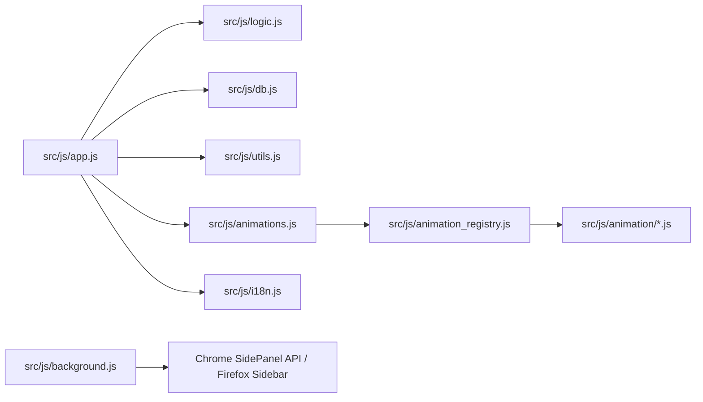

# 製品仕様書・設計指針: QuickLog-Solo (ミニマリスト向け・サイドパネル型作業メモツール)

## 1. プロジェクトのビジョン
- **コンセプト:** 「1秒で記録、1秒で集計、1秒で安心」。
- **長寿命な設計:** OSS のトレンドやライフサイクルに依存しない Vanilla JS による構築。
- **ターゲット:** 業務記録を負担に感じるが、ツールの透明性や安全性に厳しい技術者。
- **製品のポジショニング:** 本ツールは「作業メモツール」であり、エンタープライズ向けの「工数管理システム」とは一線を画す。高度な分析や外部連携を排し、個人の記録体験を最大化することに特化する。
- **設計思想・判断の背景:** 詳細については [AGENTS.md](../AGENTS.md) も併せて参照すること。

## 2. 設計思想と判断の背景 (Why)

本プロジェクトにおける技術的・設計的判断の理由は以下の通りです。

### 2.1. コア・フィロソフィー
- **持続可能性 (Sustainability):** 外部サーバーや API に依存せず、オフライン（ブラウザ内）で完結すること。ブラウザやタブが閉じられても、計測状態が確実に復元・継続されること。「レジリエンス（回復力）」という言葉よりも、システムの普遍性と自己完結性を強調する「持続可能性」を設計の最上位概念としています。
- **ミニマリズム (Minimalism):** 「必要十分（Less is More）」。過剰な機能追加を避け、特定のワークフロー（作業記録）の摩擦を最小化すること。
- **透明性 (Transparency):** データの保存先（IndexedDB）や通信が行われないことを明示し、ユーザー（技術者）が安心して利用できること。
- **保守性・長寿命 (Maintainability & Longevity):** 外部フレームワークやライブラリを一切使用せず、標準的な Web API (Vanilla JS) のみで構築すること。これにより、特定の OSS のライフサイクルやトレンドに左右されず、10年後もメンテナンス可能で動作し続けるコードを目指す。

### 2.2. 技術選定
- **Vanilla JS & フレームワーク禁止:** 依存関係の複雑化とメンテナンスコストを排除するため。また、セキュリティレビューの透過性を高める目的もあります。
- **IndexedDB (Local Only):** 外部への通信を CSP により技術的に強制遮断し、プライバシーを確保するため。

### 2.3. UI/UX 設計
- **Material 3 (M3) Tonal Palette:** アクセシビリティ（コントラスト）を確保しつつ、カテゴリごとの視認性を向上させるため。
- **ページネーション (8x2 グリッド):** サイドパネルの限られたスペースで、ボタン配置を固定（マッスルメモリーの活用）しつつ多数のカテゴリを管理するため。
- **タイポグラフィ:** 全ての言語で一貫したモダンな外観を維持し、OS標準フォントへの不適切なフォールバックを防ぐため。

### 2.4. データ管理
- **40日間 & 100件表示:** パフォーマンス維持と「直近の振り返り」への特化のため。
- **終了ロジック (待機ログ):** 日報作成時に「いつ作業が終わったか」を視覚的に明確にするため。
- **内部文字列の永続性:** 将来的なデータ互換性のために `__IDLE__` などのシステム予約 ID を使用。

## 3. システム構成 (What)
- **形態:** ブラウザ拡張機能 (Chrome/Edge: サイドパネル, Firefox: サイドバー)
- **技術:** HTML5, CSS3, JavaScript (Vanilla JS)。Web Worker によるアニメーションロジックのサンドボックス化。
- **ストレージ:** ブラウザ内 IndexedDB (Local Only)。
- **配布:** 各ブラウザストアまたはデベロッパーモードによるインストール。

## 4. 主要機能 (MVP)
### A. 打刻・記録ロジック
- カテゴリを選択して「開始」を押すと、現在時刻を打刻し、即座に履歴の先頭に表示される。
- 新しいタスクの「開始」により、前のタスクの終了時刻を自動記録。
- 終了ボタン（⏹）による終了時は、履歴の開始時刻を非表示にし、終了時刻のみを表示する特別なフォーマットを採用。
- 同時に実行できるタスクは常に1つのみ。
- **タブ間継続:** ブラウザのタブを切り替えてもサイドパネルの状態は維持され、計測が継続される。

### B. カテゴリ管理
- ユーザーがカテゴリを追加・削除・編集可能。設定は永続化される。
- ドラッグ＆ドロップによる表示順序の変更が可能。
- ページネーション（1ページ16項目、8x2グリッド）をサポート。マウスホイールで切り替え可能。
- カテゴリデータのJSON形式でのインポート/エクスポートが可能。インポート時は「追記」または「すべて削除して上書き」を選択可能。

### C. 出力機能 (クリップボードコピー)
- ヘッダーのボタン（📋, 📊）から、日報形式やタグ別の工数集計結果のコピーが可能。
- **日報コピー:**
    - Markdown, Wiki, HTML Table, CSV, Text形式をサポート。
    - **Tag Aggregation UI:** 集計結果表示エリアは `min-height: 450px` を確保し、スクロールなしで多くのタグを一覧可能。各行は固定幅のカラム（時間: 80px, コピーボタン: 48px）を持ち、長いタグ名は自動的に省略（ellipsis）される。
    - **コピー操作の標準化:** 日報およびタグ集計のコピーボタンは、クリック時にトースト通知のみを表示し、ボタン自体のテキストは変更しません。ホバー時は Material 3 のトナル・インバージョン（Primary Container 背景と On Primary Container 文字色）を適用し、ダークテーマを含めた全環境での視認性を確保します。
    - 絵文字の除去、終了時刻の表示、経過時間の表示位置（右または下）、5/10分単位の時刻丸め（Time Adjustment / 時刻アジャスト）を設定可能。
    - HTML Table形式のコピー時は、リッチテキスト（HTML）とプレーンテキストの両方をクリップボードに保持（`ClipboardItem` 使用）。
    - ユーザー設定は IndexedDB に永続化される。
- **タグ集計:**
    - 選択した日付のログから、カテゴリに紐付いたタグごとの合計時間を算出。
    - タグのないログは「タグなし」として集計。
    - 結果をクリップボードにコピー可能。

### D. データライフサイクル
- **保持期間:** 直近40日間。
- **自動削除:** 起動時に40日を超えたデータを自動消去し、メンテナンスフリーを実現。
- **手動保守:** ログデータのCSVエクスポート/インポート、およびカテゴリデータのJSONインポート/エクスポート機能を備える。

### E. サイドバー・サイドパネル機能
- 各ブラウザのサイドバー（またはサイドパネル）APIを利用し、常にブラウザの横で動作。
- Chrome/Edge: `side_panel` API
- Firefox: `sidebar_action` API

## 5. UI/UX デザイン・透明性設計
- **レイアウト:** サイドパネルに最適化された垂直レスポンシブデザイン。
- **Material 3:** Google の Material 3 に完全準拠したデザイントークン管理。ヘッダーの操作ボタン等は Material 3 IconButtons (Material Symbols 使用) として実装される。
- **透明性:** 設定内の「About」タブにて、保存先や通信仕様（Local Only）を明示。

## 6. 運用上の制約
- 外部API（Microsoft Graph等）は不使用。
- シンプルさと軽量動作を最優先。

## 7. ドキュメント管理ポリシー
- セッション内で判断された事項は、常に本ドキュメント（spec.md）に反映・更新する。
- 機能の追加や改善が行われた際は、その価値を利用者に正しく伝えるため、随時 README.md や紹介ページ（index.html）等の利用者向けドキュメントを更新し、積極的に情報を発信する。
- プルリクエスト (PR) におけるやり取りはすべて**日本語**で行う。

## 8. 紹介・配布ページ (Landing Page) ポリシー
- **目的:** 導入を検討しているメンバーに対し、ツールの概要、ポリシー、使い方を分かりやすく簡潔に伝える。
- **デザイン:** Material 3 デザインシステムに基づき、アプリ本体と共通のデザイントークンを使用する。
- **構成:**
  - 1ページ構成（遷移なし）を基本とする。
  - 最新バージョンへのリンク（ブラウザで試す）と、拡張機能パッケージ（.zip）のダウンロードリンクを設ける。
  - 視覚的メリハリ（タイポグラフィの強弱）をつけ、簡潔な言葉で表現する。
- **ビジュアル:** 表現力を補うためにグリフ文字（Material Symbols）を活用し、画像を使用する場合はシルエットなどのシンプルなものに限定する。

## 9. 追加合意事項
### 背景アニメーション
- **コンセプト:** 「ビジュアル・ヒーリング」。2分周期の LCD ドットマトリクス・スタイルを採用し、作業者の集中を妨げず、かつ心地よい変化を提供します。
- **レイヤー構造 (FG/BG):** 画面を「FG (Foreground: 業務カテゴリ名やタイマーを表示する帯)」と「BG (Background: アニメーションキャンバス)」として定義し、視認性と表現力を両立させます。
- **制作ガイド:** 開発者向けの仕様書を「制作ガイド（Creative Guide）」として再定義。技術的な制約を「クリエイターの決断」としてポジティブに捉え、制作の楽しさを強調しています。
- Web Worker によるサンドボックス化と自動遮蔽機能を備える。
- 低スペック環境への配慮として、200ms 以上の遅延が 20回連続した場合に自動停止するガードレールを実装（v0.11.0）。
- **安定性の向上 (v0.11.0):** 起動時の負荷による誤作動を防ぐため、180フレーム（約3秒）の「ウォームアップ期間」を導入し、この期間内の遅延はガードレールのカウント対象外とする。自動停止時は `onStop` コールバックを通じて `app.js` 側の状態もリセットされ、必要に応じて再開可能な状態を維持します。
- 詳細は [animation_module_spec.md](animation_module_spec.md) を参照。

### QL-Animation Studio (β版)
- ブラウザ上でアニメーションロジックを作成、リアルタイムでテスト、および配布用ファイルのダウンロードが可能な開発環境。
- **特徴:**
    - エディタ: 行番号表示、シンタックスハイライト、オートインデント、検索・置換、折り返し切り替え。折り返し有効時も行番号（Gutter）とコード行の高さが動的に同期され、視覚的な整合性が保たれます。
    - プレビュー: スピード調整 (0.5x - 2.0x)、カラー変更、除外領域シミュレータ、メトリクス表示 (レイテンシ、密度、変化率)。
    - セキュリティ: Web Worker 内での実行により、メインスレッドの IndexedDB や DOM への直接アクセス、および外部通信を遮断。
    - 描画モードサポート: 'Canvas', 'Matrix', 'Sprite' モードを完全サポート。
    - **開発・検証用モジュール (devOnly):** `devOnly: true` フラグを持つモジュール（例：動作確認用パターン）は、リリース用のパッケージからは物理的に除外されます。一方、開発環境や紹介ページ (index.html) のアプリプレビューでは選ぶことができ、視覚的な確実な動作検証に利用可能です。
    - **遮蔽戦略 (exclusionStrategy):** UI 要素 (FG) によるマスキングの振る舞いを `'mask'` (デフォルト), `'jump'`, `'freedom'` の 3 つから選択可能。特に `'freedom'` モードでは強制的なマスキングをバイパスし、UI の背後を含めた全面への描画が可能になります。

### UI/UX 補足
- **確認ダイアログ:** アプリ内カスタムダイアログを実装。ボタン（OK/キャンセル）は M3 ガイドラインに従い、等幅のグリッドレイアウトで配置される。
- **色の判別性向上:** Material 3 Tonal Palette に基づき、14色のカラーバリエーションを提供。
- **レイアウトの堅牢性:** 多言語対応に伴うテキスト長の変化に対応するため、重要な UI 要素（`#pause-btn`, `#end-btn`, `.category-btn`, `.log-name` 等）には `min-width: 0`, `overflow: hidden`, `text-overflow: ellipsis` を適用し、レイアウト崩れを防止する。
- **履歴の再現性:** ログに打刻時点のカテゴリ色を保存し、カテゴリ削除後も当時の色で履歴を表示可能にする。
- **履歴表示制限:** 直近100件まで表示。
- **キャンバスの堅牢性:** 非表示状態での初期化など、キャンバスの寸法がゼロの場合に描画エラーが発生しないようガードを設ける。
- **キーボード操作:** 日付表示部をフォーカス中、`ArrowUp`/`ArrowDown` で記録のある日付をスキップしながら移動可能。
- **デモ履歴生成:** ログが空の状態で起動した際、直近数日分の擬似的な業務履歴（3日分、1日5-7タスク、昼休憩、デモ警告メッセージ付き）を自動生成し、初めてのユーザーが機能を把握しやすくする。
- **バージョン表示:** `version.json` から取得したバージョン情報を About 画面および紹介ページに動的に表示。

### DB・同期の分離 (Isolation)
- **カスタムDB:** URL パラメータ `?db=` を指定することで、独立した IndexedDB インスタンスを利用可能。
- **同期の分離:** 状態同期に使用する `BroadcastChannel` 識別子にデータベース名を組み込むことで、ランディングページ上のプレビューと拡張機能本体、または異なる DB インスタンス間での状態の混線を防止する。
- **内部文字列の永続性:** IndexedDB に保存されるシステム予約文字列（`SYSTEM_CATEGORY_IDLE` 等）は、データ互換性のために非言語依存の値（例: `__IDLE__`）とする。これらは UI 表示時のみ各言語に翻訳される。

### ログの経過時間フォーマット
- `formatLogDuration(ms)` による丸め処理を適用。
- **60秒未満:** 「Ns」形式（例: 30s）。秒単位で四捨五入。
- **60秒以上 60分未満:** 「Nm」形式（例: 45m）。分単位で四捨五入（例: 59.5s -> 1m）。
- **60分以上:** 「Nh Nm」または「Nh」形式。
  - 10分未満の分はスペースを挟む（例: 1h 5m）。
  - 10分以上の分はスペースなし（例: 1h15m）。
  - 分が 0 の場合は時間のみ表示（例: 2h）。

### 状態表示
- 実行中: ▶ (Green)
- 待機中/一時停止中: ⏸ (Orange) - 点滅演出あり。
- 終了済み: ⏹ (Red)

### セキュリティポリシー (文字列入力)
- **XSS対策:** `textContent` または適切なエスケープを使用。
- **DoS対策:** 入力文字列（カテゴリ名等）の最大長を50文字に制限。
- **予約語の保護:** システム予約文字列（`__IDLE__` 等）をカテゴリ名として使用することを禁止する。

### バージョニングポリシー
- `[メジャー].[マイナー].[パッチ]` 形式で `src/version.json`, `package.json`, `src/manifest.*.json` で管理。
- **自動採番:** Conventional Commits (`feat:`, `fix:`, `BREAKING CHANGE:`) に基づき、`scripts/bump_version.py` によって自動的に採番・更新される。
- **整合性チェック:** `scripts/check_version.py` によって各ファイルのバージョン一致が確認される。
- **影響度検証:** `scripts/verify_version_impact.py` によって、変更内容に対して適切なバージョンアップが行われているかが CI 上で自動検証される。

### 静的デプロイメント (Vercel)
- **vercel.json:** `outputDirectory: "."` および `cleanUrls: true` を設定し、ルートの `index.html` および `src/` 配下のアセットが正しく参照されるように構成する。

## 10. 開発・品質管理ポリシー
### 設計原則・行動指針
AI エージェントとしての詳細な行動指針および設計原則の適用については [AGENTS.md](../AGENTS.md) を遵守すること。

### ディレクトリ構造・モジュール構造
- **src/:** 拡張機能のソースコード一式。
    - **js/:** アプリケーションロジック (`app.js`, `logic.js`, `db.js`, `utils.js`, `animations.js`, `i18n.js`, `messages.js` 等)。
    - **css/:** アプリ用スタイルシート (`style.css`, `m3-theme.css`, `landing.css`)。
    - **assets/:** アイコン等の静的アセット。
    - **app.html:** アプリ本体のHTML。
- **scripts/:** ビルド、パッケージング、整合性チェック用のスクリプト。
- **releases/:** 各ブラウザ向けの配布用パッケージ（ZIP）の出力先。
- **docs/:** 仕様書、開発ガイドライン等のドキュメント。
- **tests/:** Jest による単体テストおよび Playwright による E2E テスト。

### 品質保証
- **Jest:** ロジック層とDB層の単体テスト。
- **Playwright:** E2E/視覚的検証。
- **i18n カバレッジ:** `tests/i18n_coverage.test.js` により、全てのサポート言語で翻訳キーの整合性が保たれていることを保証する。
- **リンター:** ESLint (Manifest V3 globals 対応) & Stylelint。
- **データ整合性の自動修復:** `initDB` 実行時に、終了時刻のない「孤立したタスク」や古い「待機ログ」を自動的にクリーンアップ・修復する。

### パッケージングの自動化
- `scripts/create_package.py` を使用して、各ブラウザ（Chrome/Firefox）向けに最適化された ZIP パッケージを自動生成する。
- 生成されたパッケージは `releases/` ディレクトリに出力され、Git 管理からは除外される。
- `npm run build` コマンドによって、バージョンチェックおよびアニメーションレジストリ生成と併せて一括実行される。

---

## 11. 関連ドキュメント

- [開発者ガイド (README_DEV.md)](README_DEV.md)
- [テスト計画・ケース定義書 (README_TEST.md)](README_TEST.md)
- [背景アニメーション・モジュール仕様書 (animation_module_spec.md)](animation_module_spec.md)
- [AI エージェント指針 (AGENTS.md)](../AGENTS.md)
