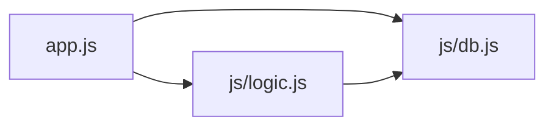

# 開発仕様書: QuickLog-Solo (ミニマリスト向け・完結型工数管理ツール)

## 1. プロジェクトのビジョン and 設計思想
- **コンセプト:** 「1秒で記録、1秒で集計、1秒で安心」。
- **ターゲット:** 業務記録を負担に感じるが、ツールの透明性や安全性に厳しい技術者。
- **設計指針:** 「必要十分（Less is More）」。過剰な機能追加を避け、特定のワークフローの摩擦を最小化する。
- **透明性:** データの保存先や通信仕様を明示し、ユーザー（技術者）の不安を解消する。

## 2. システム構成
- **形態:** PWA (Progressive Web App)
- **技術:** HTML5, CSS3, JavaScript (Vanilla JSのみ、フレームワーク禁止)。
- **ストレージ:** ブラウザ内 IndexedDB (Local Only)。外部送信は一切行わない。
- **配布:** GitHub Pages 等の静的ホスティング（HTTPS必須）。

## 3. 主要機能 (MVP)
### A. 打刻・記録ロジック
- カテゴリを選択して「開始」を押すと、現在時刻を打刻し、即座に履歴の先頭に表示される。
- 新しいタスクの「開始」により、前のタスクの終了時刻を自動記録。
- 停止ボタン（⏹）による終了時は、履歴の開始時刻を非表示にし、終了時刻のみを表示する特別なフォーマット（`        - HH:MM`）を採用し、経過時間の表示を空にする。
- 一時停止中の「(待機)」状態も、他の作業と同様に履歴にリアルタイムで表示される。
- 同時に実行できるタスクは常に1つのみ。

### B. カテゴリ管理
- ユーザーがカテゴリを追加・削除・編集可能。設定は永続化される。
- カテゴリごとに色設定（文字色を選択、背景色は自動設定）が可能。
- ドラッグ＆ドロップによる表示順序の変更が可能。
- ページネーション（1ページ8項目）をサポートし、多数의 カテゴリがあってもレイアウトを維持。マウスホイールで切り替え可能。
- 初回起動時、使い方のガイドとなるプレースホルダーを表示。

### C. 出力機能 (クリップボードコピー)
- ヘッダーに配置されたグリフボタン（📋, 📊）から、クリップボードへのコピーが可能。
- **日報用:** `[開始時刻] | [内容]`（Excel等への貼付に適したタブ区切り）。
- **工数集計用:** `[内容] | [合計時間]` の集計結果。
- コピー完了時に「コピーしました！」というトースト通知を表示。

### D. データライフサイクル
- **保持期間:** 直近40日間。
- 直近5件のログを表示し、すべてのデータはIndexedDBに保持され、CSVエクスポートやコピー機能で利用可能。
- **自動削除:** 起動時に40日を超えたデータを自動消去し、メンテナンスフリーを実現。
- **ストレージの永続化:** 起動時にブラウザの「永続ストレージ (Persistent Storage)」を自動リクエストし、ディスク容量不足時でもデータが自動削除されないように保護する。リクエストが拒否された場合は、ユーザーに通知を行い、「About」タブにステータスを表示する。
- **手動保守:** データの修正・移行用としてCSVエクスポート/インポート機能を備える。

### E. アップデート機能 (Service Worker)
- `sw.js` を介して更新を検知し、「更新」か「スキップ」を選択できる通知を表示。

## 4. UI/UX デザイン・透明性設計
- **レイアウト:** デスクトップ端に馴染む「スリム＆コンパクト」デザイン。すべての要素がスクロールなしで1画面に収まり、無駄な余白を排した設計。
- **透明性（Aboutタブ）:** 設定内の「About」タブにて、以下の情報を表示。
    - 保存先: ブラウザ内 IndexedDB。
    - 通信: 更新チェック以外、外部通信なし（Local Only）。
    - 仕組み: PWA / Service Worker によるオフライン動作。
    - 開発者情報。
- **開発者への配慮:** 起動時にブラウザコンソールへ「QuickLog-Solo Initialized」等のステータスを出力。

## 5. 運用上の制約
- Microsoft Graph API等の外部APIは不使用。
- 多機能化より「シンプルさ」と「軽量動作」を優先。

## 6. ドキュメント管理ポリシー
- セッション内で判断された事項、共有された背景情報やポリシーは、常に本ドキュメント（spec.md）に反映・更新する。
- **実装と同期:** 実装の修正や機能拡張が行われる際、必ず `README.md` および `README_DEV.md` 等のドキュメント群を同時に更新し、最新の状態を維持する。
- **言語ポリシー:** プルリクエスト (PR) におけるやり取り（説明、コメント、返信等）は、すべて**日本語**で行う。

## 7. 追加合意事項
### デザイン・UI
- **経過時間表示:** 実行中のタスク名の下に `HH:MM:SS` 形式でリアルタイム表示。左側に状態グリフを併記。
- **背景アニメーション:** 実行中（▶）エリアの背景が1分周期で「白背景 ↔ アクセントカラー」と右から左へ塗られていく。一時停止中（⏸）はアニメーションを停止する。
- **確認ダイアログ:** ブラウザ標準の `window.confirm` を廃止し、アプリ内にデザインを統一したカスタムダイアログを実装。
- **レスポンシブデザイン:** ウィンドウサイズに合わせてレイアウトが最適化される。
    - **縦長モード:** 横幅を最小限（約280px）に抑え、カテゴリ・タイマー・ログを垂直に結合して配置。ウィンドウサイズ: 280x500。
    - **横長モード:** 3ペイン構成（左：カテゴリ(150px)、中：タイマー＆操作(200px)、右：ログ(可変)）を採用し、要素間を隙間なく結合して表示面積を最小化。ウィンドウサイズ: 650x360。

### 配色ポリシー
- ユーザーは「文字色」のみをプリセットから選択。背景色は視認性を確保するために自動的に選択される。これにより、色の組み合わせに悩む時間を削減し、本来の作業に集中できるようにする。

### 状態表示
- 作業状態をオーディオプレイヤーに準拠したグリフで表現。経過時間の左側に表示される。
    - 実行中: ▶ (Green)
    - 待機中/一時停止中: ⏸ (Orange) - 点滅（blink）演出あり、背景アニメーション停止。
    - 停止中: ⏹ (Red)

### セキュリティポリシー (文字列入力)
- **XSS対策:** ユーザーが入力した文字列（カテゴリ名等）をUIに表示する際は、必ず適切にエスケープするか、`textContent` プロパティを使用して、スクリプトの実行を防止する。
- **HTMLインジェクション対策:** 不正なHTMLタグの挿入によるUIの破壊やフィッシング攻撃を防止する。
- **CSVインジェクション対策:** CSVエクスポート時にカンマ、改行、ダブルクォートを含むフィールドを適切にクォート・エスケープし、データの整合性を維持する。
- **DoS対策:** カテゴリ名等の入力文字列に対して最大長（50文字）を制限し、レイアウト崩れや過度なメモリ消費を防止する。

### バージョニングポリシー
- **構成:** `[メジャー].[マイナー].[パッチ]`
- **管理:** バージョン番号は `version.json` で一括管理し、実装から切り離す。コミット時には必ずバージョンが更新されていることを確認する。

## 8. 開発・品質管理ポリシー (v1.4.0以降)
### 設計原則
- **KISS, DRY, YAGNI:** 常にシンプルさを保ち、重複を避け、不要な機能を作らない。
- **SLAP:** 抽象化レベルを揃え、DOM操作と純粋なロジックを分離する。
- **OCP:** 設定やカテゴリ定義をデータ化し、コード変更なしで拡張可能にする。
- **定数化の徹底:** マジックナンバーやマジック文字列（IndexedDBのストア名、設定キー、レイアウト名等）を直接記述せず、必ず定数として定義して利用する。これにより、修正漏れの防止と可読性の向上を図る。定数は、その機能と密接に関連するファイル内で定義し、必要に応じてエクスポート/インポートする。

### モジュール構造

### 品質保証
- **自動テスト:** Jest + fake-indexeddb を使用し、ロジック層とDB層の品質を担保する。
- **リンター:** ESLint (JS) および Stylelint (CSS) を導入。
- **pre-commit:** コミット前に「テスト実行」「リンター実行」「バージョン整合性チェック」を強制する。

### 継承された判断とその背景
- **Vanilla JS への固執:** フレームワークの陳腐化リスクを避け、長期的なメンテナンス性と透明性を確保するため。
- **Local Only:** プライバシー重視のユーザーに「安心」を提供するための絶対条件。
- **シングルインスタンス制限制御:** データの整合性維持と、デスクトップアクセサリとしての「唯一性」を保つため。
- **データ整合性の自動修復:** 予期せぬ終了等で複数のタスクが「未終了」状態となった場合、起動時に最新のタスク以外を自動的に終了処理し、タイマーの不整合を防止する。
- **高速ビジュアルテスト:** URLパラメータ（`test_cat`, `test_elapsed`, `test_layout`）により、特定の状態（長時間経過後、特定レイアウト等）を瞬時に再現可能にする。
